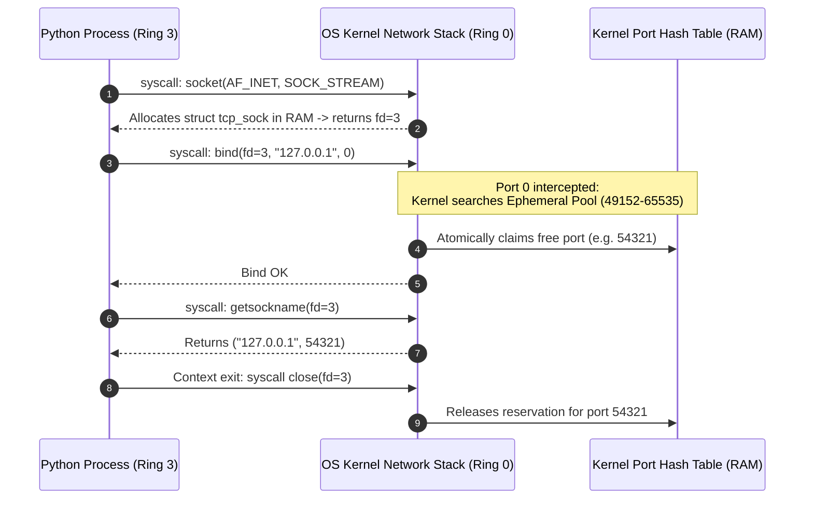
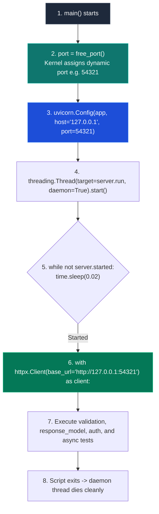

# 🔌 Ephemeral Ports, Port 0 Binding, and the `free_port()` Dynamic Runner Pattern

> **Reference / Context**: [05_testing_with_pytest.md](file:///d:/Madhan_Utils/learnings/ai-ml/ai-ml-course/course-path/phase-0-engineering-foundations/05_testing_with_pytest.md) | [07_http_fundamentals.md](file:///d:/Madhan_Utils/learnings/ai-ml/ai-ml-course/course-path/phase-0-engineering-foundations/07_http_fundamentals.md) | [09_building_apis_with_fastapi.md](file:///d:/Madhan_Utils/learnings/ai-ml/ai-ml-course/course-path/phase-0-engineering-foundations/09_building_apis_with_fastapi.md) | [`09_building_apis_with_fastapi.py`](file:///d:/Madhan_Utils/learnings/ai-ml/ai-ml-course/course-path/phase-0-engineering-foundations/09_building_apis_with_fastapi.py#L418-L440) | [complete-fastapi-and-systems-architecture-guide.md](file:///d:/Madhan_Utils/learnings/ai-ml/ai-ml-course/explanations/complete-fastapi-and-systems-architecture-guide.md)

---

## 🧭 Master Concept Map

```mermaid
flowchart TD
    subgraph PROBLEM ["❌ The Anti-Pattern: Hardcoded Static Port"]
        P8000["Hardcode port = 8000 in script"] --> COL["Conflict! Another server or zombie run holds 8000"]
        COL --> CRASH["💥 OSError: [Errno 48] Address already in use"]
    end

    subgraph SOLUTION ["✅ The Robust Pattern: Port 0 Kernel Allocation"]
        P0["bind(('127.0.0.1', 0))"] --> KERNEL["OS Kernel (Ring 0) intercepts Port 0"]
        KERNEL --> POOL["Scans Ephemeral Range (49152 - 65535)"]
        POOL --> ALLOC["Claims free port: e.g. 54321 atomically"]
        ALLOC --> GSOCK["getsockname() reads assigned port"]
        GSOCK --> UVICORN["Uvicorn binds safely to http://127.0.0.1:54321"]
    end

    style PROBLEM fill:#7f1d1d,stroke:#ef4444,color:#fff
    style SOLUTION fill:#064e3b,stroke:#10b981,color:#fff
```



---

## 1. 🎯 The Problem: Why Hardcoding Ports Breaks Automation

When building self-contained test suites, CI/CD pipelines, or local proof scripts, hardcoding static ports like `8000` or `5000` is fragile:

1. **Zombie Processes**: If a previous run was terminated abnormally (`SIGKILL` or Ctrl+C without clean teardown), the socket may remain in the kernel's `TIME_WAIT` state or a lingering process may hold the port.
2. **Parallel Test Runners**: If `pytest -n auto` runs 8 test workers simultaneously on a machine, all 8 workers will try to bind to `8000`, causing 7 of them to crash immediately.
3. **Developer Conflicts**: Running another FastAPI, Django, or React development server locally on `8000` blocks the execution of the script.

```bash
# Common failure when hardcoding port 8000
OSError: [Errno 48] Address already in use
# or on Windows
OSError: [WinError 10048] Only one usage of each socket address (protocol/network address/port) is normally permitted
```

---

## 2. ⚡ The Solution: Lines 418–422 Breakdown

In [`09_building_apis_with_fastapi.py`](file:///d:/Madhan_Utils/learnings/ai-ml/ai-ml-course/course-path/phase-0-engineering-foundations/09_building_apis_with_fastapi.py#L418-L422), we use the canonical OS-delegated ephemeral port probe:

```python
def free_port() -> int:
    with socket.socket() as s:
        s.bind(("127.0.0.1", 0))
        return s.getsockname()[1]
```

### Line-by-Line Systems Execution



1. **`with socket.socket() as s:`**:
   - Executes the `socket(AF_INET, SOCK_STREAM)` syscall.
   - The OS kernel creates a `struct tcp_sock` in Kernel RAM and returns an integer **File Descriptor (`fd`)** ticket (e.g., `3`) into the process's file descriptor table.
   - The Python `with` statement ensures `close(fd)` is called upon exit to prevent kernel resource leaks.

2. **`s.bind(("127.0.0.1", 0))`**:
   - `127.0.0.1` binds exclusively to the local loopback device (`lo`). Packets never hit physical network wires.
   - **The Port `0` Sentinel**: In BSD socket networking, port `0` is a special instruction: *"Kernel, assign an arbitrary available port from your ephemeral port pool."*
   - The kernel atomically searches its internal port hash table across the dynamic range (`49152`–`65535`), claims an unallocated port (e.g., `54321`), and updates the socket struct.

3. **`return s.getsockname()[1]`**:
   - Executes the `getsockname(fd)` syscall, querying the kernel for the socket's actual assigned `sockaddr_in` struct.
   - It returns `("127.0.0.1", 54321)`.
   - Index `[1]` extracts the dynamically allocated port integer `54321`.

---

## 3. 🔄 The Full Runner Lifecycle in `main()`

Here is how `free_port()` integrates into the live Uvicorn background server and HTTP client test runner in [`09_building_apis_with_fastapi.py`](file:///d:/Madhan_Utils/learnings/ai-ml/ai-ml-course/course-path/phase-0-engineering-foundations/09_building_apis_with_fastapi.py#L424-L448):



### Why Run Uvicorn in a Background Daemon Thread?
- **FastAPI requires an ASGI server** to handle network I/O, event loops, and HTTP parsing.
- By launching Uvicorn inside a `daemon=True` background thread and using `httpx.Client` in the main thread:
  1. The script is **100% self-contained and zero-spend**: it does not require running a separate terminal window or external Docker container.
  2. When the main thread completes all demos, Python exits immediately and the OS cleans up all daemon thread resources and sockets.

---

## 4. ⚖️ Deep Systems Tradeoff: The TOCTOU Race Condition

| Characteristic | `free_port()` Pattern | Direct Socket Activation (Production) |
|---|---|---|
| **Mechanism** | Open socket on port 0 $\rightarrow$ extract port $\rightarrow$ close socket $\rightarrow$ re-bind in Uvicorn | Master process opens port $\rightarrow$ passes open File Descriptor (`fd`) directly to workers |
| **Race Window** | **Microsecond TOCTOU Window**: Between socket close and Uvicorn bind, another process could theoretically steal the port. | **Zero Race Condition**: Port remains locked in kernel port table continuously. |
| **Setup Complexity** | **Zero Setup**: 4 lines of pure Python, works on Windows, Linux, and macOS. | **High Complexity**: Requires systemd, Gunicorn master supervisor, or custom C/Unix domain socket passing. |
| **Ideal Use Case** | Test suites, CI runners, standalone CLI scripts, self-contained educational code. | High-concurrency production deployments (Kubernetes, Systemd socket activation). |

---

## 5. 🧠 Retrieval & Mastery Checkpoint

1. What does binding to port `0` tell the OS kernel?
2. Why is binding to `127.0.0.1` safer than `0.0.0.0` for local test suites?
3. What is the Time-of-Check to Time-of-Use (TOCTOU) race condition in `free_port()`, and why is it negligible in local test scripts?
4. Why does `free_port()` return `s.getsockname()[1]` instead of `s.getsockname()[0]`?
