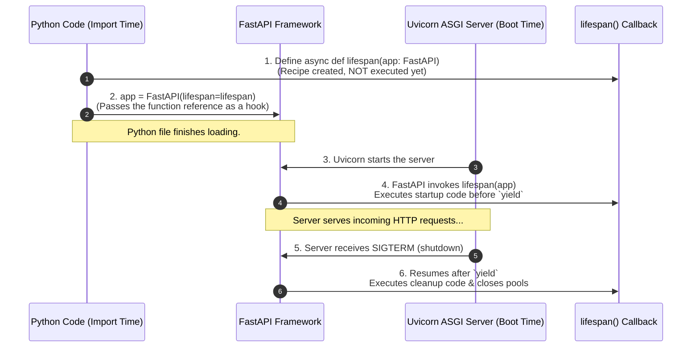
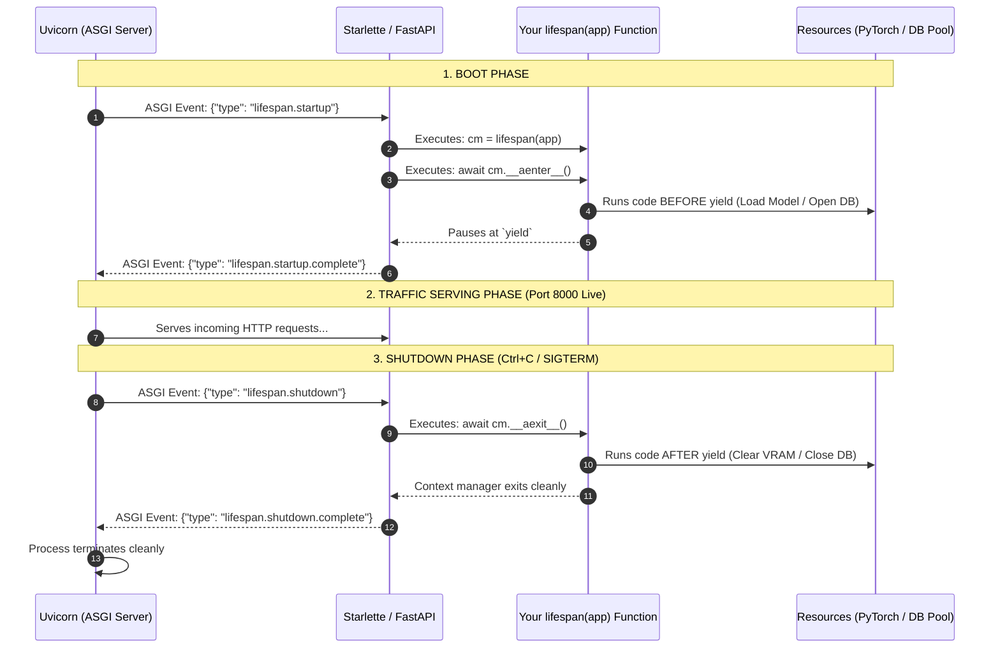

# 📌 The FastAPI Lifespan Callback Pattern (Why It Looks Circular)

> **Reference / Context**: [03_async_typehints_pydantic.md](file:///d:/Madhan_Utils/learnings/ai-ml/ai-ml-course/course-path/phase-0-engineering-foundations/03_async_typehints_pydantic.md) | [09_building_apis_with_fastapi.md](file:///d:/Madhan_Utils/learnings/ai-ml/ai-ml-course/course-path/phase-0-engineering-foundations/09_building_apis_with_fastapi.md#L36-L51) | [`09_building_apis_with_fastapi.py`](file:///d:/Madhan_Utils/learnings/ai-ml/ai-ml-course/course-path/phase-0-engineering-foundations/09_building_apis_with_fastapi.py#L48-L60) | [15_postgres_pgvector_redis.md](file:///d:/Madhan_Utils/learnings/ai-ml/ai-ml-course/course-path/phase-0-engineering-foundations/15_postgres_pgvector_redis.md)

---

### 1. 🎯 What is it? (In Plain English)
The syntax looks circular (`lifespan` takes `app`, but `FastAPI` takes `lifespan`) because you are **defining a callback recipe**, not calling it.

1. `async def lifespan(app: FastAPI):` defines a **recipe** (an instruction manual). It says: *"Whenever someone boots a FastAPI app, pass that app into me."* No app exists yet; `app: FastAPI` is just a type hint and parameter placeholder.
2. `app = FastAPI(lifespan=lifespan)` **registers** that recipe with FastAPI. You pass the function itself (the recipe), not the result of calling it.
3. Later, when the server (Uvicorn) starts, **FastAPI calls your recipe and passes itself (`app`) in**.

---

### 2. 💡 The Real-World Analogy
Think of `lifespan` like a **Fire Drill Evacuation Plan**:
- **Step 1 (Writing the Plan)**: You write a manual titled: *"What to do when building `B` catches fire."* Notice: You don't need a physical building standing in front of you to write `B` on the paper.
- **Step 2 (Assigning the Plan)**: You construct the actual building `my_office = Building(safety_plan=fire_plan)`.
- **Step 3 (Execution)**: When the building opens, the building management system executes `fire_plan(my_office)`.

---

### 3. 🎨 Visual Flowchart (Execution Timeline)



---

### 4. ⚡ Under the Hood: What Actually Happens Step-by-Step

There are 3 distinct layers working together: Python Type Hints, FastAPI's registration, and Uvicorn's ASGI event loop.

#### Step 1: Type Hinting (No Objects Passed)
In `async def lifespan(app: FastAPI):`:
- `FastAPI` is **NOT** being passed as an input. It is just a **Python Type Hint** (metadata for your IDE).
- At runtime, Python executes this line as: `async def lifespan(app):`.
- `app` is simply a variable name waiting for a future argument.

#### Step 2: Callback Registration
```python
# We give the function reference 'lifespan' to FastAPI
app = FastAPI(title="Invoice API", lifespan=lifespan)
```
Inside FastAPI (and Starlette) `__init__`, FastAPI simply saves the reference:
```python
self.router.lifespan_context = lifespan  # Saved for later; NOT executed yet!
```

#### Step 3: Uvicorn ASGI Protocol Handshake (Runtime)
When you run `uvicorn main:app` or `uvicorn.run(app)`:



---

### 5. 🔬 The Exact Python Code Starlette Executes

To understand why `asynccontextmanager` works with `yield`, look at what Starlette runs internally when Uvicorn boots:

```python
# Simplified Starlette ASGI Lifespan Handler:
async def handle_lifespan(scope, receive, send):
    message = await receive()
    if message["type"] == "lifespan.startup":
        # 1. Starlette calls your function and passes `app` (self):
        context_manager = app.router.lifespan_context(app)
        
        # 2. Enters the context manager (runs everything before `yield`):
        await context_manager.__aenter__()
        
        # 3. Tells Uvicorn that startup is done:
        await send({"type": "lifespan.startup.complete"})

    # ... Server runs and handles HTTP traffic while paused at `yield` ...

    message = await receive()
    if message["type"] == "lifespan.shutdown":
        # 4. Resumes after `yield` (runs cleanup):
        await context_manager.__aexit__(None, None, None)
        
        # 5. Tells Uvicorn shutdown is done:
        await send({"type": "lifespan.shutdown.complete"})
```

---

### 6. ⚠️ Pro-Tip / Why `app` is Passed into `lifespan` at all
Why does `lifespan` receive `app` as an argument?

So you can attach state directly to the app instance using `app.state` instead of using dirty global variables:

```python
@asynccontextmanager
async def lifespan(app: FastAPI):
    # Attach model cleanly to the app instance:
    app.state.model = load_heavy_pytorch_model()
    yield
    app.state.model.unload()

# Inside any route endpoint:
@app.get("/predict")
def predict(request: Request):
    # Clean access without global dicts!
    model = request.app.state.model
    return model.predict(...)
```
