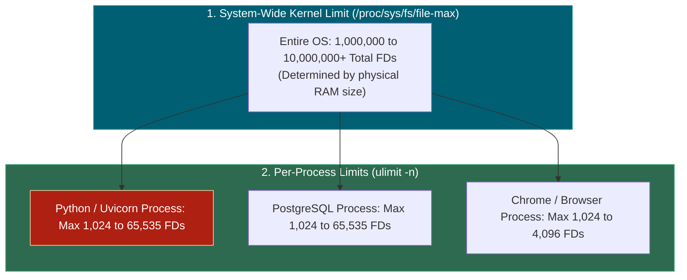
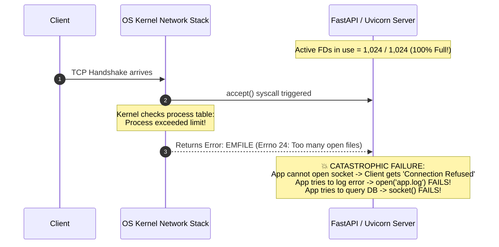
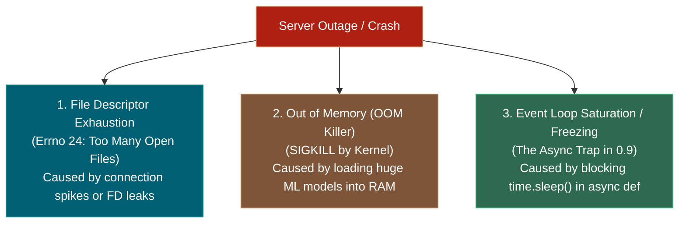

# 📌 File Descriptor Limits & Server Crashes: `Too Many Open Files`

> **Reference / Context**: [09_building_apis_with_fastapi.md](file:///d:/Madhan_Utils/learnings/ai-ml/ai-ml-course/course-path/phase-0-engineering-foundations/09_building_apis_with_fastapi.md) | [10_linux_cli.md](file:///d:/Madhan_Utils/learnings/ai-ml/ai-ml-course/course-path/phase-0-engineering-foundations/10_linux_cli.md) | [file-descriptors-ip-ports-and-0000-explained.md](file:///d:/Madhan_Utils/learnings/ai-ml/ai-ml-course/explanations/file-descriptors-ip-ports-and-0000-explained.md) | [where-sockets-live-in-the-kernel.md](file:///d:/Madhan_Utils/learnings/ai-ml/ai-ml-course/explanations/where-sockets-live-in-the-kernel.md)

---

### 1. 🎯 The Core Truth

**Yes, exceeding available File Descriptors is one of the most common causes of production server outages (the infamous `OSError: [Errno 24] Too many open files`).**

When your server runs out of File Descriptors, it doesn't just stop serving web pages—**it is paralyzed**:

- It cannot accept new client TCP connections (`accept()` fails).
- It cannot open connections to PostgreSQL or Redis.
- It cannot load files from disk.
- It cannot even write error logs!

---

### 2. 📊 How Many File Descriptors Does a Device Have?

Operating systems enforce **two distinct limits**:



| Device Type                                           | Default Per-Process Limit (`ulimit -n`) | Production-Tuned Limit                              | System-Wide Total Limit           |
| ----------------------------------------------------- | ----------------------------------------- | --------------------------------------------------- | --------------------------------- |
| **Android / OxygenOS Phone**                    | `1,024` – `4,096` per app            | Configured per app sandbox                          | $\approx 500,000$               |
| **Default Laptop (Windows / Mac / Linux)**      | `1,024` per process                     | `65,535`                                          | $\approx 1,000,000 - 3,000,000$ |
| **Production Cloud Server (AWS / GCP / Linux)** | `1,024` (Default un-tuned)              | **`1,048,576` ($1\text{ Million}+$ FDs)** | **`10,000,000+`**         |

#### Why is the Default Only 1,024?

The default limit of `1024` is a historical legacy safety guard from the 1980s. In early Unix, a rogue runaway script that opened files in an infinite loop could exhaust all system RAM. In modern production, engineers always raise this limit to **$65,536$ or $1,048,576$**.

---

### 3. 💥 What Happens During a "File Descriptor Crash"?

When your application hits its limit (e.g. at 1,024 active sockets):



---

### 4. 🕳️ The #1 Culprit: File Descriptor Leaks (FD Leaks)

A server rarely runs out of FDs simply from legitimate traffic—it almost always runs out because of a **coding bug called an FD Leak**:

#### ❌ The Buggy Leak Code:

```python
# BAD: Creating a new client on every request and never closing it!
@app.get("/price")
async def get_price():
    client = httpx.AsyncClient()  # Opens a new TCP socket (Allocates 1 FD)
    res = await client.get("https://api.crypto.com/btc")
    return res.json()
    # 💥 BUG: client was never closed! That socket FD stays locked in Kernel RAM forever!
```

- **Request #1**: `fd = 3` opened.
- **Request #1000**: `fd = 1002` opened.
- **Request #1025**: **CRASH! `Too many open files`!**

#### ✅ The Fixed Code (Reusing or Context Managers):

```python
# GOOD: Using async context manager (auto-closes socket on exit)
@app.get("/price")
async def get_price():
    async with httpx.AsyncClient() as client:
        res = await client.get("https://api.crypto.com/btc")
        return res.json()  # Automatically closes FD when finished!
```

---

### 5. 🔬 Are File Descriptors the ONLY Cause of Server Crashes?

While FD exhaustion is a major culprit, server crashes typically fall into **3 primary categories**:



1. **File Descriptor Exhaustion (`EMFILE`)**: Sockets/files cannot be opened; server hangs or rejects 100% of new traffic.
2. **Out of Memory (OOM Killer)**: Your application tries to allocate more RAM than physically exists. The Linux Kernel terminates the process instantly with `SIGKILL (kill -9)`.
3. **Event Loop Freezing (The Async Trap from 0.9 Demo 5)**: A synchronous blocking call (`time.sleep(10)` or heavy CPU calculation) locks the single event loop thread, causing incoming requests to time out (504 Gateway Timeout).
