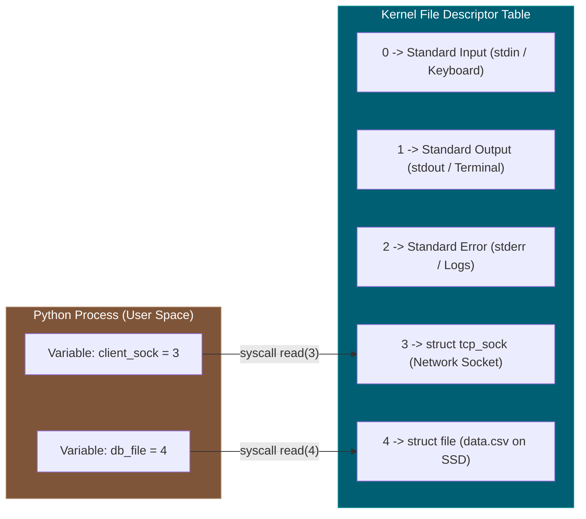
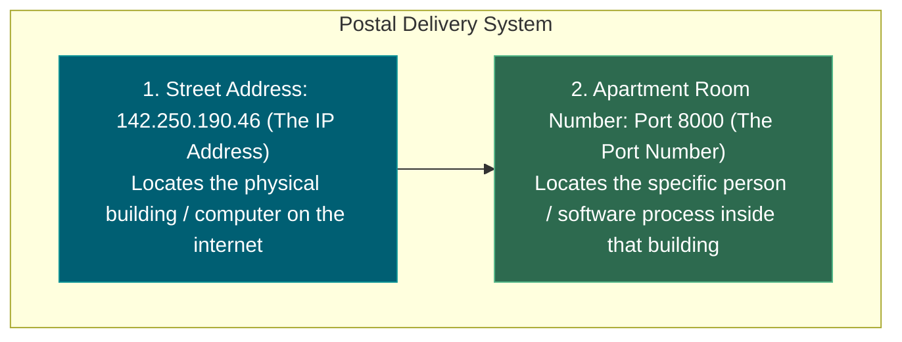
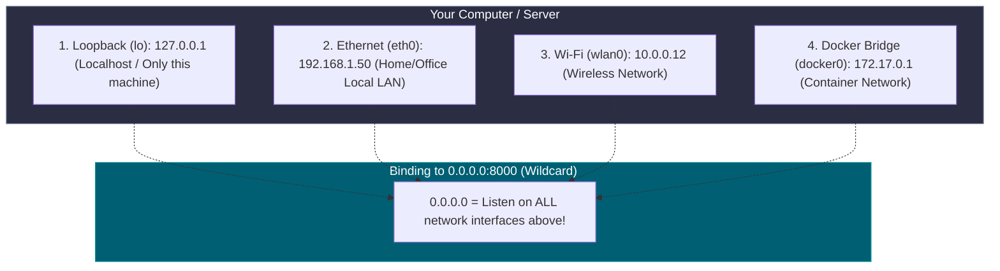
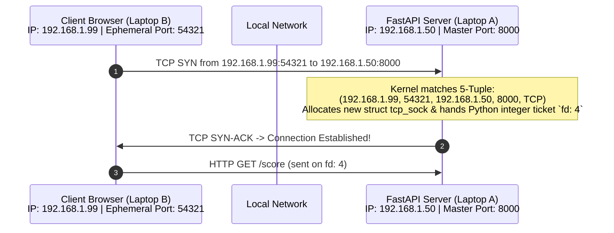

# 📌 File Descriptors, IPs, Ports, and `0.0.0.0:8000` Comprehensive Guide

> **Reference / Context**: [where-sockets-live-in-the-kernel.md](file:///d:/Madhan_Utils/learnings/ai-ml/ai-ml-course/explanations/where-sockets-live-in-the-kernel.md) | [what-is-the-os-kernel.md](file:///d:/Madhan_Utils/learnings/ai-ml/ai-ml-course/explanations/what-is-the-os-kernel.md) | [09_building_apis_with_fastapi.md](file:///d:/Madhan_Utils/learnings/ai-ml/ai-ml-course/course-path/phase-0-engineering-foundations/09_building_apis_with_fastapi.md)

---

### 1. 🎯 What is a File Descriptor (FD)?

In Unix/Linux operating systems, the guiding philosophy is **"Everything is a stream of bytes (a file)."**

A **File Descriptor (FD)** is a simple non-negative **integer number** (`0, 1, 2, 3, 4...`) that the OS Kernel assigns to a user program (like Python/Uvicorn) as a **ticket / index** into the process's private File Descriptor Table in Kernel RAM.

#### Every Process Gets Default Standard FDs:

- **`0` (`stdin`)**: Standard Input (reads keyboard text).
- **`1` (`stdout`)**: Standard Output (prints text to terminal).
- **`2` (`stderr`)**: Standard Error (prints error tracebacks).
- **`3+`**: Assigned to any newly opened disk file, database connection, or network socket!

---

### 2. 🏠 What are IP Addresses and Ports? (The Mail Delivery Analogy)

Imagine you want to send a letter to someone living in a massive 500-unit apartment building:

#### 1. The IP Address (Identifies the Machine)

An **IP Address** uniquely identifies a computer or device connected to a network.

- **IPv4**: A 32-bit number written as 4 decimal octets (e.g. `192.168.1.50` or `142.250.190.46`). Total possible addresses: $\approx 4.3 \text{ billion}$ ($2^{32}$).
- **IPv6**: A 128-bit hexadecimal number (e.g. `2001:0db8:85a3::8a2e:0370:7334`) created because the world ran out of IPv4 addresses.

#### 2. The Port Number (Identifies the Application Process)

A single server computer can run **multiple network programs at the same time** (a FastAPI web server, a PostgreSQL database, a Redis cache, an SSH server).

When a network packet arrives at the computer's IP address, **how does the OS Kernel know which app should get it?**
$\rightarrow$ **The Port Number!**

A **Port** is a 16-bit integer ranging from **`0` to `65,535`** (total **65,536 ports** per IP address):

| Port Range                   | Name                                | Description & Common Examples                                                                                                                                                                                               |
| ---------------------------- | ----------------------------------- | --------------------------------------------------------------------------------------------------------------------------------------------------------------------------------------------------------------------------- |
| **`0 – 1023`**      | **Well-Known / System Ports** | Reserved for core OS services (requires Root/Admin):• `80`: HTTP Web Traffic• `443`: HTTPS Encrypted Web Traffic• `22`: SSH Remote Terminal• `53`: DNS Domain Lookup                                            |
| **`1024 – 49151`**  | **Registered / User Ports**   | Used by user applications & custom databases:• `8000`: FastAPI / Uvicorn / Django default• `3000`: React / Next.js / Node.js dev servers• `5432`: PostgreSQL Database• `6379`: Redis Cache• `27017`: MongoDB |
| **`49152 – 65535`** | **Dynamic / Ephemeral Ports** | Temporary short-lived ports randomly assigned by the OS to client browsers when making outbound requests.                                                                                                                   |

---

### 3. 🌐 What Does `0.0.0.0:8000` Actually Mean?

A single physical computer often has **multiple network cards and multiple IP addresses simultaneously**:

- **If you bind to `127.0.0.1:8000` (`localhost:8000`)**:
  - The Kernel **only** accepts connections originating from inside the *exact same laptop*.
  - Your phone, a colleague on your Wi-Fi, or Docker containers will be **completely blocked** (`Connection Refused`).
- **If you bind to `0.0.0.0:8000` (Wildcard Address)**:
  - `0.0.0.0` tells the Kernel: *"Listen for incoming traffic on port 8000 across EVERY physical and virtual network card on this machine."*
  - This allows your laptop, other computers on your Wi-Fi LAN, Docker containers, and internet clients to reach your FastAPI server.

---

### 4. 🔗 How They All Fit Together: The 5-Tuple Connection

To uniquely route data between two programs on the internet, the OS Kernel uses the **5-Tuple**:

$$
\text{Connection} = (\text{Source IP}, \text{Source Port}, \text{Destination IP}, \text{Destination Port}, \text{Protocol: TCP})
$$

---

### 5. 📊 "How Many Do We Have Like That?" (The Limits & Scale)

#### 1. How Many Ports Can One IP Have?

- Exactly **$65,536$ ports** ($2^{16}$, from `0` to `65535`).
- **Rule**: Only **ONE** program can listen on a specific `IP:Port` at a time. If Uvicorn is on `0.0.0.0:8000`, running another server on `8000` throws `OSError: [Errno 48] Address already in use`.

#### 2. Can a Server Port (like 8000) Only Handle 65,536 Connections?

- **NO! This is the #1 networking myth.**
- Port `8000` is only the **Destination Port**.
- Because every client has a different **Source IP** and **Source Port**, a single server port `8000` can theoretically handle **millions of simultaneous client connections**!

#### 3. What Actually Limits the Number of Connections?

1. **The OS File Descriptor Limit (`ulimit -n`)**:
   - Every active client connection requires 1 File Descriptor (integer handle).
   - Default Linux limit is often 1,024 (can be raised to 1,000,000+ in production `/etc/security/limits.conf`).
2. **RAM Memory**:
   - Every active socket in Kernel RAM takes roughly **$2\text{ KB} - 4\text{ KB}$** of memory (`struct tcp_sock` + FIFO buffers).
   - $1,000,000$ active connections $\approx 2\text{ GB} - 4\text{ GB}$ of Kernel RAM.
