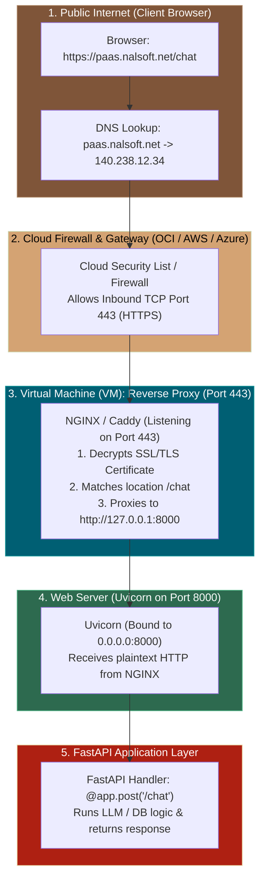
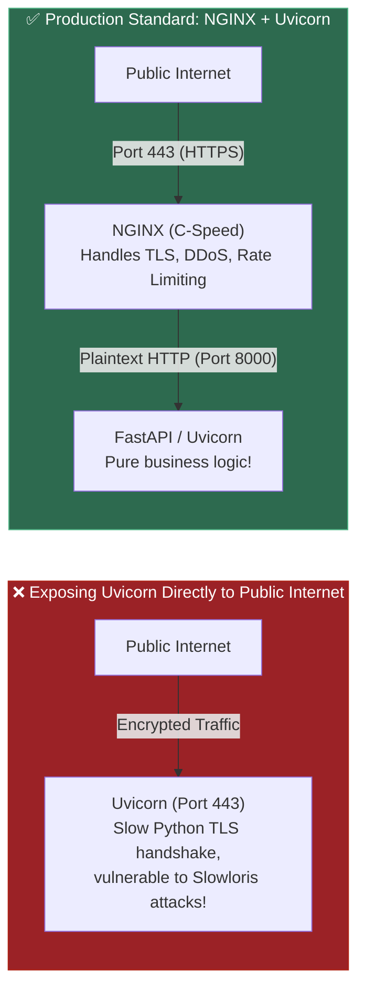

# 📌 How `https://paas.nalsoft.net/chat` Reaches FastAPI on `0.0.0.0:8000` in a VM

> **Reference / Context**: [07_http_fundamentals.md](file:///d:/Madhan_Utils/learnings/ai-ml/ai-ml-course/course-path/phase-0-engineering-foundations/07_http_fundamentals.md) | [09_building_apis_with_fastapi.md](file:///d:/Madhan_Utils/learnings/ai-ml/ai-ml-course/course-path/phase-0-engineering-foundations/09_building_apis_with_fastapi.md) | [12_nginx_reverse_proxy.md](file:///d:/Madhan_Utils/learnings/ai-ml/ai-ml-course/course-path/phase-0-engineering-foundations/12_nginx_reverse_proxy.md) | [13_oci_compute_deployment.md](file:///d:/Madhan_Utils/learnings/ai-ml/ai-ml-course/course-path/phase-0-engineering-foundations/13_oci_compute_deployment.md) | [web-server-vs-web-framework-fastapi.md](file:///d:/Madhan_Utils/learnings/ai-ml/ai-ml-course/explanations/web-server-vs-web-framework-fastapi.md)

---

### 1. 🎯 The 5-Stage Journey

When you type `https://paas.nalsoft.net/chat` in a browser, your request passes through **5 distinct architectural stages** before hitting your FastAPI code inside the VM:



---

### 2. 🔬 Step-by-Step Breakdown: From URL to Python Code

#### Step 1: DNS Resolution (Domain Name $\rightarrow$ Public IP)

1. The browser sees the domain: `paas.nalsoft.net`.
2. The browser asks DNS servers: *"What is the Public IP address of `paas.nalsoft.net`?"*
3. The DNS server replies with your Cloud VM's Public IP (e.g. `140.238.12.34`).

#### Step 2: The Port 443 Default

Because the URL starts with `https://`, the browser automatically targets **Port 443** (the universal port for encrypted HTTPS):

- The browser opens a TCP connection to: **`140.238.12.34:443`**.

#### Step 3: The Cloud Firewall (Security List)

The cloud provider's firewall (e.g. Oracle Cloud OCI Security List / AWS Security Group) checks its ingress rules:

- Port `443` $\rightarrow$ **ALLOWED**.
- Packets pass through the cloud network into the VM's network card (`eth0`).

#### Step 4: The Reverse Proxy (NGINX on Port 443)

Inside your VM, a production web server like **NGINX** is listening on Port `443`:

1. **TLS Decryption**: NGINX loads the SSL certificate (`cert.pem`) for `paas.nalsoft.net`, completes the TLS handshake, and decrypts the encrypted payload into plaintext HTTP.
2. **Route Matching**: NGINX inspects the path (`/chat`) and matches its configuration rule:

```nginx
# /etc/nginx/sites-available/nalsoft.conf
server {
    server_name paas.nalsoft.net;
    listen 443 ssl;
    ssl_certificate /etc/letsencrypt/live/paas.nalsoft.net/fullchain.pem;
    ssl_certificate_key /etc/letsencrypt/live/paas.nalsoft.net/privkey.pem;

    location /chat {
        # FORWARD TRAFFIC TO LOCAL FASTAPI RUNNING ON PORT 8000:
        proxy_pass http://127.0.0.1:8000;
        proxy_set_header Host $host;
        proxy_set_header X-Real-IP $remote_addr;
    }
}
```

#### Step 5: Uvicorn & FastAPI Ingestion (Port 8000)

1. NGINX opens a local loopback connection to `http://127.0.0.1:8000`.
2. Because your Uvicorn server is bound to **`0.0.0.0:8000`** (which includes `127.0.0.1`), Uvicorn accepts the connection immediately.
3. Uvicorn translates the HTTP bytes into the ASGI `scope` and calls your FastAPI handler:

```python
@app.post("/chat")
async def handle_chat(message: ChatRequest):
    # Your Python ML / LLM Inference Runs Here!
    return {"reply": "Response generated by AI"}
```

---

### 3. 💡 Why Do We Use NGINX in Front of FastAPI? (The Production Standard)

Why not expose FastAPI directly to the internet on Port 443 (`uvicorn main:app --port 443`)?



1. **C-Speed TLS Performance**: NGINX is written in optimized C/assembly and handles SSL/TLS handshakes 10x faster than Python.
2. **DDoS & Slowloris Protection**: NGINX buffers slow, malicious client connections before forwarding clean requests to FastAPI.
3. **Multi-Service Routing**: One VM can host 10 different apps (React on port 3000, FastAPI on port 8000, Docs on port 8080). NGINX routes `/chat` to FastAPI and `/` to React on a single domain.
