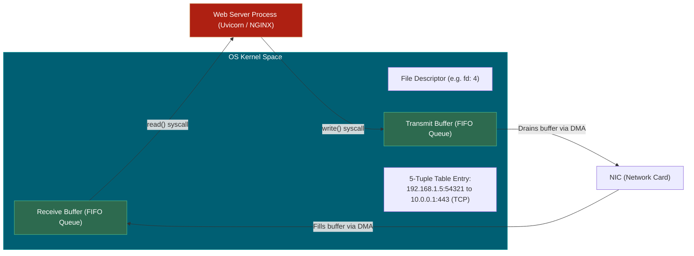
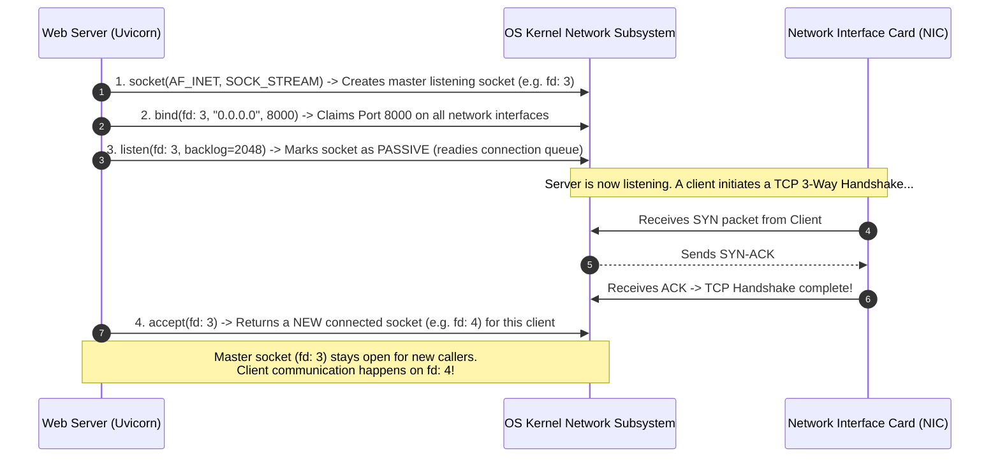
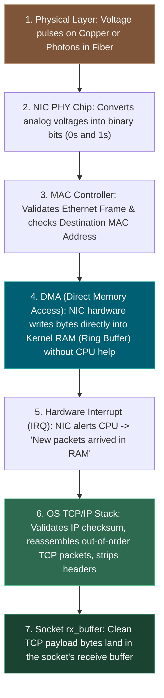
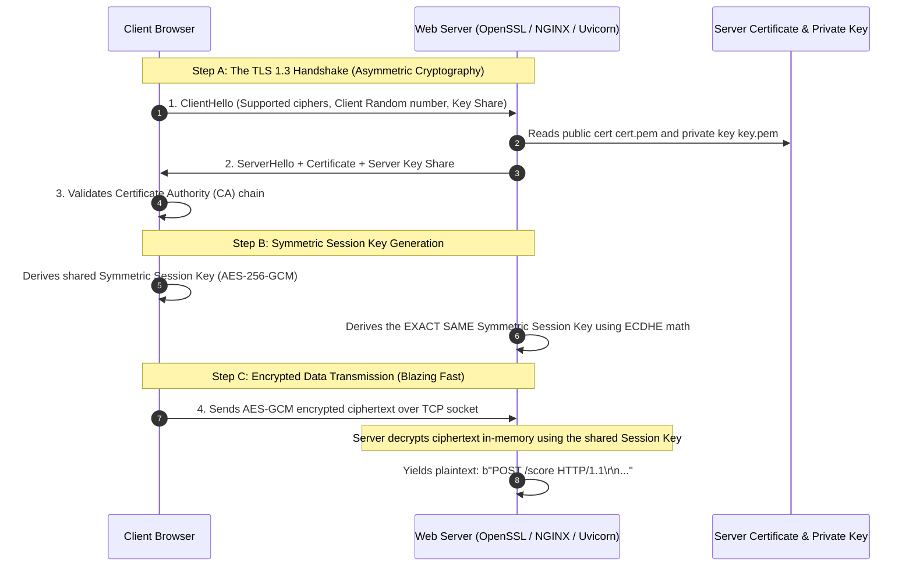
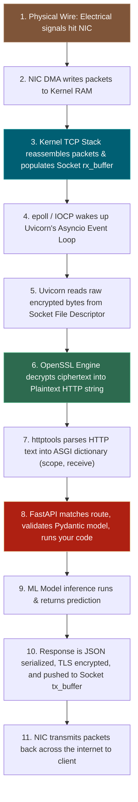

# 📌 Under the Hood: Sockets, IP/Port Binding, TLS, and Raw Wire Signals

> **Reference / Context**: [09_building_apis_with_fastapi.md](file:///d:/Madhan_Utils/learnings/ai-ml/ai-ml-course/course-path/phase-0-engineering-foundations/09_building_apis_with_fastapi.md) | [web-server-vs-web-framework-fastapi.md](file:///d:/Madhan_Utils/learnings/ai-ml/ai-ml-course/explanations/web-server-vs-web-framework-fastapi.md)

---

### 1. 🎯 What is a "Socket"? (The Kernel Reality)

A **Socket** is NOT a physical hardware plug. 

In operating systems (Linux, Windows, macOS), a **Socket** is a **kernel data structure** (represented in code by an integer called a **File Descriptor**). It consists of two in-memory FIFO buffers:
1. **Receive Buffer (`rx_buffer`)**: Stores incoming bytes arriving from the network card.
2. **Transmit Buffer (`tx_buffer`)**: Stores outgoing bytes waiting to be sent to the network card.

Every active TCP connection is uniquely identified by the **5-Tuple**:
$$\text{Socket Identifier} = (\text{Source IP}, \text{Source Port}, \text{Destination IP}, \text{Destination Port}, \text{Protocol: TCP})$$

---

### 2. ⚡ How Web Servers "Bind" to IP Addresses & Ports

When Uvicorn or NGINX starts, it executes **4 fundamental OS System Calls (Syscalls)**:

#### What does `0.0.0.0` vs `127.0.0.1` mean?
- **`127.0.0.1` (Loopback)**: The kernel only accepts packets originating from the *same machine*. It never passes traffic to external network adapters.
- **`0.0.0.0` (All Interfaces)**: The kernel listens on every physical and virtual network card (Ethernet `eth0`, Wi-Fi `wlan0`, Docker `docker0`).

---

### 3. 🌊 From Physical Wire to Memory: How Electrons Become Bytes

How does a voltage wave on an Ethernet cable or light pulse in fiber optics become `b"POST /score"` in Python memory?

1. **Physical Waves $\rightarrow$ Bits**: The PHY chip on your network card detects high/low electrical voltages (e.g., $+2.5V$ / $-2.5V$) and converts them to binary bitstreams.
2. **Direct Memory Access (DMA)**: The network card does **not** waste CPU cycles copying bytes. It writes the packets directly into system RAM using DMA channels.
3. **Interrupt (IRQ) & TCP Reassembly**: The NIC signals the CPU via an interrupt. The OS kernel's network driver reads the packet headers, verifies sequence numbers, reassembles split chunks, acknowledges receipt (ACK), and puts the raw payload bytes into the socket's `rx_buffer`.

---

### 4. 🔐 How SSL/TLS Encryption & Certificates Are Handled

Raw bytes on the wire in HTTPS are encrypted ciphertext garbage. How does the server turn them into readable HTTP text?

1. **The Certificate (`cert.pem`)**: Proves to the client that your server is genuinely `api.example.com` (signed by trusted Certificate Authorities like Let's Encrypt).
2. **The Private Key (`key.pem`)**: Secret mathematical key kept only on the server, used during the TLS handshake to authenticate the server.
3. **The TLS Handshake**: The client and server use **asymmetric encryption (Elliptic Curve Diffie-Hellman / ECDHE)** to securely agree on a temporary **Symmetric Session Key** without transmitting the key over the wire.
4. **Decryption at Line Rate**: Once the handshake completes, all subsequent traffic is encrypted/decrypted using fast hardware-accelerated **symmetric encryption (AES-GCM / ChaCha20)**.

---

### 5. 🔄 The Complete End-to-End Request Cycle

Putting all the layers together—from the internet cable to FastAPI:

---

### 6. ⚠️ Key Engineering Takeaways

1. **FastAPI never sees sockets or TLS**: FastAPI operates entirely in plaintext Python memory. It has no idea what TLS cipher was negotiated or what file descriptor was opened.
2. **TLS Termination Architecture**: In modern production systems, Python servers (Uvicorn) rarely handle TLS directly. An external reverse proxy (like **NGINX**, **Cloudflare**, or an **AWS ALB**) handles the TLS handshake, decrypts the traffic, and forwards raw plaintext HTTP to Uvicorn over a secure internal private network.
