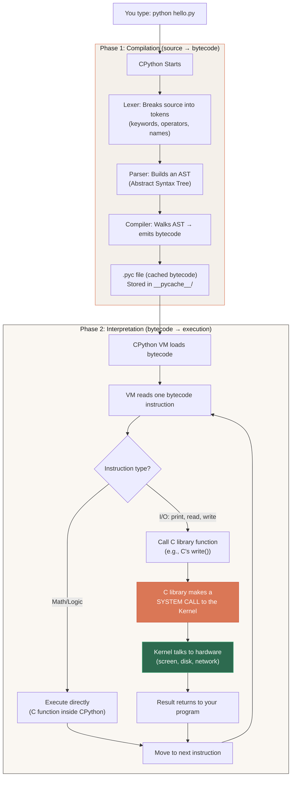
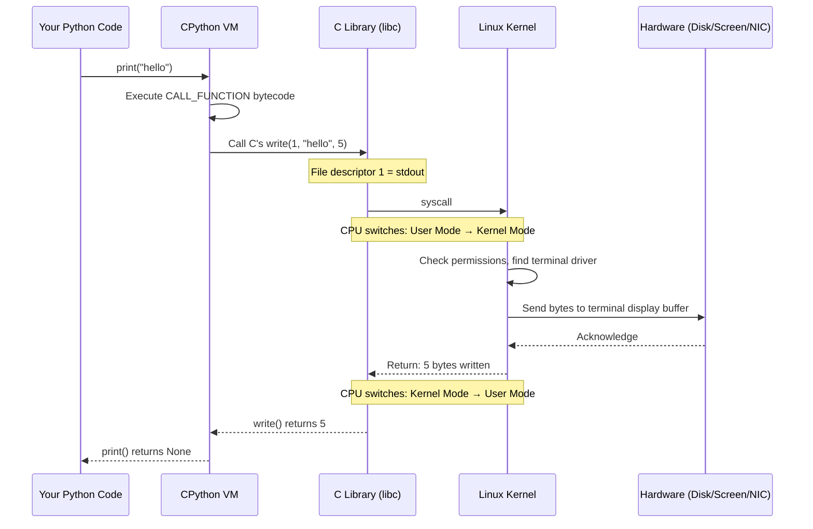
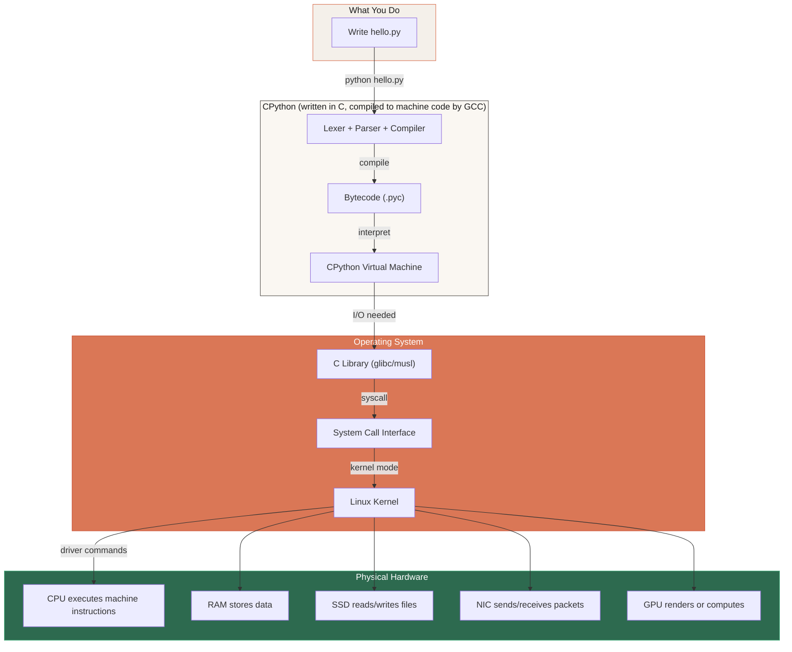

# 📌 Interpreter vs Compiler, Bytecode & CPython — How Python Actually Runs

> **Reference / Context**: [01_python_basics.md](file:///d:/Madhan_Utils/learnings/ai-ml/ai-ml-course/course-path/phase-0-engineering-foundations/01_python_basics.md) | [what-is-the-os-kernel.md](file:///d:/Madhan_Utils/learnings/ai-ml/ai-ml-course/explanations/what-is-the-os-kernel.md) | [10_linux_cli.md](file:///d:/Madhan_Utils/learnings/ai-ml/ai-ml-course/course-path/phase-0-engineering-foundations/10_linux_cli.md) | [the-complete-story-of-linux-and-ai.md](file:///d:/Madhan_Utils/learnings/ai-ml/ai-ml-course/explanations/the-complete-story-of-linux-and-ai.md)

---

### 1. 🎯 What Are They? (In Plain English)

**Compiler:** A program that reads your ENTIRE source code at once, translates it ALL into machine code (the binary your CPU directly understands), and produces a standalone executable file. You run the executable later — the compiler's job is done before your program ever starts. C, C++, Rust, and Go use this model.

**Interpreter:** A program that reads your source code line-by-line (or statement-by-statement), translates each piece on the fly, and executes it immediately — no standalone executable file is ever produced. The interpreter must be present every time you run the code.

**Bytecode:** An intermediate representation — not the original source code, not machine code, but something in between. It's a compact, platform-independent set of instructions designed for a **virtual machine** (a software CPU) to execute, not your real hardware CPU.

**CPython:** The default, reference implementation of Python. It's a program written in C that compiles your `.py` source into bytecode and then interprets that bytecode on its built-in virtual machine. CPython is both a compiler (source → bytecode) AND an interpreter (bytecode → execution) in one package.

> **The key insight most beginners miss:** Python is NOT purely interpreted. CPython compiles your code first (to bytecode), then interprets the bytecode. The word "interpreted" in "Python is an interpreted language" refers to the bytecode execution phase, not to reading your `.py` file raw.

---

### 2. 💡 The Real-World Analogy

Imagine you write a recipe in French, and you need it cooked in a kitchen that only understands English.

**The Compiler approach (C/Rust):**
You hire a professional translator. They take your entire French recipe book, translate every page into English, and hand you a complete English book. The translator goes home. The kitchen cooks directly from the English book — fast, no translator needed anymore.

**The Pure Interpreter approach (old BASIC):**
You hire a live translator who stands in the kitchen. They read one French instruction aloud, translate it to English, and the cook executes it immediately. Then the next instruction. The translator must stay the entire time. If you cook the same recipe tomorrow, the translator re-translates everything from scratch.

**The CPython approach (what Python actually does):**
You hire a translator who does something clever. First, they read your entire French recipe and translate it into a universal shorthand — not full English, but a set of numbered cooking symbols that any trained cook can follow (this is bytecode). They write this shorthand version down (`.pyc` file). Then, a specialized cook who reads the shorthand executes each symbol one at a time.

```
French Recipe (.py)  →  Translator (CPython compiler)  →  Shorthand Symbols (.pyc bytecode)
                                                                    ↓
                                                         Specialized Cook (CPython VM)
                                                                    ↓
                                                            Dish Ready (program runs)
```

**Why the shorthand step?** Because translating full French → full English is slow. The shorthand is simpler and faster to read. And if you cook the same recipe again, the shorthand is already written — skip the translation entirely.

---

### 3. 🎨 Visual Flowchart — The Complete Execution Pipeline

This is the full journey of what happens when you type `python hello.py`:



---

### 4. ⚡ Why Is It Called "Interpreter" and Not "Compiler"?

This naming causes more confusion than any other concept in programming. Here's why:

**The historical reason:** Early interpreters (1960s–70s BASIC, shell scripts) literally read source code line by line and executed it directly — no intermediate step. The word "interpreter" was coined for this model. Python inherited the label even though CPython does compile first.

**The technical distinction:**

| | Compiler | Interpreter | CPython (Hybrid) |
|---|---|---|---|
| **Input** | Full source code | Source code (line by line) | Full source code |
| **Output** | Standalone machine-code binary (.exe) | No file — executes on the fly | Bytecode (.pyc) — NOT machine code |
| **When does code run?** | After compilation, separately | During translation, immediately | After compilation to bytecode, during VM interpretation |
| **Translator needed at runtime?** | No — the .exe runs alone | Yes — interpreter must be present | Yes — CPython VM must be present |
| **Speed** | Fast (native CPU instructions) | Slow (re-translates every time) | Medium (bytecode is faster to interpret than raw source, but still not native) |
| **Examples** | C, C++, Rust, Go | Old BASIC, shell scripts | Python (CPython), Java (JVM), C# (.NET CLR) |

**So which is Python?** [Certain] CPython uses a two-phase model: compile to bytecode, then interpret the bytecode. It's technically a **compiled-then-interpreted hybrid**. The industry calls it "interpreted" because:
1. No standalone executable is produced — you always need the `python` runtime
2. The bytecode is interpreted (not compiled to native machine code)
3. The compilation step is invisible — you never manually run a compiler

---

### 5. 🔬 What Exactly IS Bytecode?

Bytecode is a set of low-level instructions designed for CPython's virtual machine (a software CPU), NOT for your physical CPU.

You can actually see it:

```python
import dis

def greet(name):
    return f"Hello, {name}!"

dis.dis(greet)
```

Output:
```
  2           0 LOAD_CONST               1 ('Hello, ')
              2 LOAD_FAST                0 (name)
              4 FORMAT_VALUE             0
              6 LOAD_CONST               2 ('!')
              8 BUILD_STRING             3
             10 RETURN_VALUE
```

Each line is one **bytecode instruction**. `LOAD_CONST` pushes a constant onto the stack. `LOAD_FAST` loads a local variable. `BUILD_STRING` concatenates. These are NOT x86 assembly instructions — they're virtual machine instructions that CPython's C code knows how to execute.

**Machine code equivalent (what a C compiler would produce for similar logic):**
```asm
mov    rdi, [rbp-8]      ; load 'name' from stack
call   string_concat     ; call a string function
mov    rax, result       ; put result in return register
ret                      ; return to caller
```

**The critical difference:**
- Bytecode → CPython VM reads it and calls pre-compiled C functions to do the work
- Machine code → CPU reads it directly and executes it in hardware, no middleman

This is why Python is slower than C. Every bytecode instruction involves CPython (a C program) reading the instruction, deciding what to do, and calling the appropriate C function. In C, the CPU executes the instructions directly.

---

### 6. 🎨 Where Does the Kernel Come In?

You now know from [what-is-the-os-kernel.md](file:///d:/Madhan_Utils/learnings/ai-ml/ai-ml-course/explanations/what-is-the-os-kernel.md) that the kernel is the OS's core — the only software that can touch hardware. Here's exactly where it enters the Python execution pipeline:



**The rule is absolute:** Your Python code → CPython VM → C library → System Call → Kernel → Hardware. Your code NEVER skips a layer. Even `1 + 1` goes through the CPython VM (though it doesn't need the kernel since it's pure computation — no I/O, no memory allocation beyond what's already assigned).

**When the kernel IS needed (I/O operations):**
- `print()` → kernel writes to terminal device
- `open()` / `read()` / `write()` → kernel accesses the file system and disk
- `socket()` / `connect()` / `send()` → kernel manages the network stack
- `import` (first time) → kernel reads `.py` file from disk
- Any memory allocation beyond the pre-allocated heap → kernel's `mmap()` / `brk()`

**When the kernel is NOT needed (pure computation):**
- `x = 1 + 1` → CPython VM executes BINARY_ADD using already-allocated memory
- `for i in range(100)` → VM loop, no I/O
- String operations on already-loaded strings → VM-internal

---

### 7. 🎨 The Full Picture — From Source Code to Electrons



**The nesting relationship (what lives inside what):**

```
┌─── Physical Hardware (CPU, RAM, Disk) ─────────────────────────┐
│  ┌─── Linux Kernel (the ONLY software touching hardware) ───┐  │
│  │  ┌─── C Library (glibc — provides write(), read()) ───┐  │  │
│  │  │  ┌─── CPython (compiled C program) ──────────────┐  │  │  │
│  │  │  │  ┌─── CPython VM ──────────────────────────┐  │  │  │  │
│  │  │  │  │  ┌─── Your Python bytecode ──────────┐  │  │  │  │  │
│  │  │  │  │  │     print("hello")                 │  │  │  │  │  │
│  │  │  │  │  └────────────────────────────────────┘  │  │  │  │  │
│  │  │  │  └──────────────────────────────────────────┘  │  │  │  │
│  │  │  └────────────────────────────────────────────────┘  │  │  │
│  │  └──────────────────────────────────────────────────────┘  │  │
│  └────────────────────────────────────────────────────────────┘  │
└──────────────────────────────────────────────────────────────────┘
```

Your `print("hello")` lives at the innermost layer. For it to reach the screen, it must pass through every layer outward — each layer adding its translation and control.

---

### 8. 🧩 What About Other Python Implementations?

CPython is the default, but there are alternatives that handle the bytecode→execution step differently:

| Implementation | How It Runs Bytecode | Speed vs CPython |
|---|---|---|
| **CPython** | Interprets bytecode one instruction at a time (C function per instruction) | 1× (baseline) |
| **PyPy** | JIT-compiles bytecode → native machine code at runtime (hot loops become real CPU instructions) | 2–10× faster |
| **Cython** | Translates Python-like code → C source → compiled machine code (ahead of time) | 10–100× faster for numeric code |
| **Jython** | Compiles to Java bytecode → runs on JVM | ~1× (different ecosystem) |
| **MicroPython** | Minimal bytecode interpreter for microcontrollers (ESP32, Raspberry Pi Pico) | Slower, but runs on 256KB RAM |

PyPy's **JIT (Just-In-Time) compiler** is worth understanding: it watches which bytecode instructions run most often (hot paths), then compiles THOSE specific paths directly to machine code. First run = slow (interpreting). Repeated runs of the same loop = fast (native CPU instructions). This is the same strategy Java's JVM and JavaScript's V8 engine use.

---

### 9. ⚠️ Pro-Tips / Common Gotchas

1. **"Python is slow" is about CPython, not Python the language.** PyPy runs the same Python code 2–10× faster because it JIT-compiles. NumPy is fast because its inner loops are pre-compiled C — Python is just the API.

2. **The `__pycache__` folder is bytecode cache.** When you import a module, CPython checks if a `.pyc` file in `__pycache__/` is newer than the `.py` source. If yes, it skips recompilation and loads the cached bytecode directly. This is why second imports are faster.

3. **`dis.dis()` is your X-ray machine.** Any time you wonder "what does Python actually do with this code?", run `dis.dis(your_function)` and read the bytecode. It reveals hidden operations like implicit `LOAD_GLOBAL` lookups that explain why local variables are faster than globals.

4. **The GIL (Global Interpreter Lock) is a CPython implementation detail, not a Python language feature.** It means only one thread can execute Python bytecode at a time in CPython. But I/O operations release the GIL (they're waiting on the kernel, not executing bytecode), which is why `asyncio` and threading still help for I/O-bound work. See [03_async_typehints_pydantic.md](file:///d:/Madhan_Utils/learnings/ai-ml/ai-ml-course/course-path/phase-0-engineering-foundations/03_async_typehints_pydantic.md) for the async model.
