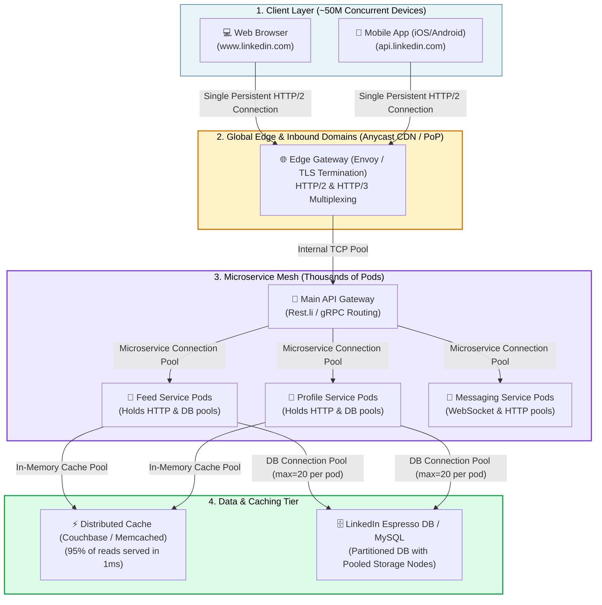
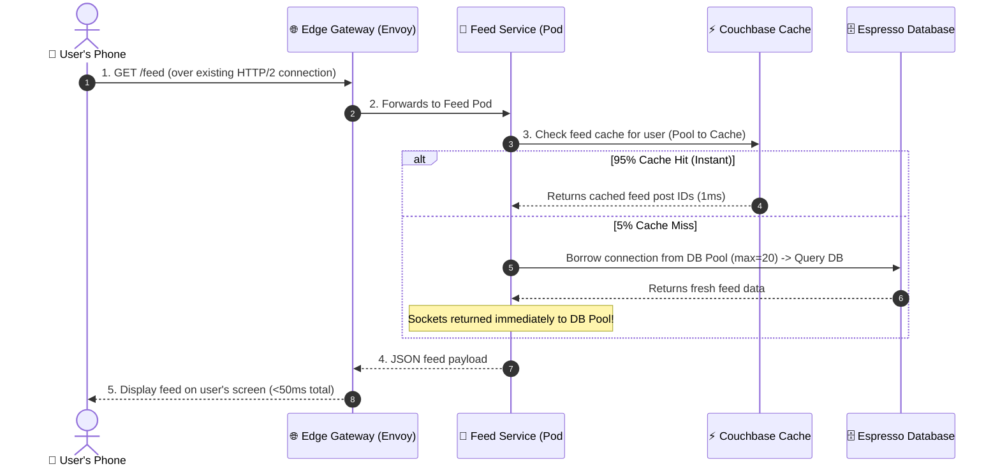

# 📌 Real-World Architecture: LinkedIn at Scale (~50M+ Concurrent Users)

> **Topic Context**: LinkedIn Web & Mobile Client Architecture, Edge Gateways, HTTP/2 Multiplexing, Microservice Pools, and Database Connection Management

---

### 1. 📊 The Scale of LinkedIn
* **Active User Base**: ~1 Billion+ members worldwide.
* **Concurrent Active Users**: **Tens of millions** scrolling feeds, viewing profiles, and messaging simultaneously during global peak hours.
* **Incoming Traffic**: **100,000+ to 500,000+ API requests per second (RPS)** hitting LinkedIn servers.

If every user opened a direct database connection, LinkedIn's database would require **50,000,000 simultaneous connections** and would crash in milliseconds. Here is how connection pooling and domains make this scale possible:

---

### 2. 🏗️ The 4-Tier LinkedIn Architecture

---

### 3. 📱 Client Perspective: Web vs. Mobile App

#### A. Inbound Domains
* **Web**: Hits `https://www.linkedin.com` $\rightarrow$ Browser downloads HTML/JS/CSS and opens a persistent HTTP/2 connection to fetch live data.
* **Mobile App (iOS / Android)**: Hits `https://api.linkedin.com` or `https://gateway.linkedin.com` $\rightarrow$ Native networking client (e.g., OkHttp on Android, URLSession on iOS) maintains **1 single persistent HTTP/2 or HTTP/3 TCP/QUIC connection** to the nearest LinkedIn Edge server.

#### B. The Magic of HTTP/2 Multiplexing
Instead of opening a new connection for your profile picture, another for the job alerts, and another for the feed:
* Your phone sends **all requests over 1 single multiplexed connection**.
* Zero connection overhead for each swipe or tap!

---

### 4. ⚙️ How Connection Pools Work Inside LinkedIn's Backend

When you pull-to-refresh your LinkedIn feed:

#### How the Math Works at Scale:
- **50,000,000 Users** are connected to Edge Gateways over multiplexed connections.
- Edge Gateways route traffic to **1,000 Feed Service Pods**.
- Each Feed Service Pod has a DB Connection Pool with **`max_size = 20`**.
- Total open database connections = $1,000 \text{ pods} \times 20 \text{ connections} = \mathbf{20,000 \text{ DB connections}}$.
- The database easily handles 20,000 stable, persistent connections, serving millions of users seamlessly!

---

### 5. 💡 The Real-World Analogy: The Mega Airport Hub

* **50 Million Passengers (LinkedIn Users)**: People traveling from all around the world.
* **The Airport Check-in Gate (Edge Domain `api.linkedin.com`)**: Where passengers arrive and scan their boarding pass.
* **The High-Speed Automated People Mover / Monorail (Connection Pools)**:
  * Instead of every passenger driving their own car directly onto the runway, everyone rides the continuous **Airport Monorail** that loops between terminals every 10 seconds.
* **The Airplanes (The Databases)**: Only boarding a fixed number of passengers at a time through organized gates. The runway is never jammed, and millions of travelers fly smoothly every day!
