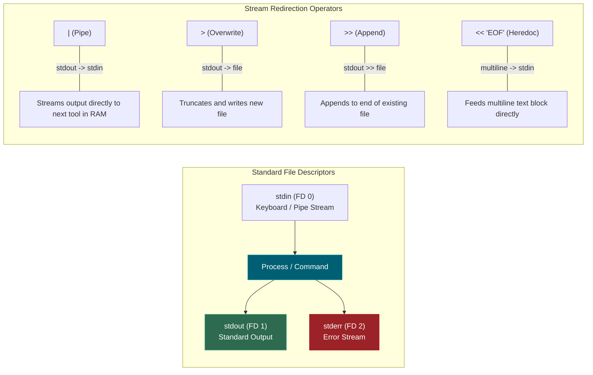
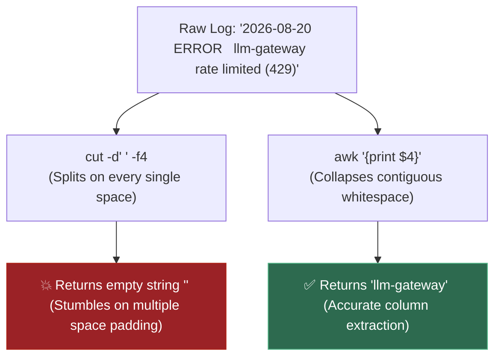

# 📌 Linux CLI Prerequisites: Echo, Cat, Awk, Streams & Command Flags

> **Reference / Context**: [10_linux_cli.md](file:///d:/Madhan_Utils/learnings/ai-ml/ai-ml-course/course-path/phase-0-engineering-foundations/10_linux_cli.md) | [linux-pipe-echo-grep-wc.md](file:///d:/Madhan_Utils/learnings/ai-ml/ai-ml-course/explanations/linux-pipe-echo-grep-wc.md) | [what-is-posix.md](file:///d:/Madhan_Utils/learnings/ai-ml/ai-ml-course/explanations/what-is-posix.md)

---

### 1. 🎯 What is it? (In Plain English)

Standard POSIX tools (`echo`, `cat`, `awk`, `grep`) and command-line flags form the foundational text-manipulation toolkit of Unix/Linux. They allow engineers to generate, concatenate, stream, slice, and filter tabular and semi-structured text across memory buffers without creating temporary intermediate files on disk.

---

### 2. 🔤 Command Name Etymology & Literal Meanings

Unix commands were written in the late 1960s and 1970s for slow teletype terminals (ASR-33), so command names were aggressively shortened. Understanding what the acronyms actually stand for removes the mystery:

| Command             | Literal Origin / Acronym                                                                                    | Core Historical Meaning & Purpose                                                                                         |
| :------------------ | :---------------------------------------------------------------------------------------------------------- | :------------------------------------------------------------------------------------------------------------------------ |
| **`echo`**  | **Echo** (Acoustic reflection)                                                                        | Repeats ("echoes") the given string back to standard output.                                                              |
| **`cat`**   | **conCATenate**                                                                                       | Concatenates (links end-to-end) and prints multiple files to standard output.                                             |
| **`grep`**  | **g/re/p** (**G**lobally search for **R**egular **E**xpression and **P**rint) | From the original Unix`ed` line editor command `g/re/p` — search entire file for a regex and print matches.          |
| **`awk`**   | **A**ho, **W**einberger, **K**ernighan                                                    | Named after its three Bell Labs creators: Alfred**A**ho, Peter **W**einberger, and Brian **K**ernighan. |
| **`uniq`**  | **UNIQ**ue                                                                                            | Filters out or counts duplicate adjacent lines from a sorted stream.                                                      |
| **`sort`**  | **SORT**                                                                                              | Sorts lines of text alphabetically or numerically in ascending/descending order.                                          |
| **`cut`**   | **CUT**                                                                                               | Slices out specific sections/columns from each line based on byte positions or single delimiters.                         |
| **`sed`**   | **S**tream **ED**itor                                                                           | Non-interactive batch text editor that parses and transforms continuous data streams.                                     |
| **`ls`**    | **L**i**S**t                                                                                    | Lists files, directories, and filesystem metadata.                                                                        |
| **`du`**    | **D**isk **U**sage                                                                              | Calculates disk space used by files and directory trees.                                                                  |
| **`df`**    | **D**isk **F**ree                                                                               | Reports total and available disk space across all mounted storage filesystems.                                            |
| **`ss`**    | **S**ocket **S**tatistics                                                                       | Modern utility that directly dumps kernel TCP/UDP network socket states.                                                  |
| **`ps`**    | **P**rocess **S**tatus                                                                          | Displays a point-in-time snapshot of active running processes and their PIDs.                                             |
| **`kill`**  | **KILL**                                                                                              | Sends POSIX operating system signals (e.g.`SIGTERM`, `SIGKILL`) to a process ID.                                      |
| **`dmesg`** | **D**isplay **MES**sa**G**e                                                               | Displays or controls the kernel message ring buffer (shows OOM kills and hardware events).                                |
| **`chmod`** | **CH**ange **MOD**e                                                                             | Changes the file system mode (read, write, execute permissions) on files and directories.                                 |
| **`tail`**  | **TAIL** (End of animal)                                                                              | Outputs the last ("tail") part of files or continuously streams new appends (`-f`).                                     |
| **`head`**  | **HEAD** (Beginning of animal)                                                                        | Outputs the first ("head") part (default: first 10 lines) of files or streams.                                            |
| **`wc`**    | **W**ord **C**ount                                                                              | Counts lines (`-l`), words (`-w`), and bytes (`-c`) from input streams.                                             |
| **`tmux`**  | **T**erminal **MU**ltiple**X**er                                                          | Multiplexes one terminal window into multiple pseudo-terminals and detached sessions.                                     |
| **`touch`** | **TOUCH**                                                                                             | Updates file access/modification timestamps, or creates an empty file if it doesn't exist.                                |
| **`mkdir`** | **M**a**K**e **DIR**ectory                                                                | Creates one or more new directories in the filesystem hierarchy.                                                          |

---

### 3. 💡 The Real-World Analogy: The Industrial Assembly Line

- **`echo`** is the **raw material dispenser**: it feeds a specific stream of parts or test blocks into the beginning of the belt.
- **`cat`** is the **warehouse unloader**: it opens one or more storage crates (files) and dumps their contents continuously onto the conveyor belt.
- **Pipe (`|`)** is the **conveyor belt**: it passes products from the exit of one station directly into the intake of the next without dropping them on the floor.
- **`grep`** is the **quality inspector with a stencil**: it lets only items matching a specific pattern through to the next station.
- **`awk`** is the **smart sorter**: it looks at each multi-column box passing by, ignores messy spacing between labels, and snatches only the exact column or message needed.
- **`uniq -c`** is the **tally counter**: it tallies consecutive identical items moving along the belt.
- **Flags (`-e`, `-rn`, `-ltnp`)** are the **machine settings dials**: they configure whether a tool operates recursively, shows line numbers, handles escape characters, or filters for specific network protocols.

---

### 4. 🎨 Visual Flowcharts (Mermaid)

#### A. Standard POSIX Stream Architecture & Pipeline Redirection



#### B. Delimiter Parsing: `cut` vs. `awk` on Padded Logs



---

### 5. ⚡ Deep-Dive Technical Breakdown

#### 5.1 — `echo`: String Generation & Stream Injection

`echo` writes strings to `stdout`. It is heavily used in testing, log mocking, and variable initialization.

```bash
# Default echo: outputs text with trailing newline
echo "Hello World"

# -n flag: suppress trailing newline
echo -n "user_id="; echo "4821"

# -e flag: enable interpretation of backslash escapes (\n, \t)
echo -e "500\n200\n500\n404\n500" | grep "500" | wc -l
# Output: 3
```

#### 5.2 — `cat`: File Concatenation & Heredocs

`cat` reads file data sequentially and emits it to `stdout`.

```bash
# 1. Read and print entire file
cat /var/log/nginx/access.log

# 2. Heredoc: Create multi-line files without an interactive editor
cat << 'EOF' > server.log
2026-08-20T12:00:01 INFO  api-gateway    Request /v1/chat/completions 200 OK
2026-08-20T12:00:02 ERROR llm-gateway    rate limited by provider (429)
2026-08-20T12:00:04 ERROR llm-gateway    timeout calling provider (504)
EOF
```

> **Trap**: Quoting `'EOF'` prevents the shell from expanding environment variables (`$VAR`) or command substitutions (`$(cmd)`) inside the payload before writing to disk.

#### 5.3 — `awk`: Columnar Slicing & Text Pattern Matching

`awk` processes structured and semi-structured text line-by-line.

##### Special Built-in Variables:

- `$0`: The entire current line.
- `$1`, `$2`, ..., `$N`: The 1st, 2nd, and Nth whitespace-delimited fields.
- `NF`: Number of fields on the current line.
- `NR`: Current line/record number.

##### Key Patterns Used in Topic 0.10:

```bash
# Extract the first column (even with irregular leading spaces)
echo "   42   user_a" | awk '{print $1}'
# Output: 42

# Pattern matching: extract columns 9 and 11 only from lines containing 'MiB'
nvidia-smi | awk '/MiB/ {print $9, $11}'

# Substring extraction: isolate variable-length error messages starting at column 4
grep "ERROR" server.log | awk '{print substr($0, index($0,$4))}'
```

---

### 6. 🛠️ Master CLI Flag Reference for Topic 0.10

| Command             | Flag                | Name            | Exact Meaning & System Behavior                                                    |
| ------------------- | ------------------- | --------------- | ---------------------------------------------------------------------------------- |
| **`echo`**  | `-e`              | Escapes         | Enables interpretation of backslash escapes (`\n`, `\t`).                      |
|                     | `-n`              | No newline      | Suppresses automatic trailing newline character.                                   |
| **`grep`**  | `-r` / `-R`     | Recursive       | Recursively traverses all subdirectories.                                          |
|                     | `-n`              | Line numbers    | Prefixes matching output with line numbers (e.g.`config.py:4:`).                 |
|                     | `-i`              | Ignore case     | Case-insensitive matching (`grep -i oom` matches `OOM` and `oom`).           |
|                     | `--exclude-dir`   | Exclude dir     | Skips scanning specified folder trees (e.g.`--exclude-dir=.venv`).               |
| **`sort`**  | `-r`              | Reverse         | Inverts sort order to descending.                                                  |
|                     | `-n`              | Numeric         | Sorts numerically (e.g.`2` before `10`, rather than `10` before `2`).      |
|                     | `-h`              | Human numeric   | Compares human-readable units accurately (`2G` sorted above `900M`).           |
| **`uniq`**  | `-c`              | Count           | Counts duplicate adjacent lines.**Requires `sort` first**.                 |
| **`ls`**    | `-l`              | Long format     | Displays file permissions, owner, size, and modification timestamp.                |
|                     | `-a`              | All             | Includes hidden dotfiles (`.env`, `.venv`, `.git`).                          |
|                     | `-h`              | Human sizes     | Converts raw byte counts into KB, MB, GB formats (`ls -lah`).                    |
| **`du`**    | `-s`              | Summary         | Displays aggregate folder size instead of listing every sub-item.                  |
|                     | `-h`              | Human units     | Prints sizes in`M` and `G`.                                                    |
|                     | `--`              | End of options  | Instructs`du` that remaining tokens are file arguments, not flags.               |
| **`ss`**    | `-l`              | Listening       | Filters only listening sockets waiting for connections.                            |
|                     | `-t`              | TCP             | Displays TCP sockets only (excludes UDP/raw sockets).                              |
|                     | `-n`              | Numeric         | Shows IP/port numbers directly; skips slow DNS reverse lookups.                    |
|                     | `-p`              | Processes       | Shows process names and PIDs bound to the port.                                    |
| **`kill`**  | `-TERM` / `-15` | SIGTERM         | Polite shutdown request. Allows process to flush buffers and close sockets.        |
|                     | `-KILL` / `-9`  | SIGKILL         | Immediate kernel vaporization. Process cannot catch or clean up.                   |
| **`dmesg`** | `-T`              | Timestamps      | Converts kernel uptime deltas into human-readable calendar dates.                  |
| **`tail`**  | `-f`              | Follow          | Continuously streams new lines appended to a file in real-time.                    |
|                     | `-n <N>`          | Line count      | Emits the last`<N>` lines of a file (e.g. `tail -n 2`).                        |
| **`set`**   | `-e`              | Exit on error   | Terminate script immediately on non-zero exit code.                                |
|                     | `-u`              | Unset variables | Treat unbound variables as errors.                                                 |
|                     | `-o pipefail`     | Pipe safety     | Pipeline fails if any upstream command fails, not just the last.                   |
|                     | `-a` / `+a`     | Export env      | Automatically export created variables (`set -a`), then toggle off (`set +a`). |

---

### 7. ⚠️ Pro-Tips & Common Gotchas

1. **The `uniq -c` Silent Failure**: `uniq` only collapses **consecutive duplicate lines**. If input is `[200, 500, 200]`, `uniq -c` reports `1 200`, `1 500`, `1 200`. Always run `sort | uniq -c`.
2. **The `du -sh */` Dotfile Trap**: Shell glob `*/` skips dot-directories. `.venv/` and `.cache/` will be invisible. Always use `du -sh -- * .[!.]* | sort -rh`.
3. **Unsafe CI Pipelines**: Default shell pipelines only check the exit code of the *final* command. In `grep ERROR missing.log | wc -l`, `grep` fails (exit 2) but `wc -l` succeeds (exit 0), causing broken CI steps to pass forever. Always declare `set -euo pipefail`.
