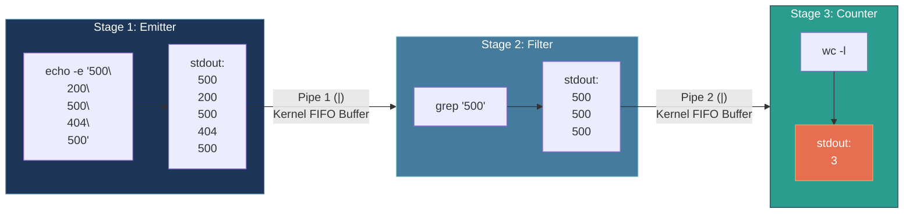

# 📌 Anatomy of a Linux Pipeline: `echo -e "500\n200\n500\n404\n500" | grep "500" | wc -l`

> **Reference / Context**: [10_linux_cli.md](file:///d:/Madhan_Utils/learnings/ai-ml/ai-ml-course/course-path/phase-0-engineering-foundations/10_linux_cli.md#L33-L65) | [what-is-unix.md](file:///d:/Madhan_Utils/learnings/ai-ml/ai-ml-course/explanations/what-is-unix.md) | [07_http_fundamentals.md](file:///d:/Madhan_Utils/learnings/ai-ml/ai-ml-course/course-path/phase-0-engineering-foundations/07_http_fundamentals.md)

---

### 1. 🎯 What does this command do? (In Plain English)

This command simulates a stream of 5 web server HTTP status codes, filters out everything except the **500 Internal Server Errors**, and counts how many errors occurred—producing the final output `3`.

It performs this entire 3-stage operation in **kernel memory (RAM)** through Unix stream pipes (`|`) without saving a single temporary file to disk.

---

### 2. 💡 The Real-World Analogy: The Quality Control Sieve

Think of a water filtration and counting station:
1. **`echo -e` (The Water Hose)**: Pours 5 colored balls down a tube: 🔴 Red (500), 🟢 Green (200), 🔴 Red (500), 🟡 Yellow (404), 🔴 Red (500).
2. **`|` (The Connecting Pipe)**: A sealed tube connecting Station 1 directly to Station 2.
3. **`grep "500"` (The Color Sieve)**: A filter that catches and discards the Green (200) and Yellow (404) balls, letting only the 3 Red (500) balls pass through.
4. **`wc -l` (The Turnstile Counter)**: A mechanical clicker at the end of the tube that clicks `+1` for every red ball that drops through, displaying `3`.

---

### 3. 🎨 Visual Execution Pipeline (Mermaid)



---

### 4. ⚡ Step-by-Step Command Breakdown

```bash
echo -e "500\n200\n500\n404\n500" | grep "500" | wc -l
```

| Component | Flag / Symbol | Purpose in this Pipeline |
| :--- | :--- | :--- |
| **`echo`** | `-e` | **Enable escape sequences**. Without `-e`, `echo` literally prints `\n` as two characters. With `-e`, it converts `\n` into actual newline line breaks, emitting a 5-line stream. |
| **`\|`** (Pipe 1) | `\|` | **Connects stdout to stdin**. Re-routes `echo`'s 5-line output stream directly into `grep`'s standard input via kernel memory buffer. |
| **`grep`** | `"500"` | **Global Regular Expression Print**. Scans incoming lines and passes forward only lines matching the string `"500"`. Discards `200` and `404`. |
| **`\|`** (Pipe 2) | `\|` | Passes the filtered 3-line stream from `grep` directly into `wc`. |
| **`wc`** | `-l` | **Word Count (Lines)**. Counts the number of newline characters received in its `stdin`. Receives 3 lines, outputting `3`. |

---

### 5. ⚠️ Common Gotchas & Pro-Tips

1. **Missing `-e` Flag**: If you run `echo "500\n200\n500"` without `-e` in standard bash, `grep "500"` sees only **1 single line** containing backslashes, so `wc -l` outputs `1` instead of `3`.
2. **Real AI/Production Analogy**: This exact 3-stage pattern is how engineers count production AI errors in real time without downloading gigabytes of logs:
   ```bash
   cat /var/log/fastapi/access.log | grep " 500 " | wc -l
   ```
