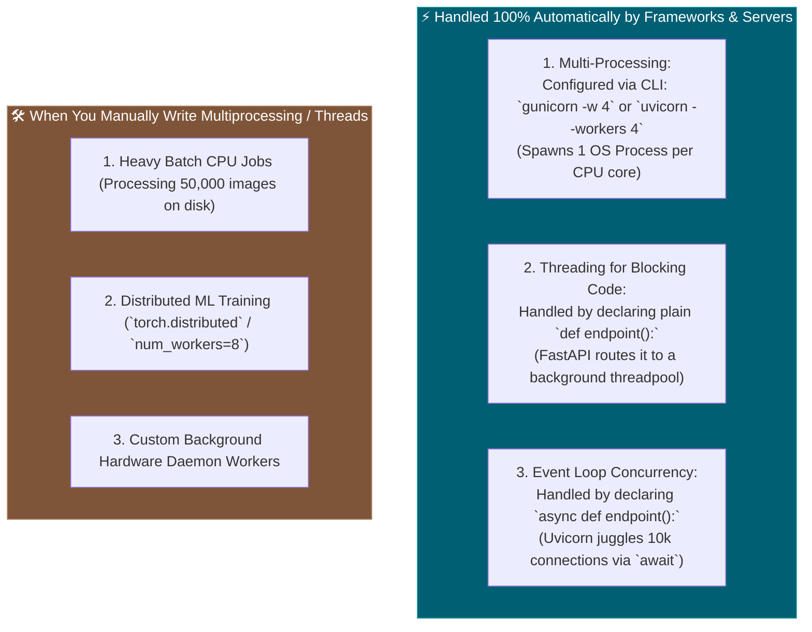

# 📌 Manual vs. Automatic Multiprocessing & Threading

> **Reference / Context**: [03_async_typehints_pydantic.md](file:///d:/Madhan_Utils/learnings/ai-ml/ai-ml-course/course-path/phase-0-engineering-foundations/03_async_typehints_pydantic.md) | [09_building_apis_with_fastapi.md](file:///d:/Madhan_Utils/learnings/ai-ml/ai-ml-course/course-path/phase-0-engineering-foundations/09_building_apis_with_fastapi.md) | [threads-vs-event-loop-explained.md](file:///d:/Madhan_Utils/learnings/ai-ml/ai-ml-course/explanations/threads-vs-event-loop-explained.md) | [complete-fastapi-and-systems-architecture-guide.md](file:///d:/Madhan_Utils/learnings/ai-ml/ai-ml-course/explanations/complete-fastapi-and-systems-architecture-guide.md)

---

### 1. 🎯 What is Automatic vs. What is Manual?

In modern web development (FastAPI / Uvicorn), **you almost NEVER write manual `threading.Thread` or `multiprocessing.Process` code yourself**.

The frameworks, web servers, and runtime libraries manage processes, worker threads, and event loops **automatically under the hood** through configuration flags and function keywords:



---

### 2. ⚡ How Automation Works in FastAPI & Uvicorn

#### 1. Automatic Multi-Processing (Zero Code Required)
You never write `multiprocessing.Process` in your web code. You configure workers at the deployment level:
```bash
# Spawns 4 independent OS processes across 4 CPU cores:
uvicorn main:app --workers 4

# Or in production with Gunicorn:
gunicorn -w 4 -k uvicorn.workers.UvicornWorker main:app
```

#### 2. Automatic Threading (Controlled by `def` vs `async def`)
FastAPI determines whether to run your code on the Event Loop thread or in a background worker threadpool simply by inspecting how you defined your function:

```python
# A. Runs on the SINGLE Event Loop Thread (Non-blocking I/O)
@app.get("/users")
async def get_users():
    return await db.fetch_all()

# B. AUTOMATICALLY routed to a background OS Threadpool (Blocking/Sync)
@app.get("/heavy-calc")
def calculate_risk():
    time.sleep(1) # Safe! FastAPI runs this in a background thread without freezing the server.
    return {"risk": 0.42}
```

---

### 3. 🛠️ The Rare Scenarios Where You Write Manual Code

You only manually reach for `multiprocessing` or `threading` when writing **standalone scripts, data pipelines, or ML training code**:

| Task | Manual Technique | Why It Needs Manual Code |
|---|---|---|
| **Batch CPU Image/Data Processing** | `from multiprocessing import Pool` | Bypasses Python's GIL to use 100% of all CPU cores for offline batch jobs. |
| **PyTorch Fast Data Ingestion** | `DataLoader(dataset, num_workers=8)` | PyTorch spawns 8 background worker processes to decode images while the GPU trains. |
| **Delegating a sync call inside `async def`** | `await asyncio.to_thread(cpu_math)` | Manually offloads a blocking function to Python's internal threadpool. |
