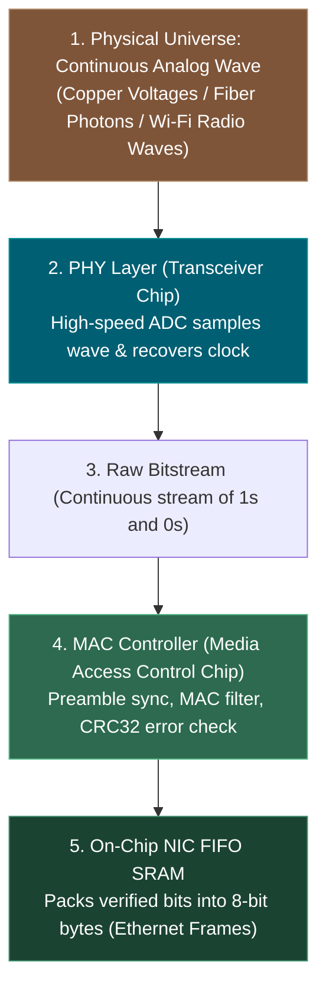
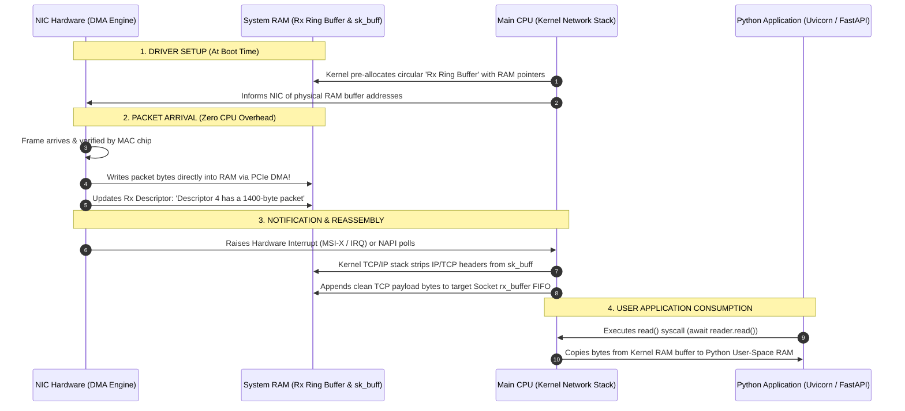
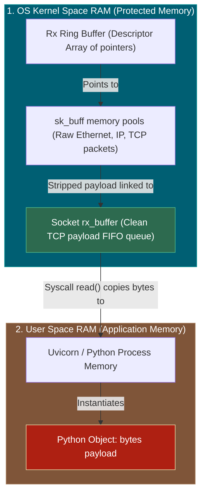

# 📌 Network Interface Cards (NIC), Physical-to-Digital Ingestion, DMA & Kernel Buffers

> **Reference / Context**: [how-web-servers-bind-sockets-tls-and-bytes.md](file:///d:/Madhan_Utils/learnings/ai-ml/ai-ml-course/explanations/how-web-servers-bind-sockets-tls-and-bytes.md) | [09_building_apis_with_fastapi.md](file:///d:/Madhan_Utils/learnings/ai-ml/ai-ml-course/course-path/phase-0-engineering-foundations/09_building_apis_with_fastapi.md)

---

### 1. 🎯 What is a Network Card (NIC)?

A **Network Interface Card (NIC)** is the dedicated hardware expansion chip on your motherboard (e.g. Intel, Realtek, Broadcom) that bridges the **physical world** (copper voltage, radio waves, light pulses) with the **digital world** (binary bytes in RAM).

---

### 2. ⚡ How the NIC Translates the Physical Universe into Digital Bits

How does an analog physical signal turn into a binary `0` or `1`? The NIC processes this in **3 specialized silicon stages**:

#### Stage A: The PHY Transceiver (Analog $\rightarrow$ Digital Conversion)
- **On Copper (Ethernet)**: High-frequency voltage pulses (e.g., $+1\text{V}, 0\text{V}, -1\text{V}$ using MLT-3 / PAM modulation). An ultra-fast **Analog-to-Digital Converter (ADC)** inside the PHY chip samples the voltage line billions of times per second.
- **On Fiber Optics**: A **photodiode** detects laser photons. Light pulse = `1`, No light = `0`.
- **On Wi-Fi (Radio)**: An **RF Demodulator** decodes phase and amplitude shifts (QAM modulation) from $2.4\text{GHz} / 5\text{GHz}$ electromagnetic waves.
- **Clock & Data Recovery (CDR)**: The PHY chip synchronizes its internal clock with the sender's clock so it knows *exactly when* to sample each incoming bit.

#### Stage B: The MAC Layer Controller (Framing & Verification)
The raw bitstream enters the **MAC Controller silicon**:
1. **Preamble Synchronization**: The sender transmits `10101010...` followed by the **Start Frame Delimiter** (`10101011`) so the NIC knows: *"The Ethernet frame starts right now."*
2. **Hardware MAC Filtering**: The NIC reads the Destination MAC Address. If the frame is NOT addressed to this machine's MAC address (and is not broadcast `FF:FF:FF:FF:FF:FF`), **the NIC drops the frame instantly in silicon** without wasting CPU cycles.
3. **CRC32 Checksum (Error Check)**: The NIC calculates a math hash (Frame Check Sequence / FCS). If electrical noise flipped even a single bit, the frame is silently destroyed.
4. **Byte Assembly**: Verified bits are grouped into 8-bit bytes and placed in the NIC's small onboard SRAM memory.

---

### 3. 🧠 How Kernel Buffers Relate to RAM and DMA (Direct Memory Access)

Once the NIC has the packet bytes in its onboard SRAM, how do they get into system RAM so Python can read them?

#### ⚠️ The Disaster Without DMA (Why DMA Exists)
Without DMA, the main CPU would have to execute an instruction to copy every single byte across the motherboard bus. At **10 Gbps (1.25 GB/sec)**, your CPU would spend 100% of its power simply moving bytes from the NIC into RAM—freezing all application code!

#### ✅ The DMA Solution: Hardware-to-RAM Direct Writing
**DMA (Direct Memory Access)** allows the NIC's onboard DMA controller to become a "bus master." It communicates directly with the motherboard's PCIe bus and memory controller, writing packets straight into **System RAM without interrupting the CPU**.

---

### 4. 🔬 The Memory Hierarchy: From Physical RAM Stick to Python String

To understand where "Kernel Buffers" live, look at how the OS slices physical RAM:

1. **Kernel Space RAM**: Protected memory region managed by the OS. Regular programs cannot touch this memory directly (for security and stability).
2. **Rx Ring Buffer**: A fixed circular array of memory pointers in Kernel RAM.
3. **`sk_buff` (Socket Buffer in Linux)**: The kernel's internal C-struct that wraps the raw network packet.
4. **Socket `rx_buffer` FIFO**: The specific per-connection FIFO buffer where reassembled TCP bytes wait for your application.
5. **User Space RAM**: Where Python, Uvicorn, and FastAPI live. When Python calls `await reader.read(4096)`, the OS kernel copies the bytes across the user/kernel memory boundary into Python's address space.

---

### 5. 💡 Summary Analogy: The Automated Harbor

- **The Sea & Waves**: The physical wire carrying electrical voltage pulses.
- **The Harbor Crane (The NIC PHY + MAC)**: Detects arriving ships, verifies their flags, and unpacks shipping containers.
- **The Autonomous Railroad (DMA)**: Moves the shipping containers straight from the crane into the **Central Warehouse (Kernel RAM)** without calling the city mayor (CPU).
- **The Local Store Clerk (FastAPI / Uvicorn)**: Walks into the warehouse loading dock (`read()` syscall), takes the package, and opens the goods for the customer.
