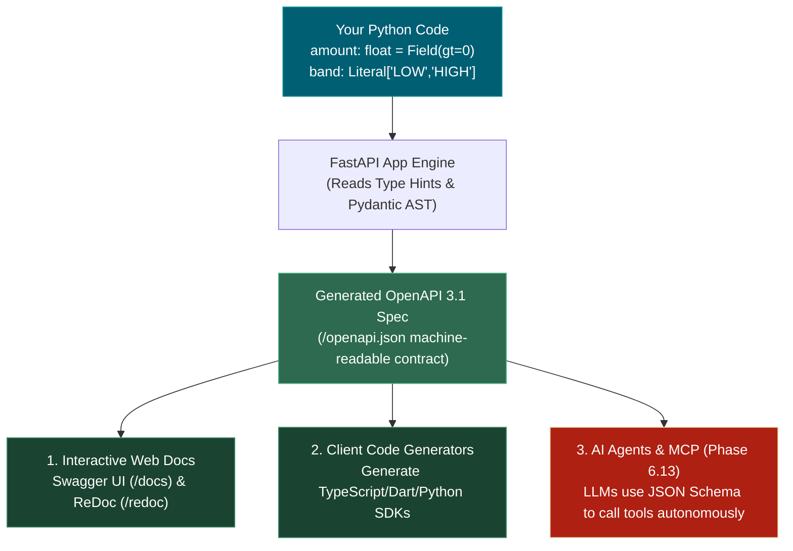

# 📌 OpenAPI Specification in FastAPI

> **Reference / Context**: [03_async_typehints_pydantic.md](file:///d:/Madhan_Utils/learnings/ai-ml/ai-ml-course/course-path/phase-0-engineering-foundations/03_async_typehints_pydantic.md) | [08_consuming_rest_apis.md](file:///d:/Madhan_Utils/learnings/ai-ml/ai-ml-course/course-path/phase-0-engineering-foundations/08_consuming_rest_apis.md) | [09_building_apis_with_fastapi.md](file:///d:/Madhan_Utils/learnings/ai-ml/ai-ml-course/course-path/phase-0-engineering-foundations/09_building_apis_with_fastapi.md) | [`09_building_apis_with_fastapi.py`](file:///d:/Madhan_Utils/learnings/ai-ml/ai-ml-course/course-path/phase-0-engineering-foundations/09_building_apis_with_fastapi.py)

---

### 1. 🎯 What is it? (In Plain English)
**OpenAPI** is an open, vendor-neutral standard (a formal JSON or YAML specification) that describes the exact contract of an API—every route, HTTP method, required input field, data type, validation rule, and possible response status code.

In FastAPI, **you never write or maintain this schema by hand**. FastAPI automatically generates the entire OpenAPI JSON document at runtime directly by inspecting your Python type hints and Pydantic models.

---

### 2. 💡 The Real-World Analogy
Think of OpenAPI like a **Standardized Architectural Electrical Blueprint**:
- Rather than an electrician having to open every wall to guess the voltage, socket shapes, and wire thickness, the architect provides a standard ISO blueprint.
- Any tool, appliance manufacturer, or foreign contractor can read that blueprint and build compatible plugs without ever speaking to the original builder.
- In software, client developers (frontend, mobile, AI agents) read your `/openapi.json` blueprint to know exactly what payload shapes your API demands.

---

### 3. 🎨 Visual Flowchart (Mermaid)



---

### 4. ⚡ Quick Code / Practical Example (Minimal & Clear)

When you write this minimal FastAPI code:

```python
from fastapi import FastAPI
from pydantic import BaseModel, Field

app = FastAPI()

class InvoiceRequest(BaseModel):
    vendor: str = Field(..., min_length=1)
    amount: float = Field(..., gt=0)

@app.post("/score")
def score_invoice(req: InvoiceRequest):
    return {"status": "ok"}
```

FastAPI automatically generates this OpenAPI JSON object (viewable via `app.openapi()` or at `http://127.0.0.1:8000/openapi.json`):

```json
{
  "paths": {
    "/score": {
      "post": {
        "summary": "Score Invoice",
        "operationId": "score_invoice_score_post",
        "requestBody": {
          "content": {
            "application/json": {
              "schema": {
                "$ref": "#/components/schemas/InvoiceRequest"
              }
            }
          }
        }
      }
    }
  },
  "components": {
    "schemas": {
      "InvoiceRequest": {
        "type": "object",
        "required": ["vendor", "amount"],
        "properties": {
          "vendor": { "type": "string", "minLength": 1, "title": "Vendor" },
          "amount": { "type": "number", "exclusiveMinimum": 0.0, "title": "Amount" }
        }
      }
    }
  }
}
```

---

### 5. ⚠️ Pro-Tip / Connection to AI & MCP (Phase 6.13)
- **Why this matters for AI Engineers**: Modern LLM Tool Calling (OpenAI Function Calling, Anthropic Tool Use, and Model Context Protocol / MCP) is built entirely on the JSON Schema standard embedded within OpenAPI.
- When an AI agent decides how to execute a tool, it is directly parsing this machine-generated schema to decide which parameters to supply.
- **The Core Rule**: Always annotate endpoint signatures with precise types and `Field(...)` constraints. Your annotations don't just validate incoming web traffic—they teach AI models how to invoke your code correctly without human intervention.
