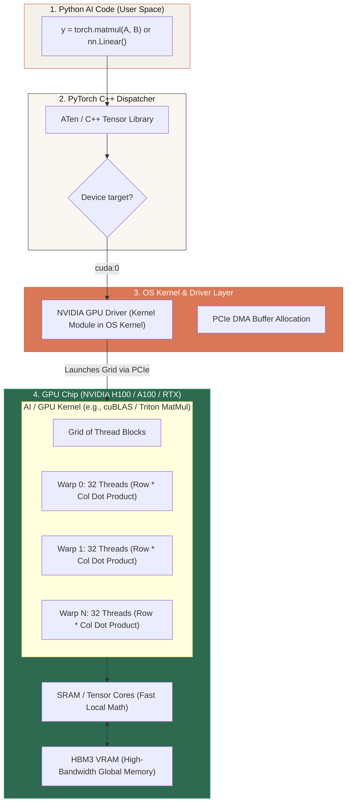

# 📌 OS Kernel vs. AI/GPU Compute Kernels — Demystifying the Name Collision

> **Reference / Context**: [what-is-the-os-kernel.md](file:///d:/Madhan_Utils/learnings/ai-ml/ai-ml-course/explanations/what-is-the-os-kernel.md) | [interpreter-compiler-bytecode-cpython.md](file:///d:/Madhan_Utils/learnings/ai-ml/ai-ml-course/explanations/interpreter-compiler-bytecode-cpython.md) | [01_python_basics.md](file:///d:/Madhan_Utils/learnings/ai-ml/ai-ml-course/course-path/phase-0-engineering-foundations/01_python_basics.md) | [06_numpy_pandas_matplotlib.md](file:///d:/Madhan_Utils/learnings/ai-ml/ai-ml-course/course-path/phase-0-engineering-foundations/06_numpy_pandas_matplotlib.md)

---

### 1. 🎯 What is an "AI Kernel"? (In Plain English)

[Certain] **Yes, AI/GPU Kernels and OS Kernels are completely different things sharing the same English word.** 
The word *"kernel"* historically means *"seed"* or *"core component"*. Computer science reused this name in two completely separate domains:

1. **OS Kernel (The Master Referee)**: The central software program of an Operating System (Linux, Windows) that manages physical hardware, schedules processes, and enforces security between user apps and the CPU/RAM/Disks.
2. **AI / GPU Compute Kernel (The Math Recipe)**: A specialized micro-program (written in CUDA, Triton, C++, or OpenCL) designed to run simultaneously across **thousands of GPU cores** to perform parallel tensor math (Matrix Multiplication, Softmax, LayerNorm, FlashAttention).

```
┌────────────────────────────────────────────────────────────────────────────┐
│                             THE TWO KERNELS                                │
├─────────────────────────────────────┬──────────────────────────────────────┤
│              OS KERNEL              │          AI / GPU KERNEL             │
├─────────────────────────────────────┼──────────────────────────────────────┤
│ • Controls the entire computer      │ • Computes a specific math equation  │
│ • Runs on CPU (privileged Ring 0)   │ • Runs on GPU (thousands of cores)   │
│ • Manages memory, files, networking │ • Does Matrix Multiplications (GEMM) │
│ • Example: Linux, Windows NT Kernel │ • Example: FlashAttention, CUDA MatMul│
└─────────────────────────────────────┴──────────────────────────────────────┘
```

---

### 2. 💡 The Real-World Analogy

Imagine a massive **Automobile Manufacturing Factory**:

- **The OS Kernel** is the **Factory General Manager**. 
  - They control the power grid, open and lock security doors, assign workers to shifts, manage storage warehouses, and decide who gets access to raw materials. They don't assemble screws themselves; they manage the facility.
- **The AI Kernel** is a **Specialized Robotic Stamping Press** on the assembly line.
  - It does exactly ONE mechanical job: pressing 1,000 sheets of metal at the exact same fraction of a second in parallel. It has no idea who owns the factory, doesn't care about security doors, and can't manage storage. It only crunches metal at lightning speed.

---

### 3. 🎨 Visual Flowchart — How PyTorch Calls an AI Kernel

When you run a neural network layer like `output = model(input)` in PyTorch, here is how Python code reaches an **AI GPU Kernel**:



---

### 4. 🔬 Why Do We Need AI/GPU Kernels? (The Memory Wall & Loops)

Why can't Python or normal C++ code just do a `for` loop to multiply matrices?

#### The Problem: Python Loops vs. GPU Parallelism
If you multiply two $4096 \times 4096$ matrices in pure Python:
- Operations needed: $\approx 68 \text{ billion}$ multiplications and additions.
- Python CPU execution time: **~30 to 60 seconds**.
- An optimized GPU Kernel (CUDA/cuBLAS): **~0.5 milliseconds** (over $60,000\times$ faster!).

#### How an AI Kernel Works Internally:
A GPU does not have 8 or 16 big cores like an Intel/AMD CPU. It has **thousands of tiny cores** (e.g., 16,896 CUDA cores on an RTX 4090).

An **AI Kernel** is written so that:
1. Thread `(0, 0)` computes element `C[0][0]`.
2. Thread `(0, 1)` computes element `C[0][1]`.
3. ...
4. Thread `(4095, 4095)` computes element `C[4095][4095]`.

All 16 million outputs are calculated simultaneously in parallel batches!

---

### 5. ⚡ What a Real AI Kernel Looks Like (Triton / CUDA)

Here is a simplified example of an **AI Kernel written in OpenAI's Triton** (modern Python-like GPU kernel language for AI):

```python
import triton
import triton.language as tl

@triton.jit
def add_kernel(
    x_ptr,  # Pointer to input vector 1 in GPU VRAM
    y_ptr,  # Pointer to input vector 2 in GPU VRAM
    output_ptr, # Pointer to output vector in GPU VRAM
    n_elements, # Total number of numbers to add
    BLOCK_SIZE: tl.constexpr,
):
    # Each GPU thread block gets its own unique ID
    pid = tl.program_id(axis=0)
    
    # Calculate the exact memory offsets this specific thread block is responsible for
    block_start = pid * BLOCK_SIZE
    offsets = block_start + tl.arange(0, BLOCK_SIZE)
    mask = offsets < n_elements

    # 1. Load data from slow GPU VRAM into fast on-chip SRAM registers
    x = tl.load(x_ptr + offsets, mask=mask)
    y = tl.load(y_ptr + offsets, mask=mask)

    # 2. Perform parallel addition on GPU compute units
    output = x + y

    # 3. Write result back to GPU VRAM
    tl.store(output_ptr + offsets, output, mask=mask)
```

**Notice what this kernel does NOT have**:
- No filesystem calls (`open()`, `save()`).
- No user authentication or permission checks.
- No network communication.
- Pure math, memory indexing, and tensor registers.

---

### 6. 🚀 Famous AI Kernels You Will Encounter in LLMs

When reading AI research papers or optimizing LLMs (DeepSeek, LLaMA, GPT-4), you will hear about these famous AI kernels:

| AI Kernel Name | What Math It Does | Why It Changed AI |
|---|---|---|
| **GEMM Kernel (cuBLAS / CUTLASS)** | General Matrix Multiply ($A \times B + C$) | The backbone of all Neural Network Linear/Dense layers. |
| **FlashAttention (v1 / v2 / v3)** | Fused Softmax + Matrix Multiply for Attention | Made Long-Context LLMs (32k to 1M tokens) possible by avoiding slow GPU VRAM round-trips. |
| **Fused LayerNorm / RMSNorm** | Normalizes activation vectors in-place | Eliminates intermediate memory allocations between transformer blocks. |
| **AWQ / GPTQ Quantization Kernels** | Dequantizes 4-bit weights to 16-bit floats on the fly | Allows running 70B parameter LLMs on consumer GPUs (e.g. RTX 3090/4090). |
| **PagedAttention (vLLM)** | Manages KV Cache memory like OS virtual memory | Boosted LLM serving throughput by $4\times$ by eliminating KV cache memory fragmentation. |

---

### 7. ⚖️ Direct Comparison: OS Kernel vs. AI Kernel vs. Other "Kernels"

In computer science, 4 distinct things share the word "Kernel":

| Kernel Type | Where It Runs | Primary Language | Core Responsibility |
|---|---|---|---|
| **OS Kernel** (Linux, Windows NT) | CPU (Ring 0 Privileged) | C, Assembly, Rust | Managing CPU time, RAM paging, File System, Network Sockets, Security. |
| **AI / Compute Kernel** (CUDA, Triton, Metal) | GPU / TPU / NPU | C++, CUDA, Triton, HLSL | Parallel tensor math, matrix multiplication, activation functions. |
| **Classical ML Kernel** (SVM Kernel Trick) | Mathematical Formula (CPU) | Math / Python | Projects data into higher dimensional space (RBF, Polynomial, Linear). |
| **Agentic / Orchestration Kernel** (Semantic Kernel) | Application Framework (CPU) | C#, Python | Orchestrates LLM prompt pipelines, tool calling, and long-term memory. |

---

### 8. ⚠️ Key Takeaway & Mental Model

- When a software engineer says **"The kernel crashed"**, they mean the **Linux/OS Kernel panicked (Blue Screen of Death / Kernel Panic)** — the operating system died.
- When an AI engineer says **"We wrote a custom Triton kernel"**, they mean **they optimized an attention or matrix math algorithm to run $3\times$ faster on an NVIDIA H100 GPU.**
