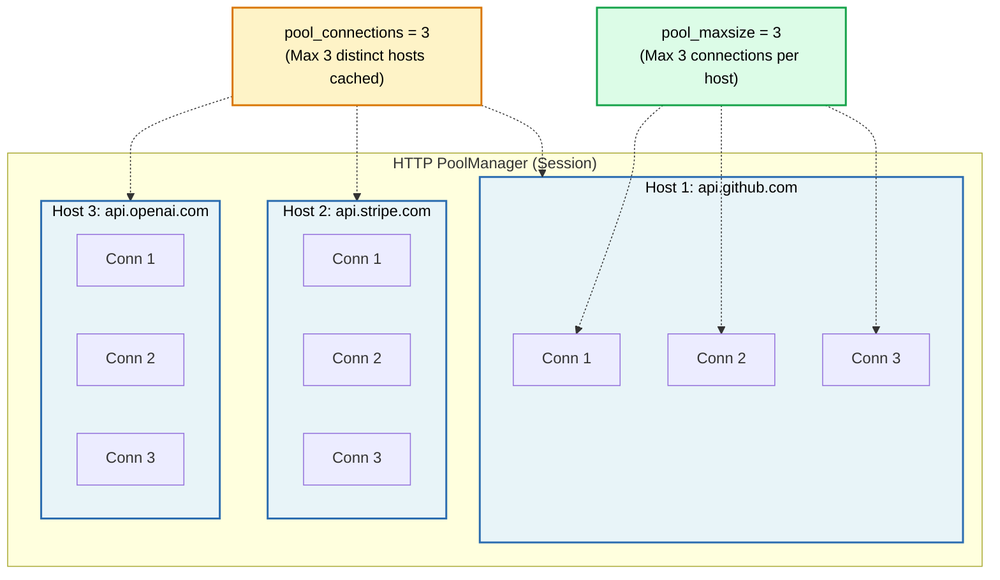

# 📌 `pool_connections` vs `pool_maxsize`

> **Reference / Context**: [07_http_fundamentals.md](file:///d:/Madhan_Utils/learnings/ai-ml/ai-ml-course/course-path/phase-0-engineering-foundations/07_http_fundamentals.md) | [08_consuming_rest_apis.md](file:///d:/Madhan_Utils/learnings/ai-ml/ai-ml-course/course-path/phase-0-engineering-foundations/08_consuming_rest_apis.md) | [`08_consuming_rest_apis.py`](file:///d:/Madhan_Utils/learnings/ai-ml/ai-ml-course/course-path/phase-0-engineering-foundations/08_consuming_rest_apis.py)
> **Context**: Python `requests.adapters.HTTPAdapter` & `urllib3.PoolManager`

---

### 1. 🎯 What is the Difference? (In Plain English)

When using HTTP connection pooling in libraries like Python's `requests` / `urllib3`:

| Parameter | Meaning | Controls... | Default |
| :--- | :--- | :--- | :--- |
| **`pool_connections`** | Number of **different hosts / domains** to save pools for. | *How many distinct targets* (e.g., `google.com`, `github.com`, `stripe.com`) to remember. | `10` |
| **`pool_maxsize`** | Number of **concurrent connections per host** to keep alive. | *How many parallel connections* can be open at once to a *single* domain. | `10` |

---

### 2. 💡 The Real-World Analogy

#### 🚏 The Bus Terminal Analogy
- **`pool_connections` = Number of Destination Platforms**:
  If `pool_connections = 3`, the terminal only maintains dedicated platforms for 3 cities (e.g., *Platform A: New York*, *Platform B: Chicago*, *Platform C: Boston*). If a bus to *Miami* arrives, the terminal has to close one of the older platforms to make room.
- **`pool_maxsize` = Number of Buses Parked per Platform**:
  If `pool_maxsize = 5`, each city's platform can hold up to 5 buses waiting for passengers to that specific destination.

---

### 3. 🎨 Visual Concept (Mermaid)



---

### 4. ⚡ Code Example (Python `requests`)

```python
import requests
from requests.adapters import HTTPAdapter

session = requests.Session()

# Configure pool adapter:
adapter = HTTPAdapter(
    pool_connections=5,  # Cache connection pools for up to 5 unique domains
    pool_maxsize=20      # Allow up to 20 parallel requests to the SAME domain
)

session.mount("https://", adapter)
session.mount("http://", adapter)

# 1. Requests to 5 different domains will reuse their respective pools:
# session.get("https://api.github.com/...")
# session.get("https://api.stripe.com/...")

# 2. Multi-threaded requests to the SAME domain (e.g. 20 concurrent threads to github.com)
# will reuse up to 20 open connections without waiting or throwing warnings.
```

---

### 5. ⚠️ Pro-Tip / When to Change Them

- **Increase `pool_connections`**: If your app calls **many different microservices / external domains** frequently.
- **Increase `pool_maxsize`**: If your app uses **multiple threads / async concurrency** to hammer a **single high-traffic API endpoint**.
- **Warning sign**: If you see `WARNING:urllib3.connectionpool:Connection pool is full, discarding connection`, it means your thread count to that host exceeded `pool_maxsize`!
