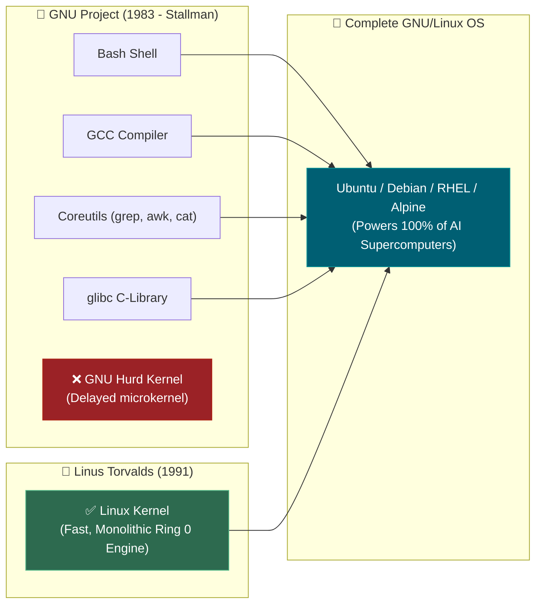
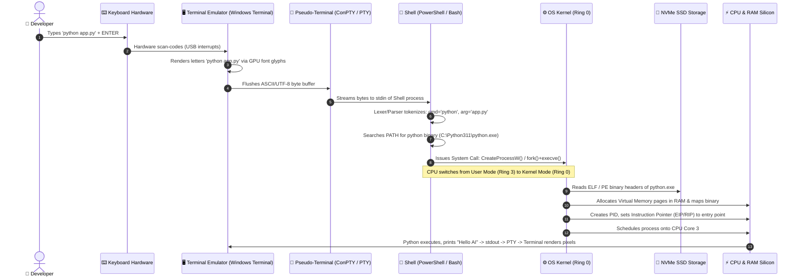

# 📌 POSIX, UNIX, Linux, GNU, Kernel, Terminal & Shell: The Complete Systems Architecture

> **Reference / Context**: [10_linux_cli.md](file:///d:/Madhan_Utils/learnings/ai-ml/ai-ml-course/course-path/phase-0-engineering-foundations/10_linux_cli.md) | [what-is-posix.md](file:///d:/Madhan_Utils/learnings/ai-ml/ai-ml-course/explanations/what-is-posix.md) | [what-is-unix.md](file:///d:/Madhan_Utils/learnings/ai-ml/ai-ml-course/explanations/what-is-unix.md) | [what-is-the-os-kernel.md](file:///d:/Madhan_Utils/learnings/ai-ml/ai-ml-course/explanations/what-is-the-os-kernel.md) | [the-complete-story-of-linux-and-ai.md](file:///d:/Madhan_Utils/learnings/ai-ml/ai-ml-course/explanations/the-complete-story-of-linux-and-ai.md) | [why-is-the-os-so-large.md](file:///d:/Madhan_Utils/learnings/ai-ml/ai-ml-course/explanations/why-is-the-os-so-large.md)

---

### 1. 🎯 What is it? (In Plain English)

Modern computing is built on distinct layers that are frequently confused:
1. **POSIX** is a **standard document / specification** (the rulebook for APIs and commands), not software.
2. **UNIX** is the **ancestral 1969 operating system** and design philosophy; today it is an official compliance standard.
3. **GNU** is an **open-source tool suite project** (`bash`, `gcc`, `grep`, `coreutils`) that built everything needed for an OS *except* a successful kernel.
4. **Linux** is exclusively the **monolithic OS kernel** (the low-level hardware-arbitrating engine created by Linus Torvalds in 1991).
5. **GNU/Linux** is the **complete operating system** (GNU user tools running on top of the Linux kernel).
6. **Terminal** is a **graphical UI application** (window, font renderer, keyboard listener) like Windows Terminal or VS Code Terminal.
7. **Shell** is a **command language interpreter** (e.g., PowerShell, Bash, Zsh) that parses text, manages pipelines, and makes **system calls** asking the **Kernel** to execute programs on the physical hardware.

---

### 2. 💡 The Real-World Analogy: The City Construction Project

| Computing Concept | Real-World Analogy | Function |
| :--- | :--- | :--- |
| **POSIX** | **Universal Building Code & ISO Standards** | The law specifying standardized screw threads, door heights, and electrical voltages. It is written on paper, not built of concrete. |
| **UNIX** | **The Original Historic Roman Architecture** | The classic architectural framework (aqueducts, grid layout, modular bricks) that inspired all modern civil engineering. |
| **GNU** | **The Complete Power Tool Set & Construction Crew** | The excavators, cranes, jackhammers, drills, and worker blueprints (`bash`, `gcc`, `grep`). They had every tool to build a city, but lacked an engine to power them. |
| **Linux Kernel** | **The Heavy-Duty Diesel Engine & Power Grid** | The pure engine (Ring 0) that pumps electricity, routes water, schedules fuel, and commands the heavy machinery. |
| **GNU/Linux Distro (Ubuntu)** | **The Complete Functioning City** | The engine + the tools + the buildings + city hall packaged together, ready for citizens to live in. |
| **Terminal Emulator** | **The Drive-Through Intercom & Microphone Window** | The physical window where you speak your order. It doesn't cook the food; it just captures your voice and displays the bill. |
| **Shell (PowerShell / Bash)** | **The Order-Taking Cashier** | Listens to your voice, understands the menu syntax, validates coupons, and passes work tickets to the kitchen. |
| **System Calls (Syscalls)** | **The Official Kitchen Order Ticket** | The secure, standardized request slip sent from user space across the counter into the secure kitchen. |
| **Hardware (CPU / RAM / GPU)** | **The Kitchen Ovens & Chefs** | The physical silicon executing the operations and cooking the meal. |

---

### 3. 🏛️ Master Classification Matrix

| Component | What It Actually Is | Executable Software? | Privilege Level | Where It Lives in the System |
| :--- | :--- | :--- | :--- | :--- |
| **POSIX** | **International API Standard** (IEEE 1003 / ISO 9945) | ❌ No (Rulebook) | N/A | Defined in C header files (`<unistd.h>`, `<sys/socket.h>`) & system specs. |
| **UNIX** | **Historic OS (1969) & Official Trademark** | Historically Yes / Today Standard | Ring 0 & Ring 3 | Bell Labs codebase (1969–1980s) / The Open Group compliance spec. |
| **GNU Project** | **Free Software Userland Tool Suite** | ✅ Yes (`bash`, `gcc`, `coreutils`) | **Ring 3 (User Space)** | `/bin`, `/usr/bin` (`grep`, `awk`, `cat`, `sort`, `tar`, `bash`). |
| **GNU Hurd** | **GNU's Unfinished Microkernel** | ✅ Yes (Experimental) | Ring 0 + Ring 3 Servers | Runs on GNU Mach microkernel; plagued by IPC complexity. |
| **Linux Kernel** | **Monolithic Operating System Kernel** | ✅ Yes (`vmlinuz`) | **Ring 0 (Kernel Space)** | Bootloader loads binary directly into privileged kernel RAM. |
| **Terminal Emulator** | **GUI Display & Input Application** | ✅ Yes | **Ring 3 (User Space)** | Windows Terminal, Alacritty, iTerm2, Kitty, VS Code Terminal. |
| **PTY (Pseudo-Terminal)** | **Bidirectional Character Stream Pipe** | ✅ Yes (Kernel & Subsystem) | Ring 0 / Ring 3 Bridge | Linux `/dev/pts/*`, Windows ConPTY (connects GUI to Shell). |
| **Shell** | **Command Interpreter & REPL Language** | ✅ Yes | **Ring 3 (User Space)** | `pwsh.exe`, `/bin/bash`, `/bin/zsh`, `cmd.exe`. |
| **Command / Binary** | **Compiled Target Program or Built-in** | ✅ Yes | **Ring 3 (User Space)** | `python.exe`, `git`, `grep`, `docker`, or shell built-in (`cd`). |
| **Hardware** | **Physical Silicon & Transistors** | ❌ Hardware | Physical Layer | CPU, RAM, NVMe SSD, PCIe Bus, NVIDIA H100 GPU, NIC. |

---

### 4. 🎨 Complete 7-Layer End-to-End System Architecture

```mermaid
flowchart TD
    subgraph L7 ["LAYER 7: PHYSICAL INPUT"]
        KB["⌨️ Hardware Keyboard (User presses keys: 'p-y-t-h-o-n script.py \n')"]
    end

    subgraph L6 ["LAYER 6: TERMINAL EMULATOR (User Space - Ring 3 GUI)"]
        TERM["🖥️ Windows Terminal / Alacritty / VS Code Terminal / iTerm2<br>• Captures raw OS window keyboard events<br>• Renders font glyphs via GPU (DirectX / OpenGL)<br>• Manages window tabs, scrolling buffers, colors"]
    end

    subgraph L5 ["LAYER 5: PSEUDO-TERMINAL INTER-PROCESS BRIDGE (PTY)"]
        PTY["🔀 ConPTY (Windows) / /dev/pts/N (Linux)<br>• Translates keystrokes into ANSI / UTF-8 byte streams<br>• Feeds stdin / receives stdout/stderr"]
    end

    subgraph L4 ["LAYER 4: SHELL INTERPRETER (User Space - Ring 3 Process)"]
        SHELL["🐚 PowerShell (pwsh.exe) / Bash (/bin/bash) / Zsh<br>• Parses tokens: Program='python', Args=['script.py']<br>• Resolves PATH environment variable to find 'python.exe'<br>• Manages pipes (|), redirects (>), environment variables"]
    end

    subgraph L3 ["LAYER 3: SYSTEM CALL GATEWAY (Ring 3 -> Ring 0 Trap)"]
        SYSCALL["📜 System Call Interface (Syscall Gate)<br>• Windows: CreateProcessW() / NtCreateUserProcess()<br>• Linux: fork() + execve() + mmap()"]
    end

    subgraph L2 ["LAYER 2: THE OS KERNEL (Kernel Space - Ring 0 Supervisor)"]
        KERNEL["⚙️ Linux Kernel / Windows NT Kernel<br>• CPU Scheduler: Allocates execution time slice (CFS)<br>• Virtual Memory Manager: Allocates isolated RAM pages<br>• VFS & Storage Driver: Reads binary file from NVMe disk<br>• Device Drivers: Talks to PCIe, Network, GPU"]
    end

    subgraph L1 ["LAYER 1: PHYSICAL HARDWARE EXECUTION"]
        HW["⚡ CPU Cores (ALU / Registers) • DDR5 RAM • NVMe Flash • NVIDIA GPU"]
    end

    KB -->|"USB Interrupt"| TERM
    TERM -->|"Byte Stream"| PTY
    PTY -->|"stdin"| SHELL
    SHELL -->|"Issues Syscall"| SYSCALL
    SYSCALL -->|"CPU Mode Switch (Sysenter)"| KERNEL
    KERNEL -->|"Direct Register Control"| HW

    style L6 fill:#1d3557,stroke:#457b9d,color:#fff
    style L4 fill:#2a9d8f,stroke:#264653,color:#fff
    style L3 fill:#e76f51,stroke:#f4a261,color:#fff
    style L2 fill:#005f73,stroke:#0a9396,color:#fff
    style L1 fill:#2b2d42,stroke:#8d99ae,color:#fff
```

---

### 5. 📜 Deep-Dive Answers to Core Historical & Architectural Questions

#### Question 1: What kernel did original UNIX use?
* **The Bell Labs UNIX Kernel (1969–1979)**: Dennis Ritchie and Ken Thompson wrote the original Unix kernel in PDP-7 assembly, then rewrote it in C in 1972. It was a **monolithic kernel** handling processes, memory, and the original Unix file system.
* **The Commercial Splits**:
  - **AT&T System V**: Produced commercial proprietary Unix kernels for mainframes.
  - **BSD (Berkeley Software Distribution)**: UC Berkeley rewrote AT&T's code into the open BSD kernel (which gave the world TCP/IP sockets).
  - **Darwin / XNU (Apple macOS)**: Apple's modern kernel is **XNU** ("X is Not Unix"), combining Carnegie Mellon's Mach microkernel with FreeBSD's monolithic kernel and driver subsystem.

#### Question 2: If GNU is the open-source clone of Unix, why didn't GNU have a kernel?
* In 1983, Richard Stallman launched the **GNU Project** to build a 100% free Unix clone.
* By 1990, GNU had successfully built world-class userland tools: `gcc` (compiler), `bash` (shell), `grep`, `awk`, `make`, `tar`, and `glibc`.
* **The GNU Hurd Trap**: GNU attempted to build a kernel called **GNU Hurd** based on a **microkernel architecture** (Mach). 
  - In a microkernel, file systems, network stacks, and device drivers run as isolated user-space processes that communicate via message-passing (IPC).
  - This architecture proved mathematically complex to debug, suffered severe performance bottlenecks, and became trapped in perpetual development delays.
* **The 1991 Breakthrough**: Linus Torvalds, a 21-year-old student in Finland, built a traditional, high-performance **monolithic kernel** (the **Linux Kernel**) for Intel 386 PCs. 
* Developers combined Stallman's complete GNU user-space tools with Torvalds' working Linux kernel, creating the complete operating system known as **GNU/Linux**.

#### Question 3: What is the difference between Terminal, Shell, and Command?
People often say *"open PowerShell and run a terminal command"*, mixing three separate software layers:

1. **Terminal (The Window / Canvas)**:
   - **What it is**: An interactive GUI program.
   - **Examples**: `Windows Terminal`, `iTerm2`, `Alacritty`, `PuTTY`, `VS Code Integrated Terminal`.
   - **What it does**: It renders characters on screen using GPU acceleration, processes mouse clicks, handles font ligatures, and catches keyboard inputs. It has **zero intelligence** about programming, directories, or scripts.
2. **Shell (The Brain / Language Interpreter)**:
   - **What it is**: A command-line interpreter process connected to the terminal via a stream (PTY).
   - **Examples**: `PowerShell (pwsh.exe)`, `Bash (/bin/bash)`, `Zsh`, `Fish`, `CMD (cmd.exe)`.
   - **What it does**: It parses the text you type, expands `$VARIABLES`, evaluates loops and conditionals, manages piping (`|`), locates executable binaries on your hard drive, and sends execution requests to the OS kernel.
3. **Command / Executable (The Workhorse Program)**:
   - **Built-in commands**: Handled directly inside the shell without launching an external file (e.g., `cd`, `exit`, `set`, `alias`).
   - **External binaries**: Independent compiled executable files on disk (e.g., `python.exe`, `git.exe`, `grep`, `docker.exe`, `ffmpeg.exe`).

---

### 6. 🔍 Step-by-Step Keystroke Trace: What Happens When You Type `python app.py` and Press ENTER?

---

### 7. ⚠️ Pro-Tips & Common Engineering Gotchas

1. **PowerShell is an Object-Oriented Engine, Bash is a Plain-Text Stream**:
   - In **Linux / Bash**, commands pass raw byte streams (`ASCII / UTF-8 text`) across pipes (`|`). You use `grep`, `awk`, and `cut` to parse string columns.
   - In **Windows PowerShell**, commands output **live .NET objects**. When you run `Get-Process | Where-Object CPU -gt 10`, you are filtering structured object properties in memory without string parsing.
2. **Why Windows Native is NOT POSIX**:
   - Windows uses the Win32 / NT API model (`CreateProcess`, `HANDLE`, drive letters `C:\`, backslashes `\`).
   - Linux and macOS use POSIX (`fork()`, `exec()`, file descriptors `0/1/2`, single root tree `/`).
   - This is why running Docker or deep learning frameworks natively on Windows often requires **WSL2** (Windows Subsystem for Linux), which is a real Linux kernel running inside a hyper-optimized lightweight Hyper-V virtual machine.
3. **Application Crashes vs. Kernel Panics / Blue Screens (BSOD)**:
   - If Python crashes (e.g., `Segmentation Fault` or `OutOfMemoryError`), only that single user-space (Ring 3) process dies. The Kernel reclaims its RAM and the OS keeps running smoothly.
   - If a device driver (e.g., buggy NVIDIA GPU driver) crashes in Kernel Space (Ring 0), the entire operating system halts immediately with a **Kernel Panic (Linux)** or **Blue Screen of Death (Windows)** to prevent physical hardware destruction or silent data corruption.
