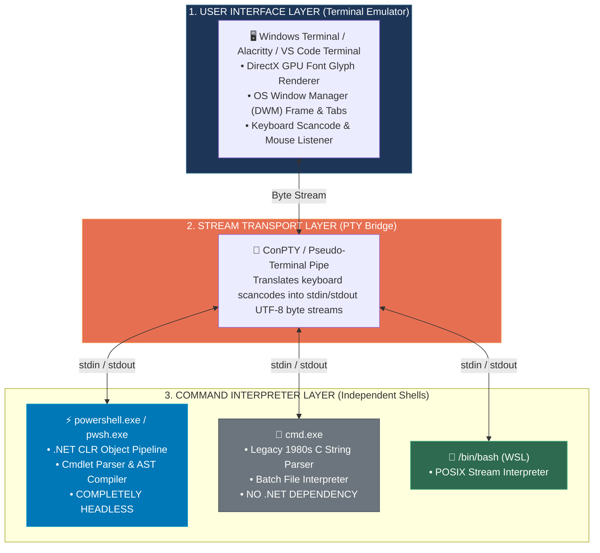

# 📌 Why Do We Need a Terminal Emulator? & Is PowerShell Behind CMD?

> **Reference / Context**: [10_linux_cli.md](file:///d:/Madhan_Utils/learnings/ai-ml/ai-ml-course/course-path/phase-0-engineering-foundations/10_linux_cli.md) | [posix-unix-linux-gnu-kernel-terminal-shell.md](file:///d:/Madhan_Utils/learnings/ai-ml/ai-ml-course/explanations/posix-unix-linux-gnu-kernel-terminal-shell.md) | [what-is-the-os-kernel.md](file:///d:/Madhan_Utils/learnings/ai-ml/ai-ml-course/explanations/what-is-the-os-kernel.md)

---

### 1. 🎯 What is it? (In Plain English)

Two fundamental facts govern terminal and shell computing:
1. **PowerShell is completely headless (blind & deaf)**: `pwsh.exe` and `powershell.exe` contain zero code to draw a window, rasterize font pixels on a screen, or capture keyboard hardware interrupts. You cannot interact with PowerShell directly as a human without a **Terminal Emulator** (e.g., Windows Terminal, Alacritty, VS Code Terminal) to serve as the visual UI.
2. **`cmd.exe` does NOT use PowerShell**: `cmd.exe` is a 1980s legacy C string-parsing shell for Windows NT. `powershell.exe` is a 2006 object-oriented engine built on the Microsoft .NET CLR. They are completely independent sibling processes with zero shared execution engine.

---

### 2. 💡 The Real-World Analogy

#### Analogy 1: The Radio DJ vs. The Radio Tower (Terminal vs. Shell)
* **PowerShell** is the **Radio DJ**: It speaks content, plays music, processes audio tracks, and generates the broadcast stream (text/objects). But the DJ cannot transmit radio waves into people's living rooms.
* **The Terminal Emulator** is the **Radio Receiver Speaker in your house**: It receives the invisible electrical signal (character byte stream), converts it into physical sound waves (pixels and colors on screen), and lets you turn the volume dial (user keyboard inputs).
* Without the speaker, the DJ is still broadcasting, but no human can hear them.

#### Analogy 2: Gas Car vs. Electric Car (CMD vs. PowerShell)
* **`cmd.exe`** is a **1985 Manual Transmission Carbureted Engine**: It only accepts physical fuel lines (plain text strings), has basic gears (batch scripts), and knows nothing about computer electronics.
* **`PowerShell`** is a **Modern Tesla Electric Motor**: It runs on computerized battery telemetry (.NET structured objects), has digital firmware, and passes rich data packets.
* Putting both inside Windows Terminal is like parking both cars in the **same two-car garage**—the garage (Terminal) holds both, but neither car's engine runs inside the other.

---

### 3. 🎨 Visual Architecture: The Terminal $\leftrightarrow$ Shell Separation



---

### 4. ⚡ Direct Architectural Comparison

| Dimension | Terminal Emulator (e.g., Windows Terminal) | PowerShell (`pwsh.exe`) | Command Prompt (`cmd.exe`) |
| :--- | :--- | :--- | :--- |
| **Primary Job** | Render text, handle tabs, manage window pixels. | Parse commands, run scripts, pass .NET objects. | Parse legacy batch files and plain text commands. |
| **Has a GUI / Window?** | **YES** (DirectX/OpenGL window). | **NO** (Completely headless console application). | **NO** (Completely headless console application). |
| **Pipeline Data Type** | Raw ANSI/UTF-8 character byte stream. | **Live .NET in-memory objects** (`[System.IO.FileInfo]`). | **Raw text strings** line-by-line. |
| **Runtime Engine** | C++ / WinUI / DirectWrite. | .NET Common Language Runtime (CLR / C#). | Pure Native C / Win32. |
| **Can Run Without UI?** | No (It is literally a UI app). | **YES** (Cron jobs, CI/CD pipelines, APIs). | **YES** (Background scripts, legacy installers). |

---

### 5. 🔍 Can We Run PowerShell "Directly" Without a Terminal?

Yes, but only in headless / automated environments. 

#### When PowerShell Runs with NO Terminal:
1. **Automated Python Subprocesses**:
   ```python
   import subprocess
   # PowerShell runs with ZERO terminal window:
   result = subprocess.run(["powershell", "-NoProfile", "-Command", "Get-Date"], capture_output=True, text=True)
   print(result.stdout)
   ```
2. **CI/CD Build Agents (GitHub Actions / Jenkins)**:
   - Automated runners invoke `powershell.exe` in the background, piping raw stdout logs directly to disk files.
3. **Scheduled Windows Tasks / Daemons**:
   - Background tasks run `powershell.exe -WindowStyle Hidden -File script.ps1`.

#### Why Humans Require a Terminal:
A human developer cannot read electric voltage signals in RAM chips. The Terminal Emulator is the translator between human eyeballs/fingers and the headless shell process.

---

### 6. ⚠️ Pro-Tips & Common Gotchas

1. **Why `conhost.exe` pops up on older Windows**:
   - On legacy Windows (Windows 7/10), when you launched `powershell.exe` or `cmd.exe` directly, the Windows kernel noticed it was a console subsystem binary with no UI. The OS automatically spawned a hidden helper GUI app called `conhost.exe` (Console Host) to provide the black window.
   - On Windows 11, **Windows Terminal** took over this role as the default modern terminal emulator.
2. **`cmd.exe` does not understand PowerShell syntax**:
   - Running `ls | Select-Object -First 5` in `cmd.exe` will fail with syntax errors because `cmd.exe` has no idea what `Select-Object` or .NET objects are.
3. **PowerShell aliases vs CMD commands**:
   - In PowerShell, typing `dir` or `cls` actually executes internal PowerShell aliases (`Get-ChildItem` and `Clear-Host`), not `cmd.exe`.
