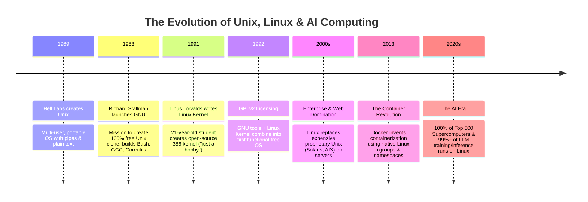
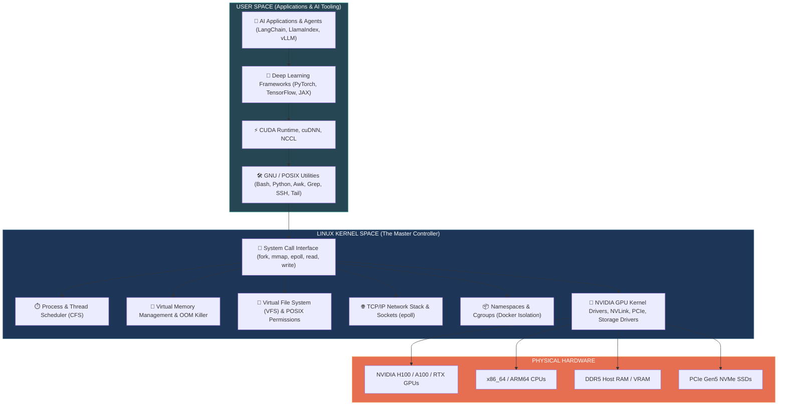
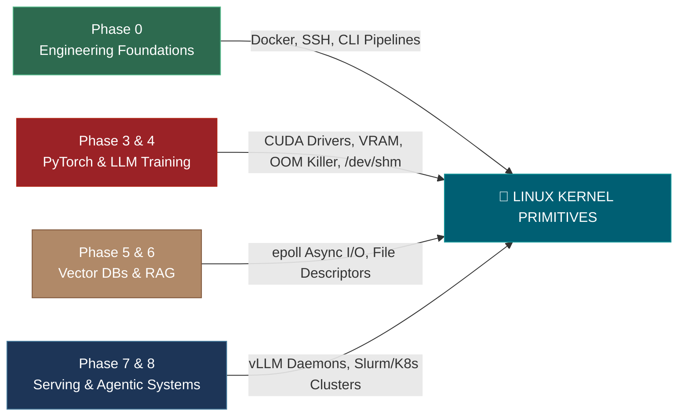

# 📌 The Complete Story of Linux & Why It Powers Modern AI Engineering

> **Reference / Context**: [10_linux_cli.md](file:///d:/Madhan_Utils/learnings/ai-ml/ai-ml-course/course-path/phase-0-engineering-foundations/10_linux_cli.md) | [what-is-unix.md](file:///d:/Madhan_Utils/learnings/ai-ml/ai-ml-course/explanations/what-is-unix.md) | [what-is-posix.md](file:///d:/Madhan_Utils/learnings/ai-ml/ai-ml-course/explanations/what-is-posix.md) | [what-is-the-os-kernel.md](file:///d:/Madhan_Utils/learnings/ai-ml/ai-ml-course/explanations/what-is-the-os-kernel.md)

---

### 1. 🎯 What is Linux? (In Plain English)

Technically, **Linux is NOT an entire operating system**—it is a **monolithic OS kernel**: the central software engine written in C that controls computer hardware (CPU, RAM, GPU, NVMe SSDs, network cards) and coordinates running programs.

What most people call "Linux" is actually the **GNU/Linux Operating System**:
- **The Linux Kernel** (Engine): Created by Linus Torvalds in 1991 to manage physical hardware and process execution.
- **GNU User-Space Tools** (Dashboard & Controls): Created by Richard Stallman's GNU Project (e.g. `bash`, `gcc`, `grep`, `awk`, `cat`, `coreutils`) that give humans and software a way to command the kernel.
- **Distributions (Distros)**: Packaged bundles combining the Linux kernel + GNU utilities + package managers (e.g., **Ubuntu**, **Debian**, **RHEL**, **Alpine**).

---

### 2. 💡 The Real-World Analogy: Car Engine vs. Complete Vehicle

- **The Linux Kernel** is the **high-performance turbocharged engine**: it injects fuel (allocates RAM), turns the crankshaft (schedules CPU cycles), and rotates the wheels (streams data over PCIe to NVIDIA GPUs). But an engine alone on the garage floor cannot be driven.
- **GNU Utilities (`bash`, `cat`, `ls`, `grep`)** are the **steering wheel, pedals, dashboard, and gear shifter**: they provide the user interface to control the engine.
- **A Linux Distribution (Ubuntu / RHEL)** is the **complete assembled vehicle**: engine + dashboard + chassis + tires + GPS navigation, ready to drive off the lot.

---

### 3. 📜 The Complete Story of Linux (How a Student's Hobby Conquered Computing)

#### 🏛️ Stage 1: The Frustration with Proprietary Unix (1970s–1983)
Unix (created in 1969 at Bell Labs) was elegant, modular, and powerful. However, in the 1980s, AT&T began aggressively commercializing it. Companies like Sun Microsystems (Solaris), IBM (AIX), and HP (HP-UX) created locked-down, proprietary Unix versions that ran only on expensive, proprietary workstations costing tens of thousands of dollars.

#### 🦬 Stage 2: Richard Stallman and the GNU Project (1983)
In 1983, MIT researcher Richard Stallman launched the **GNU Project** (**G**NU's **N**ot **U**nix) with a radical mission: build a 100% free, open-source Unix-compatible operating system. 
By 1990, the GNU Project had built world-class compilers (`gcc`), shells (`bash`), and text utilities (`grep`, `awk`, `coreutils`). **However, their kernel (GNU Hurd) was plagued by architectural design delays and didn't work.** They had a complete car interior and controls, but no engine.

#### 🐧 Stage 3: The Student's "Hobby" (August 1991)
In Helsinki, Finland, a 21-year-old university student named **Linus Torvalds** bought a personal PC with an Intel 80386 processor. He wanted to run Unix on it, but commercial licenses were unaffordable, and the educational MINIX OS was severely restricted.

Torvalds decided to write his own task-switching kernel from scratch in C and assembly. On **August 25, 1991**, he posted his famous message to the `comp.os.minix` newsgroup:

> *"I'm doing a (free) operating system (just a hobby, won't be big and professional like gnu) for 386(486) AT clones..."*

#### 🤝 Stage 4: The Marriage of GNU and Linux (1992)
Linus released his kernel under the **GNU GPLv2 (General Public License)**. Developers around the globe realized that putting Linus's working kernel underneath GNU's complete software tools yielded a **100% free, fully functional Unix-like operating system**. 

Because Linux ran on cheap, standard consumer PC hardware rather than expensive IBM/Sun mainframes, it spread like wildfire across universities, research labs, and early Internet service providers.

#### 🌐 Stage 5: Total Infrastructure & Cloud Conquest (2000s–Present)
- **100% of the World's Top 500 Supercomputers** run Linux.
- **96.3% of the Top 1 Million Web Servers** run Linux.
- **Android** runs on top of a modified Linux kernel (over 3 billion active devices).
- **Docker and Kubernetes** were built natively around Linux kernel primitives.
- **AWS, Google Cloud, Oracle Cloud (OCI), and Azure** run their primary compute backbones on Linux.

---

### 4. 🎨 Visual Architecture: The Modern AI Operating System Stack

---

### 5. 🤖 How Linux Directly Relates to Every Phase of This AI/ML Course

Every phase of the **114-topic curriculum** directly interacts with Linux kernel mechanics:

| Course Phase | Key Topics | Why Linux is the Mandatory Foundation |
| :--- | :--- | :--- |
| **Phase 0 — Engineering Foundations** | `0.10 Linux CLI` `0.11 Docker` `0.13 Cloud VMs` | • **Containers are pure Linux**: Docker is not a virtual machine; it uses Linux kernel **Namespaces** (process isolation) and **Control Groups (cgroups)** (RAM/CPU throttling). • **Cloud Deployments**: OCI and AWS GPU instances are provisioned headlessly over SSH; SSH requires strict Linux octal permissions (`chmod 600`). |
| **Phases 1 to 4 — ML, PyTorch & LLM Fine-Tuning** | `1.10 PyTorch Basics` `3.10 Training Loop` `4.11 Fine-Tuning` | • **NVIDIA CUDA & Drivers**: The low-level kernel driver (`nvidia.ko`) and IPC memory sharing (`NCCL`) are written natively for Linux memory management. • **Fast DataLoader Multiprocessing**: PyTorch uses Linux `fork()` and shared POSIX memory (`/dev/shm`) to stream image/token batches to GPUs without serialization lag. • **The Silent OOM Killer**: When 70B parameter models exceed host RAM, the Linux kernel Out-Of-Memory killer terminates the process without a Python traceback (`dmesg -T`). |
| **Phases 5 & 6 — Vector DBs & Enterprise RAG** | `5.2 Vector Stores` `6.6 RAG Pipeline` | • **Socket & File Descriptor Scaling**: Ingesting and querying millions of vectors concurrently creates thousands of network sockets and open index files. Developers must tune Linux kernel limits (`ulimit -n`, `epoll`). |
| **Phases 7 & 8 — Production Serving & Autonomous Agents** | `7.5 CI/CD` `7.6 Tracing` `7.11 Production Deploy` | • **Inference Engines**: Production inference servers (**vLLM**, **TGI**, **Ollama**, **TensorRT-LLM**) are engineered specifically as Linux background daemons. • **Session Persistence**: Long-running 12-hour evaluation benchmarks and fine-tuning runs must run inside Linux terminal multiplexers (`tmux`, `nohup`) so client laptop sleep doesn't kill the job. |

---

### 6. ⚠️ The Hard Truths for AI Engineers

1. **Nobody Trains or Deploys Production LLMs on Windows**:
   While Windows is popular for consumer desktop workstations, 100% of production AI clusters (H100 clusters on AWS, Lambda Labs, RunPod, OCI) run headless Linux. Windows features like WSL2 exist specifically to give developers a virtualized Linux kernel on their laptops.
2. **AI Failures in Production are Resource & Kernel Failures, Not Code Syntax Errors**:
   When an AI pipeline dies in production, it is almost never a Python `SyntaxError`. It is a Linux kernel event:
   - Port collisions (`EADDRINUSE` — diagnosed with `ss -ltnp`).
   - Out-of-memory purges (Kernel OOM — diagnosed with `dmesg -T`).
   - Disk saturation from model weights (diagnosed with `du -sh -- * .[!.]* | sort -rh`).
   - Broken pipeline exit codes passing silently in CI (fixed with `set -euo pipefail`).
