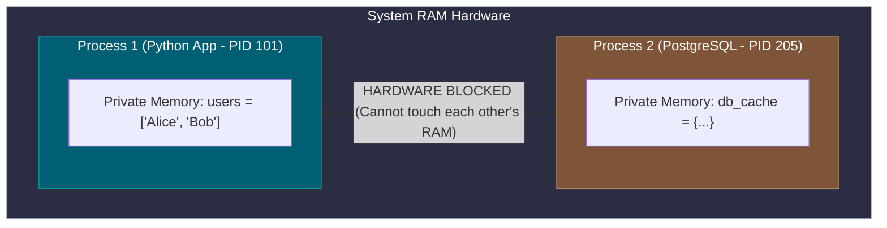
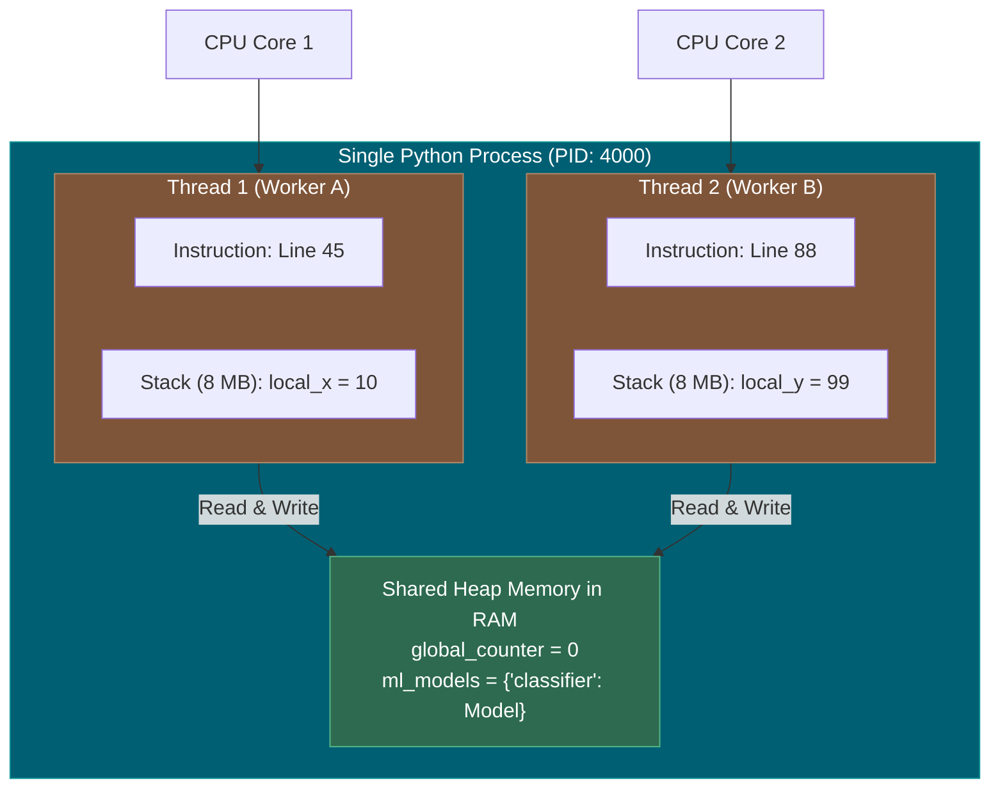
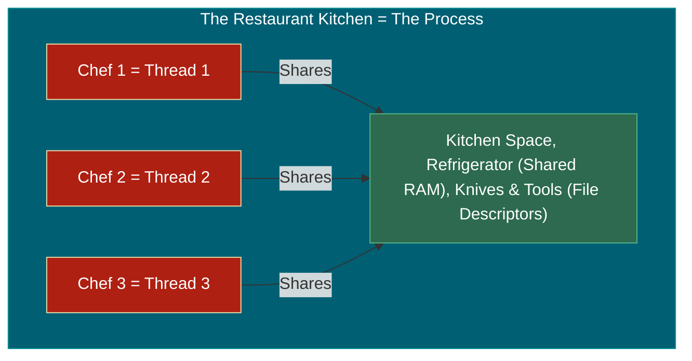
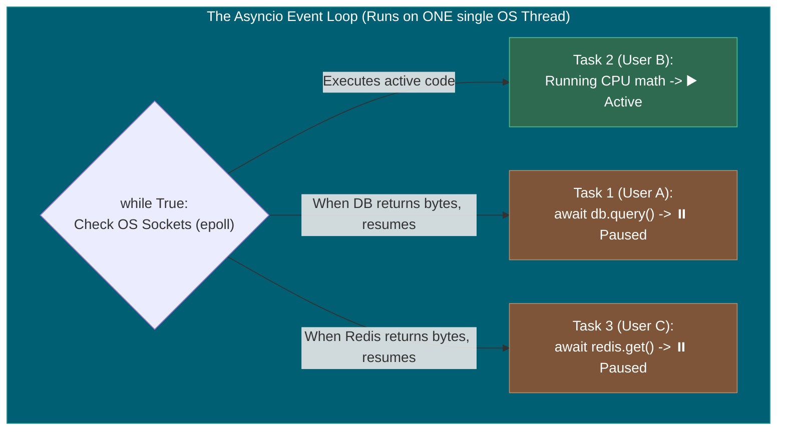

# 📌 Processes, Threads & The Event Loop: The Definitive Guide

> **Reference / Context**: [03_async_typehints_pydantic.md](file:///d:/Madhan_Utils/learnings/ai-ml/ai-ml-course/course-path/phase-0-engineering-foundations/03_async_typehints_pydantic.md) | [09_building_apis_with_fastapi.md](file:///d:/Madhan_Utils/learnings/ai-ml/ai-ml-course/course-path/phase-0-engineering-foundations/09_building_apis_with_fastapi.md) | [uvicorn-asgi-event-loop-explained.md](file:///d:/Madhan_Utils/learnings/ai-ml/ai-ml-course/explanations/uvicorn-asgi-event-loop-explained.md) | [complete-fastapi-and-systems-architecture-guide.md](file:///d:/Madhan_Utils/learnings/ai-ml/ai-ml-course/explanations/complete-fastapi-and-systems-architecture-guide.md)

---

### 1. 🎯 What is a Process? (The House with a Locked Fence)

A **Process** is an independent, running instance of an application (e.g., when you launch Python, VS Code, or Chrome).

When the OS Kernel starts a process:

1. It assigns it a unique ID number called a **PID (Process ID)** (e.g. `PID: 4812`).
2. It allocates a **private, isolated block of RAM (Virtual Memory)** that belongs *only* to that process.
3. It gives it a private **File Descriptor Table** (holding its open files and sockets).

#### 🛡️ The Golden Rule of Processes: Total Isolation

- Process A (**Chrome**) **cannot** read, write, or touch the memory of Process B (**Python**).
- If Process A has a bug and crashes, **Process B continues running unaffected**.



---

### 2. 🎯 What is a Thread? (The Worker Inside the House)

A **Thread** is the actual **stream of execution (the worker)** *inside* a process that the CPU core physically runs.

- A process is just the **container** (the house).
- The thread is the **person doing the work** inside that house.
- Every process starts with **1 Main Thread** by default. A process can spawn additional threads to perform multiple tasks at the same time.

#### 🧠 What Does a Thread Own vs. What Does It Share?

- **What Threads SHARE (Process Heap Memory)**: All threads inside the same process share the **exact same variables, global dictionaries, and open file descriptors**.
- **What Each Thread OWNS Privately**:
  1. **A Program Counter (PC)**: A CPU register that tracks *"Which line of code am I executing right now?"*
  2. **A Call Stack (Stack Memory ~8 MB)**: A private memory scratchpad to hold local function variables and track function return lines.



---

### 💡 The Restaurant Kitchen Analogy



- **The Kitchen = The Process**:
  - The kitchen has a refrigerator (RAM), a stove, and spice racks (File Descriptors).
  - The restaurant across the street (another Process) has its own separate kitchen. They cannot steal your ingredients.
- **The Chefs = The Threads**:
  - You can have **1 chef (Single-Threaded)** or **3 chefs (Multi-Threaded)** working inside this same kitchen.
  - All 3 chefs share the **exact same refrigerator (Shared Memory)**.
  - If Chef 1 chops garlic and puts it in a bowl on the counter, Chef 2 can pick up that bowl immediately without leaving the kitchen.
  - **The Risk (Race Conditions)**: If Chef 1 and Chef 2 both try to add salt to the same pot of soup at the exact same second, they might over-salt it (Data Corruption) unless they coordinate with a lock!

---

### 3. 💻 Code Proof: Threads (Shared Memory) vs. Processes (Isolated Memory)

Look at these two tiny Python scripts to see the concrete difference:

#### Example A: Threads (Share the Same Memory Variable)

```python
import threading

# Shared variable in process memory:
counter = 0

def add_ten():
    global counter
    counter += 10

# Spawn 2 threads inside the SAME process:
t1 = threading.Thread(target=add_ten)
t2 = threading.Thread(target=add_ten)

t1.start()
t2.start()
t1.join()
t2.join()

print("Final Counter:", counter)
# Output: Final Counter: 20
# ✅ Both threads modified the EXACT SAME variable in RAM!
```

#### Example B: Processes (Have Separate Isolated Memory Copies)

```python
import multiprocessing

counter = 0

def add_ten():
    global counter
    counter += 10
    print(f"Inside Child Process: counter = {counter}")

if __name__ == "__main__":
    # Spawn 2 separate OS PROCESSES:
    p1 = multiprocessing.Process(target=add_ten)
    p2 = multiprocessing.Process(target=add_ten)

    p1.start()
    p2.start()
    p1.join()
    p2.join()

    print("Main Process Counter:", counter)
    # Output:
    # Inside Child Process: counter = 10
    # Inside Child Process: counter = 10
    # Main Process Counter: 0
    # ❌ The main process is STILL 0 because processes have isolated RAM copies!
```

---

### 4. 🎯 What is an "Event Loop" and How Does It Compare?

Now that you know what a Thread is, **how does an Event Loop fit in?**

| Model                                       | How It Works                                           | Concurrency Cost                                         | Analogy                                  |
| ------------------------------------------- | ------------------------------------------------------ | -------------------------------------------------------- | ---------------------------------------- |
| **1. Multi-Process (Gunicorn)**       | Spawns multiple whole processes (PIDs)                 | Very Heavy ($\approx 50\text{ MB}$ RAM per worker)     | Hiring 4 separate kitchens               |
| **2. Multi-Thread (Threadpool)**      | Spawns multiple threads inside 1 process               | Medium ($\approx 8\text{ MB}$ stack RAM per thread)    | 4 chefs working in 1 kitchen             |
| **3. Event Loop (FastAPI / Uvicorn)** | **1 Thread** juggling 10,000 tasks via `await` | Ultra-Lightweight ($\approx 2\text{ KB}$ RAM per task) | **1 master chef on roller skates** |



#### Why the Event Loop is Revolutionary for APIs:

In web APIs, your code spends **95% of its time waiting** (waiting for PostgreSQL, waiting for OpenAI's API, waiting for Redis).

- In a **Threaded model (WSGI)**: While waiting, the thread sits idle, holding **8 MB of RAM** and blocking other users.
- In an **Event Loop model (ASGI)**: When your code hits `await`, the single thread **releases the task** and immediately runs code for other users. When the database finally replies, the event loop resumes that task.

---

### 5. ⚠️ The Fatal Async Trap (Why You Must Understand Threads)

Because the Event Loop runs on **ONE single thread**:

- If you call `time.sleep(5)` or run heavy CPU math inside an `async def` function, **you freeze that single thread**.
- The chef is paralyzed for 5 seconds. Because there is only 1 thread, **all other 10,000 connected users are frozen simultaneously!**

**The Solution in FastAPI**:

1. For I/O operations (Database, HTTP API calls) $\rightarrow$ Use `async def` and `await`.
2. For blocking or heavy CPU operations $\rightarrow$ Use **plain `def`** (FastAPI will automatically send it to a **Background Worker Threadpool** so the main Event Loop thread stays free!).
