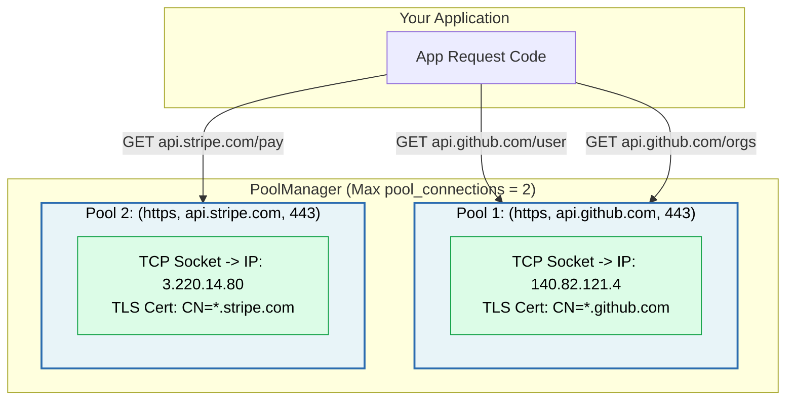
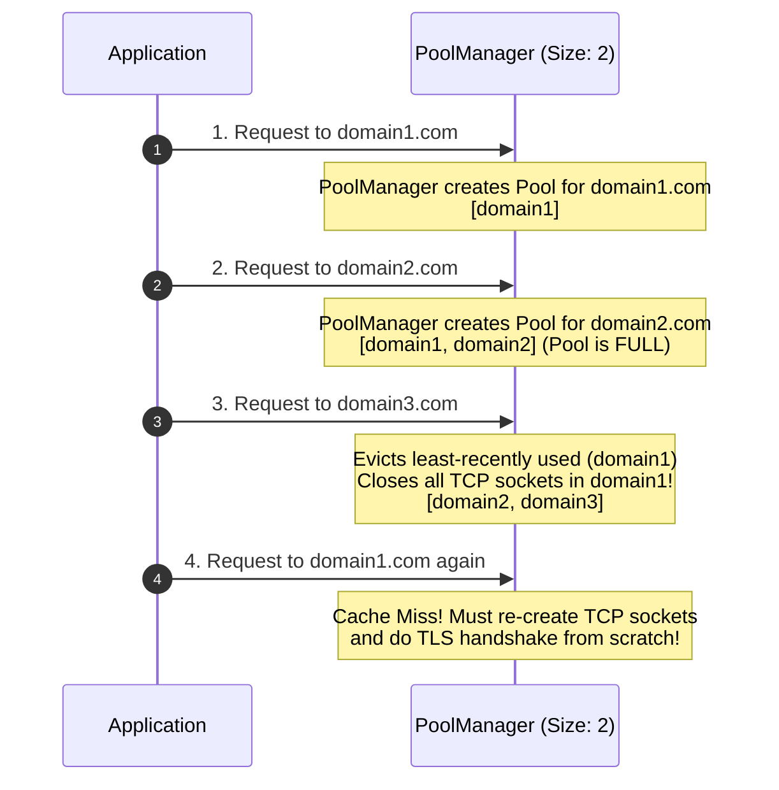

# 📌 Understanding Domains, Hosts, & Pool Keys in Connection Pooling

> **Reference / Context**: [07_http_fundamentals.md](file:///d:/Madhan_Utils/learnings/ai-ml/ai-ml-course/course-path/phase-0-engineering-foundations/07_http_fundamentals.md) | [08_consuming_rest_apis.md](file:///d:/Madhan_Utils/learnings/ai-ml/ai-ml-course/course-path/phase-0-engineering-foundations/08_consuming_rest_apis.md)
> **Topic Context**: Networking Fundamentals, URL Anatomy, TCP/TLS Sockets, and HTTP Pool Keys

---

### 1. 🎯 What is a "Domain" / "Host" in Connection Pooling?

In networking, a **Domain** (or **Host**) is the human-readable address that identifies a specific server on the internet (e.g., `api.github.com`, `api.stripe.com`, `google.com`).

When your application sends an HTTP request, a connection pool needs to know **where** the physical wire (TCP socket) goes. A connection pool key is technically a combination of **3 things**:

$$\text{Pool Key} = (\text{Scheme}, \text{Host}, \text{Port})$$

```text
https://api.github.com:443/v1/users?id=10
└──┬──┘ └──────┬──────┘ └┬┘ └─────┬────┘
 Scheme       Host      Port     Path (Ignored by Pool)
```

| URL | Scheme | Host | Port | Is it the same pool? |
| :--- | :--- | :--- | :--- | :--- |
| `https://api.github.com/users` | `https` | `api.github.com` | `443` | **Pool A** |
| `https://api.github.com/repos` | `https` | `api.github.com` | `443` | **Pool A** (Reuses same pool!) |
| `http://api.github.com/users` | `http` | `api.github.com` | `80` | **Pool B** (Different scheme/port) |
| `https://api.stripe.com/charges` | `https` | `api.stripe.com` | `443` | **Pool C** (Different host) |

---

### 2. 💡 The Real-World Analogy

#### 🏢 The Dedicated Office Hotline Analogy
- Imagine you have a desk with **speed-dial landline phones**:
  - **Phone Line 1** connects directly to **Google Headquarters** (Domain 1).
  - **Phone Line 2** connects directly to **Stripe Headquarters** (Domain 2).
- When you pick up Phone Line 1, you can ask Google for *maps*, *search*, or *email* (different paths like `/maps` or `/search`), because they are all inside Google's building.
- But you **cannot** use Phone Line 1 to talk to Stripe! Stripe is a completely different building in another location with different security guards. You must have a separate line (Pool) for Stripe.
- **`pool_connections`** is how many **different speed-dial desk phones (domains)** you have space for on your desk.

---

### 3. 🔬 Why Can't One Connection Be Shared Across Different Domains?

Under the hood, an open HTTP connection is a physical **TCP Socket** wrapped in **TLS (SSL) Encryption**:



1. **Different IP Addresses (DNS)**: `api.github.com` resolves to `140.82.121.4`, whereas `api.stripe.com` resolves to `3.220.14.80`. A TCP socket is locked to a specific destination IP & port.
2. **TLS Certificate Lock-In**: During the SSL handshake, the server presents a cryptographic certificate validating its domain (e.g. `CN=*.github.com`). Sending a request for `stripe.com` over a socket authenticated with GitHub's certificate will cause a fatal TLS security violation.
3. **HTTP Host Headers**: Web servers route requests based on the `Host: api.github.com` header.

---

### 4. ⚙️ What Happens When You Exceed `pool_connections`? (LRU Eviction)

If your app sets `pool_connections = 2` and accesses **3 different domains** sequentially:



---

### 5. ⚡ Summary: The Hierarchy in Memory

```text
PoolManager (Manages all pools)
 ├── pool_connections = Maximum number of Host Pools to keep in cache (e.g. 10 hosts)
 │
 ├── [Host Pool 1: api.github.com:443]
 │    └── pool_maxsize = Max open sockets to github (e.g. 5 TCP connections)
 │
 ├── [Host Pool 2: api.stripe.com:443]
 │    └── pool_maxsize = Max open sockets to stripe (e.g. 5 TCP connections)
 │
 └── [Host Pool 3: api.openai.com:443]
      └── pool_maxsize = Max open sockets to openai (e.g. 5 TCP connections)
```
