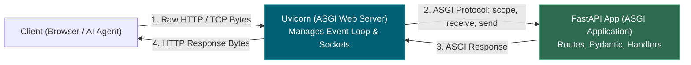
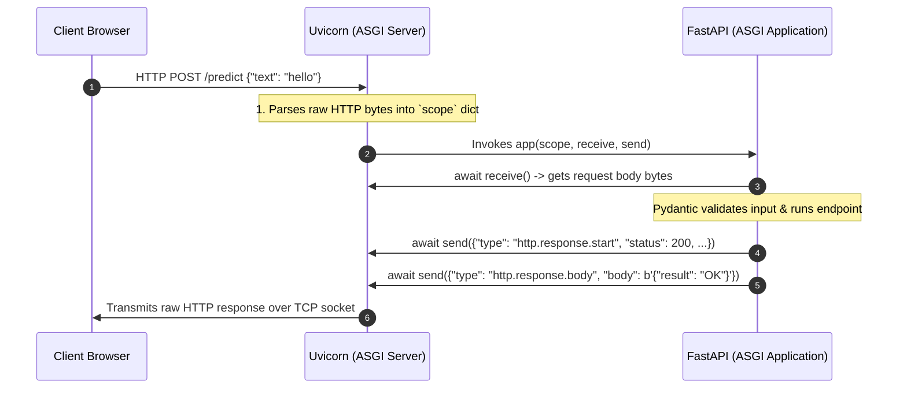
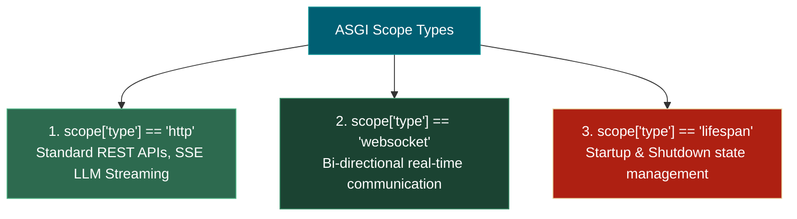
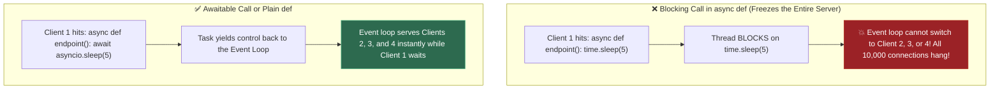

# 📌 Uvicorn, ASGI, and the Event Loop: The Complete Deep Dive

> **Reference / Context**: [03_async_typehints_pydantic.md](file:///d:/Madhan_Utils/learnings/ai-ml/ai-ml-course/course-path/phase-0-engineering-foundations/03_async_typehints_pydantic.md) | [09_building_apis_with_fastapi.md](file:///d:/Madhan_Utils/learnings/ai-ml/ai-ml-course/course-path/phase-0-engineering-foundations/09_building_apis_with_fastapi.md) | [fastapi-lifespan-callback-pattern.md](file:///d:/Madhan_Utils/learnings/ai-ml/ai-ml-course/explanations/fastapi-lifespan-callback-pattern.md)

---

### 1. 🎯 What is ASGI? (In Plain English)

**ASGI** stands for **Asynchronous Server Gateway Interface**.

It is the open standard interface (the universal adapter plug) that connects an asynchronous Python web server (like **Uvicorn** or **Hypercorn**) to an asynchronous Python web application (like **FastAPI** or **Starlette**).



---

### 2. 📜 Why Was ASGI Created? (WSGI vs. ASGI)

Before ASGI, the Python web ecosystem ran on **WSGI** (Web Server Gateway Interface, PEP 3333), used by Flask and Django.

| Feature | Legacy WSGI (Flask / Gunicorn) | Modern ASGI (FastAPI / Uvicorn) |
|---|---|---|
| **Paradigm** | Synchronous, Blocking | Asynchronous, Non-blocking (`asyncio`) |
| **Concurrency Model** | 1 OS Thread / Process per Request | 1 Event Loop thread serving 10,000+ Tasks |
| **Protocol Signature** | `app(environ, start_response)` | `await app(scope, receive, send)` |
| **WebSockets** | ❌ Impossible natively (blocks thread indefinitely) | ✅ First-class native support |
| **LLM Token Streaming (SSE)** | ❌ Stalls worker thread for 30s | ✅ Native streaming via `StreamingResponse` |
| **Lifespan Hooks** | ❌ Ad-hoc / Non-standardized | ✅ Standardized `lifespan.startup` / `shutdown` |

#### The WSGI Bottleneck:
In WSGI, if 100 clients connect and each makes an LLM inference call that takes 5 seconds, you need **100 heavy OS worker threads** running concurrently. When worker 101 arrives, it hangs.

#### The ASGI Solution:
In ASGI, Uvicorn runs **1 OS thread with an Asyncio Event Loop**. When a request waits for an LLM response or a database query, it yields execution (`await`), allowing the single thread to handle all 10,000 other requests simultaneously.

---

### 3. 💡 The Real-World Analogy: Single Master Waiter vs. 100 Chefs

- **WSGI (Flask on Gunicorn)**: 
  - Like hiring 20 waiters for 20 tables. If a waiter takes an order to the kitchen and waits 15 minutes for the steak to cook, that waiter stands idle staring at the stove. Table #21 must wait outside.
- **ASGI + Event Loop (FastAPI on Uvicorn)**:
  - Like **one world-class waiter on roller skates** (the Event Loop).
  - The waiter takes Table 1's order, passes it to the kitchen (`await db.fetch()`), and immediately rolls over to Tables 2, 3, and 4 to take their orders while Table 1's food cooks.
  - The moment Table 1's food is ready on the counter, the waiter delivers it.

---

### 4. 🔬 The Core ASGI Specification: `app(scope, receive, send)`

At its lowest level, **every FastAPI application is simply a single callable async function** with this exact signature:

```python
async def app(scope: dict, receive: callable, send: callable) -> None:
    """The Universal ASGI Contract."""
```



#### The 3 Parameters Explained:

#### 1. `scope` (The Connection Context Dictionary)
An immutable dictionary created by Uvicorn describing the connection metadata.
```python
scope = {
    "type": "http",              # Protocol type: "http", "websocket", or "lifespan"
    "asgi": {"version": "3.0"},
    "http_version": "1.1",
    "method": "POST",
    "path": "/score",
    "raw_path": b"/score",
    "query_string": b"model=gbm",
    "headers": [
        (b"host", b"127.0.0.1:8000"),
        (b"content-type", b"application/json"),
    ],
    "client": ("127.0.0.1", 54321),
    "server": ("127.0.0.1", 8000),
}
```

#### 2. `receive` (Incoming Async Channel)
An `async` function that FastAPI calls to receive events and byte chunks from Uvicorn:
- For HTTP requests: returns `{"type": "http.request", "body": b'{"amount": 500}', "more_body": False}`.
- For Lifespan events: returns `{"type": "lifespan.startup"}` or `{"type": "lifespan.shutdown"}`.

#### 3. `send` (Outgoing Async Channel)
An `async` function that FastAPI calls to send events and byte chunks back to Uvicorn:
- Send HTTP Status & Headers: `await send({"type": "http.response.start", "status": 200, "headers": [...]})`
- Send Response Body: `await send({"type": "http.response.body", "body": b'{"status": "ok"}', "more_body": False})`

---

### 5. ⚡ Building a Pure ASGI Web Application (Zero Frameworks)

To see that FastAPI is just a high-level wrapper over pure ASGI, here is a working, raw ASGI application with zero dependencies (runnable with `uvicorn main:app`):

```python
# Save as raw_asgi.py and run: uvicorn raw_asgi:app --port 8000
import json

async def app(scope, receive, send):
    # 1. Handle Lifespan (Startup / Shutdown)
    if scope["type"] == "lifespan":
        while True:
            message = await receive()
            if message["type"] == "lifespan.startup":
                print("Raw ASGI Server: Initializing resources...")
                await send({"type": "lifespan.startup.complete"})
            elif message["type"] == "lifespan.shutdown":
                print("Raw ASGI Server: Cleaning up resources...")
                await send({"type": "lifespan.shutdown.complete"})
                return

    # 2. Handle HTTP Traffic
    if scope["type"] == "http":
        # Read incoming request body
        request_event = await receive()
        body = request_event.get("body", b"")
        
        # Build JSON response
        response_data = json.dumps({
            "message": "Hello from pure ASGI!",
            "path": scope["path"],
            "method": scope["method"],
            "body_received": body.decode("utf-8")
        }).encode("utf-8")

        # Send HTTP Headers
        await send({
            "type": "http.response.start",
            "status": 200,
            "headers": [
                [b"content-type", b"application/json"],
                [b"content-length", str(len(response_data)).encode("utf-8")],
            ],
        })

        # Send HTTP Body
        await send({
            "type": "http.response.body",
            "body": response_data,
            "more_body": False,
        })
```

**FastAPI does not reinvent this.** FastAPI simply:
1. Implements this exact `app(scope, receive, send)` function.
2. Decodes `scope["path"]` to match `@app.get(...)` routes.
3. Decodes `body` into Pydantic models.
4. Serializes the returned dictionary into JSON and calls `await send(...)`.

---

### 6. 🎨 The 3 Protocols Supported by ASGI



1. **`http`**: Short-lived request/response cycles AND continuous chunked streams (`StreamingResponse` for LLM token streaming).
2. **`websocket`**: Long-lived two-way channels for real-time chat, notifications, and interactive dashboards.
3. **`lifespan`**: Standardized event lifecycle so servers boot heavy models/pools before listening for traffic, and clean them up when stopping.

---

### 7. ⚠️ The Async Trap (Demo 5 in 0.9)

Because Uvicorn and FastAPI run inside **one single asyncio event loop thread**:



**Golden Rules for AI Engineers**:
1. **Async I/O (`httpx`, `asyncpg`, `aiofiles`)** $\rightarrow$ Use `async def` and `await`.
2. **Blocking / CPU Heavy Work (`scikit-learn`, `numpy`, `torch.predict`, `time.sleep`, `requests`)** $\rightarrow$ Use **plain `def`** (FastAPI runs it on a background threadpool) or use `await asyncio.to_thread(cpu_func)`.
