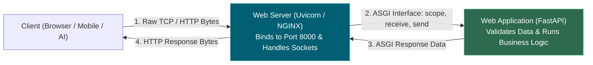
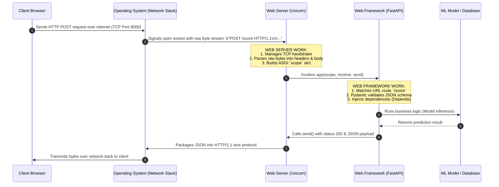

# 📌 Web Servers vs. Web Applications: Why FastAPI is NOT a Server

> **Reference / Context**: [09_building_apis_with_fastapi.md](file:///d:/Madhan_Utils/learnings/ai-ml/ai-ml-course/course-path/phase-0-engineering-foundations/09_building_apis_with_fastapi.md) | [12_nginx_reverse_proxy.md](file:///d:/Madhan_Utils/learnings/ai-ml/ai-ml-course/course-path/phase-0-engineering-foundations/12_nginx_reverse_proxy.md) | [uvicorn-asgi-event-loop-explained.md](file:///d:/Madhan_Utils/learnings/ai-ml/ai-ml-course/explanations/uvicorn-asgi-event-loop-explained.md)

---

### 1. 🎯 What is it? (In Plain English)

**FastAPI is NOT a web server.**

- A **Web Server** (e.g., **Uvicorn**, **NGINX**, **Apache**) is a program that binds to an IP address and Port (like `0.0.0.0:8000`), manages TCP network sockets, handles SSL/TLS certificates, and receives raw electrical/byte streams from the internet.
- A **Web Framework / Application** (e.g., **FastAPI**, **Flask**, **Django**) is a Python library that defines **business logic**: routing URLs (`@app.get("/score")`), validating data (Pydantic), querying databases, and returning JSON.

FastAPI has **zero ability** to open a network port or listen to incoming HTTP traffic on its own. It requires a web server like **Uvicorn** to do the heavy networking work.



---

### 2. 💡 The Real-World Analogy: Telephone Network vs. Receptionist

- **The Web Server (Uvicorn / NGINX)** is like the **Telephone Company & Physical Desk Phone**:
  - It maintains the physical wire connection, listens for the ring signal (incoming TCP packet), establishes the call, filters out static noise, and digitizes sound waves into speech.
  - But the telephone has no idea *how to answer customer questions*.
- **The Web Framework (FastAPI)** is the **Customer Service Agent (Receptionist)**:
  - The agent sits at the desk. When the phone rings, the telephone hands the conversation to the agent.
  - The agent understands the customer's language, verifies their account ID (Pydantic validation), looks up their invoice in the database, and speaks the answer.
  - Without the phone, the agent can scream into an empty room, but nobody on the outside world will hear them.

---

### 3. 🎨 Visual Architecture: The Complete Request Journey



---

### 4. ⚡ Comparison Table: Web Server vs. Web Framework

| Dimension                | Web Server (e.g. Uvicorn, NGINX)                                | Web Framework / App (e.g. FastAPI, Flask)    |
| ------------------------ | --------------------------------------------------------------- | -------------------------------------------- |
| **Primary Job**    | Network I/O, Socket management, Byte parsing                    | Business logic, URL routing, Data validation |
| **Port Binding**   | Binds to`0.0.0.0:8000` via OS syscalls (`bind`, `listen`) | Does NOT touch OS sockets directly           |
| **Protocol Level** | Low-level TCP, HTTP/1.1, HTTP/2, WebSockets                     | High-level JSON, HTML, Python Objects        |
| **Concurrency**    | Manages Event Loop (`epoll`, `kqueue`) or Thread Pool       | Writes endpoints (`async def score(...)`)  |
| **Example Tools**  | Uvicorn, Hypercorn, Gunicorn, NGINX, Caddy                      | FastAPI, Starlette, Flask, Django, Litestar  |

---

### 5. 🔬 The Code Proof: Why FastAPI Cannot Run Alone

If you create this pure FastAPI script:

```python
# app.py
from fastapi import FastAPI

app = FastAPI()

@app.get("/")
def home():
    return {"message": "Hello World"}
```

And run:

```bash
python app.py
```

**What happens?**
The script exits in **0.05 seconds** and terminates! It never opens port 8000, never waits for requests, and cannot be reached from any browser. Because `FastAPI()` is just a Python object containing a dictionary of routes.

To make it an active, listening server, you must hand that `app` object to a **Web Server**:

```bash
uvicorn app:app --port 8000
```

Here:

- The first `app` is the filename (`app.py`).
- The second `app` is the FastAPI variable inside the file.
- **Uvicorn** is the web server that actually starts listening on port `8000`!

---

### 6. ⚠️ What is a "Python Web Server"?

A **Python Web Server** is any server program implemented in or interfaced with Python that understands the **WSGI** (legacy) or **ASGI** (modern) bridge:

1. **Uvicorn**: Lightning-fast ASGI server built on `uvloop` (C-based event loop) and `httptools` (NodeJS C-parser). The default standard for FastAPI.
2. **Gunicorn**: Robust multi-process process manager. Often used in production to run multiple Uvicorn worker processes (`gunicorn -w 4 -k uvicorn.workers.UvicornWorker main:app`).
3. **Hypercorn**: Another ASGI server with advanced HTTP/3 and trio support.
4. **NGINX / Caddy**: External reverse-proxy web servers written in C/Go, typically placed in front of Uvicorn in production to handle SSL/TLS, DDoS protection, and rate limiting.
