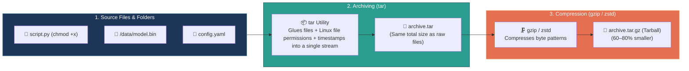

# 📌 What is a Tarball? (`.tar`, `.tar.gz`, `.tgz`)

> **Reference / Context**: [10_linux_cli.md](file:///d:/Madhan_Utils/learnings/ai-ml/ai-ml-course/course-path/phase-0-engineering-foundations/10_linux_cli.md) | [11_docker_and_compose.md](file:///d:/Madhan_Utils/learnings/ai-ml/ai-ml-course/course-path/phase-0-engineering-foundations/11_docker_and_compose.md) | [docker-images-containers-layers-overlayfs.md](file:///d:/Madhan_Utils/learnings/ai-ml/ai-ml-course/explanations/docker-images-containers-layers-overlayfs.md)

---

### 1. 🎯 What is it? (In Plain English)

A **tarball** is a single archive file that bundles an entire collection of files and folders together while preserving their Linux permissions, ownerships, and directory structure—typically compressed using `gzip` or `zstd`.

The term comes from:
* **`tar`** = **T**ape **AR**chive (a 1979 Unix utility originally created to write sequential file streams to physical magnetic tape drives).
* **Ball** = Jargon for bundling multiple separate items into a single, cohesive lump.

---

### 2. 💡 The Real-World Analogy: Moving Box + Vacuum Seal

* **Individual Files**: Loose clothes, shoes, jackets, and socks scattered in a room.
* **`tar` (The Cardboard Box)**: You put all the items into one sturdy moving box. The box keeps everything organized together in exact order and labels who owns what. **The box does NOT make the clothes smaller; it just turns 50 loose items into 1 package.**
* **`gzip` (The Vacuum Seal)**: You suck all the air out of the box to shrink its physical size for transport.
* **The Result (`.tar.gz`)**: A single, compact package that can be shipped across the country (or across a network) and unpacked into the exact original wardrobe layout.

---

### 3. 🎨 Visual Architecture: Archiving vs. Compression

---

### 4. ⚡ Why Docker & AI Infrastructure Rely on Tarballs

1. **Docker Layer Distribution**:
   * Every image layer built in Docker is literally saved and transmitted across Docker Hub as a compressed `layer.tar.gz` file.
   * When you run `docker save my-image -o image.tar`, Docker packages all image layers and metadata manifests into a single tarball.
2. **Preserving Linux Permissions**:
   * Standard `.zip` files often drop Unix execution bits (`chmod +x`) or user ownership (`UID:GID`). A tarball preserves exact POSIX file attributes bit-for-bit.

---

### 5. 💻 Essential CLI Commands

| Action | Command | Explanation |
| :--- | :--- | :--- |
| **Create a compressed tarball** | `tar -czvf app.tar.gz ./app` | `-c` (create), `-z` (gzip), `-v` (verbose), `-f` (filename) |
| **Extract a tarball** | `tar -xzvf app.tar.gz` | `-x` (extract), `-z` (gzip), `-v` (verbose), `-f` (filename) |
| **Inspect contents without extracting** | `tar -tvf app.tar.gz` | `-t` (list table of contents), `-v` (show permissions & sizes) |
| **Extract to a specific directory** | `tar -xzvf app.tar.gz -C /opt/app` | `-C` (change target directory before unpacking) |

---

### 6. ⚠️ Pro-Tip & Common Trap: `tar` is NOT a Compressor

* **The Trap**: Thinking `tar -cf backup.tar ./data` saved disk space.
* **The Reality**: `tar` by itself has **0% compression ratio**. A 10GB folder archived with `tar -cf` creates a 10GB `.tar` file. You must pass the compression flag (`-z` for gzip, `-j` for bzip2, or `--zstd` for modern ultra-fast compression) to actually reduce the file size.
