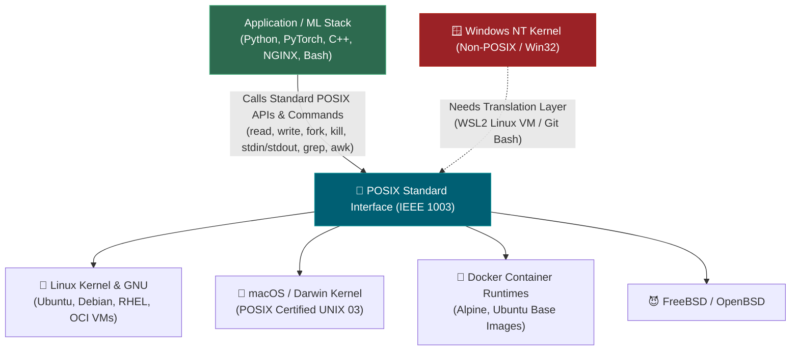

# 📌 What is POSIX? (Portable Operating System Interface)

> **Reference / Context**: [10_linux_cli.md](file:///d:/Madhan_Utils/learnings/ai-ml/ai-ml-course/course-path/phase-0-engineering-foundations/10_linux_cli.md) | [what-is-unix.md](file:///d:/Madhan_Utils/learnings/ai-ml/ai-ml-course/explanations/what-is-unix.md) | [linux-cli-prerequisites-echo-cat-awk-flags.md](file:///d:/Madhan_Utils/learnings/ai-ml/ai-ml-course/explanations/linux-cli-prerequisites-echo-cat-awk-flags.md)

---

### 1. 🎯 What is it? (In Plain English)

**POSIX** stands for **Portable Operating System Interface** (with the **X** added to evoke **UNIX**). 

It is an international standard family (IEEE 1003 / ISO/IEC 9945) that defines the universal contract between software applications and the underlying operating system. It dictates exactly how system calls (`read`, `write`, `fork`), shell utilities (`grep`, `cat`, `awk`, `echo`), file streams (`stdin`, `stdout`, `stderr`), process signals (`SIGTERM`, `SIGKILL`), and file permissions (`chmod 755`) must behave.

---

### 2. 💡 The Real-World Analogy: Universal USB-C & Wall Sockets

Imagine if every lamp and laptop manufacturer invented their own custom electrical outlet shape and voltage. You would need different power plugs for every room in every country.

**POSIX is the international standard wall outlet and USB-C spec for computer operating systems:**
- As a software developer writing Python, C, or PyTorch, you write code against the standard POSIX socket.
- Whether the underlying machine runs **Ubuntu Linux**, **macOS**, **Alpine Docker containers**, or **FreeBSD**, the operating system provides the exact same POSIX socket holes (`fork()`, `open()`, `pipe()`, `SIGTERM`).
- Your software plugs in and runs without needing a rewrite for each OS vendor.

---

### 3. 🎨 Visual Flowchart (Mermaid)

---

### 4. ⚡ What POSIX Actually Standardizes

POSIX specifies 4 core operational contracts in every modern engineering environment:

| POSIX Pillar | What It Defines | Practical Example from Topic 0.10 |
| :--- | :--- | :--- |
| **1. Standard Streams & FDs** | File Descriptor numbering conventions. | `0 = stdin`, `1 = stdout`, `2 = stderr`. |
| **2. Shell Language & Utilities** | Mandatory syntax for commands and pipelines. | `echo`, `cat`, `awk`, `grep`, `sort`, `uniq`, `tail`, and the pipe `\|`. |
| **3. Process Signals** | Numerical and named inter-process signals. | `SIGTERM (15)` graceful stop vs `SIGKILL (9)` forced termination. |
| **4. Permission & Path Semantics** | Octal permission bits and forward slash paths. | `chmod 600` (`rw-------`), forward slashes `/var/log/app.log`. |

---

### 5. ⚠️ Pro-Tip / Common Gotchas

1. **POSIX Compliant vs. Certified**:
   - **macOS** is officially *POSIX Certified* (UNIX 03 compliant).
   - **Linux** is *mostly POSIX Compliant* (follows POSIX standards practically, but Torvalds and GNU deliberately do not pay for formal certification).
   - **Windows** is **NOT POSIX**: Native Windows uses the Win32 API, backslashes `\`, and completely different process creation APIs (`CreateProcess` instead of `fork`/`exec`). This is why Docker and AI training tools run inside **WSL2** (a genuine Linux VM running on Windows).
2. **`#!/bin/sh` vs. `#!/bin/bash` (Bashisms)**:
   - Scripts starting with `#!/bin/sh` are restricted to strict POSIX syntax and run on any Unix machine.
   - Scripts starting with `#!/bin/bash` can use non-standard shell extensions (like double brackets `[[ ... ]]` or indexed arrays), which fail if executed on a minimalist POSIX system like Alpine Linux (`ash`).
