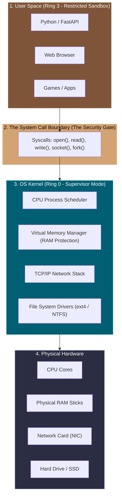
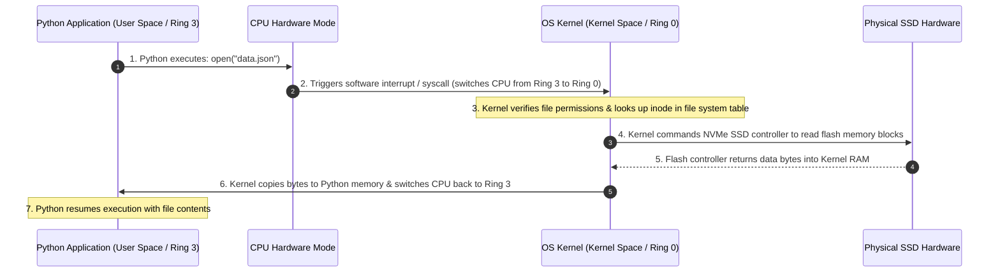

# 📌 What is the OS Kernel? (The Master Controller)

> **Reference / Context**: [how-web-servers-bind-sockets-tls-and-bytes.md](file:///d:/Madhan_Utils/learnings/ai-ml/ai-ml-course/explanations/how-web-servers-bind-sockets-tls-and-bytes.md) | [nic-and-fifo-buffers-explained.md](file:///d:/Madhan_Utils/learnings/ai-ml/ai-ml-course/explanations/nic-and-fifo-buffers-explained.md) | [09_building_apis_with_fastapi.md](file:///d:/Madhan_Utils/learnings/ai-ml/ai-ml-course/course-path/phase-0-engineering-foundations/09_building_apis_with_fastapi.md)

---

### 1. 🎯 What is the Kernel? (In Plain English)

The **Kernel** is the core master program of your operating system (e.g., the **Linux Kernel**, **Windows NT Kernel**, or **macOS XNU Kernel**). 

It is the **all-powerful bridge and referee** that sits between physical hardware (CPU, RAM sticks, SSDs, Network Cards) and user-level applications (Python, Chrome, VS Code, FastAPI).

---

### 2. 💡 The Real-World Analogy: Air Traffic Control Tower

Imagine a massive international airport:
- **The Hardware (Runways, Fuel Pumps, Hangars)**: The raw physical resources (CPU, RAM, Disks).
- **The User Applications (Passenger Airplanes - Python, Chrome)**: Airplanes trying to take off, land, and refuel.
- **The Kernel (The Air Traffic Control Tower)**:
  - If pilots flew onto runways whenever they felt like it, planes would constantly crash into each other and destroy the airport.
  - Instead, an airplane pilot **cannot touch a runway** without radioing the Control Tower first (**a System Call**).
  - The Tower checks safety, assigns runway 24R (**allocates RAM/CPU**), and ensures no two planes occupy the same physical space at the same time.

---

### 3. 🛡️ The 4 Core Jobs of the Kernel

Why can't Python just talk to the hardware directly?

#### 1. Memory Protection & Isolation (Virtual Memory)
- If Python could write directly to physical RAM chips, a buggy Python script could overwrite Chrome's memory, steal your bank passwords from RAM, or crash the whole machine.
- The Kernel gives every process its own isolated **Virtual Memory Sandbox**. Python has no idea other programs exist in RAM.

#### 2. CPU Scheduling & Multitasking
- You might have **8 CPU cores**, but your computer is running **300 active background processes**.
- The Kernel's **Scheduler** slices time into milliseconds, pausing and switching between tasks so fast that all 300 apps appear to run simultaneously.

#### 3. Hardware Abstraction (Device Drivers)
- You don't want to write assembly code to pulse laser diodes on a Western Digital SSD vs. a Samsung SSD.
- The Kernel provides a universal interface: you just call `open("file.txt", "r")`, and the Kernel translates that into the exact electronic signals for that specific disk drive.

#### 4. Security & Privilege Rings (Ring 0 vs Ring 3)
Modern CPUs have hardware-enforced privilege rings:
- **Ring 0 (Kernel Mode / Supervisor)**: Full, unrestricted access to the CPU instructions and memory. Only the OS Kernel is allowed to execute here.
- **Ring 3 (User Mode)**: Restricted environment where user applications (Python, Node.js, games) run. The CPU hardware physically blocks Ring 3 code from accessing hardware registers directly.

---

### 4. ⚡ What is a "System Call" (Syscall)?

A **System Call** is the official programmatic request a user application makes to ask the Kernel to perform hardware operations on its behalf:

| What Your Python Code Does | The Kernel Syscall Under the Hood | Hardware Resource Touched |
|---|---|---|
| `f = open("model.pt", "rb")` | `sys_openat()` | SSD / Hard Drive |
| `data = f.read(1024)` | `sys_read()` | Disk Controller $\rightarrow$ RAM |
| `app = FastAPI()` $\rightarrow$ bind port | `sys_bind()`, `sys_listen()` | Network Interface Card (NIC) |
| `await reader.read()` | `sys_recvfrom()` / `sys_read()` | Socket FIFO buffer in Kernel RAM |
| `import multiprocessing` | `sys_fork()` / `sys_clone()` | CPU Core / Process Table |

---

### 5. 🔬 What Happens When You Run Python Code?

