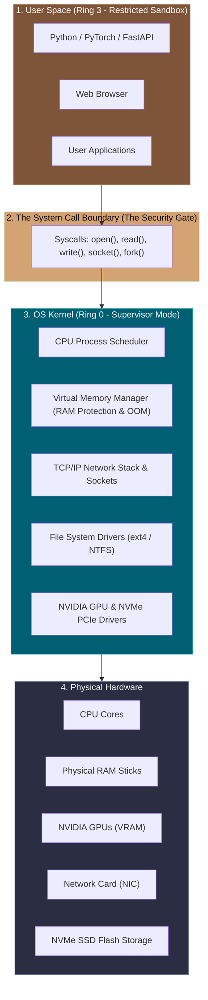
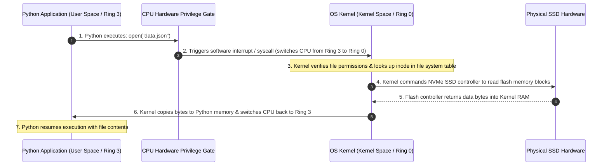
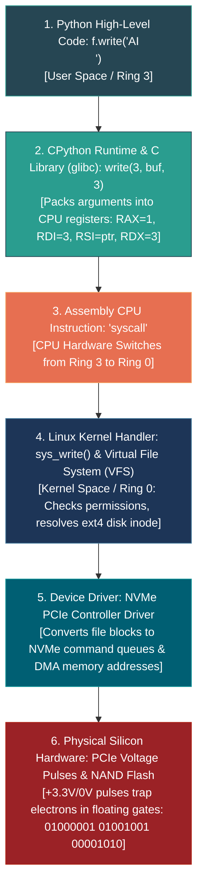

# 📌 What is the OS Kernel? (The Master Controller)

> **Reference / Context**: [10_linux_cli.md](file:///d:/Madhan_Utils/learnings/ai-ml/ai-ml-course/course-path/phase-0-engineering-foundations/10_linux_cli.md) | [the-complete-story-of-linux-and-ai.md](file:///d:/Madhan_Utils/learnings/ai-ml/ai-ml-course/explanations/the-complete-story-of-linux-and-ai.md) | [what-is-posix.md](file:///d:/Madhan_Utils/learnings/ai-ml/ai-ml-course/explanations/what-is-posix.md) | [09_building_apis_with_fastapi.md](file:///d:/Madhan_Utils/learnings/ai-ml/ai-ml-course/course-path/phase-0-engineering-foundations/09_building_apis_with_fastapi.md) | [how-web-servers-bind-sockets-tls-and-bytes.md](file:///d:/Madhan_Utils/learnings/ai-ml/ai-ml-course/explanations/how-web-servers-bind-sockets-tls-and-bytes.md) | [interpreter-compiler-bytecode-cpython.md](file:///d:/Madhan_Utils/learnings/ai-ml/ai-ml-course/explanations/interpreter-compiler-bytecode-cpython.md) | [os-kernel-vs-ai-gpu-kernels.md](file:///d:/Madhan_Utils/learnings/ai-ml/ai-ml-course/explanations/os-kernel-vs-ai-gpu-kernels.md)

---

### 1. 🎯 What is the Kernel? (In Plain English)

The **Kernel** is the core master program of your operating system (e.g., the **Linux Kernel**, **Windows NT Kernel**, or **macOS XNU Kernel**). 

It is the **all-powerful bridge and referee** that sits between physical hardware (CPU, RAM sticks, SSDs, Network Cards, GPUs) and user-level applications (Python, Chrome, VS Code, PyTorch).



---

### 2. 💡 The Real-World Analogy: Air Traffic Control Tower

Imagine a massive international airport:
- **The Hardware (Runways, Fuel Pumps, Hangars)**: The raw physical resources (CPU, RAM, Disks, GPUs).
- **The User Applications (Passenger Airplanes - Python, Chrome)**: Airplanes trying to take off, land, and refuel.
- **The Kernel (The Air Traffic Control Tower)**:
  - If pilots flew onto runways whenever they felt like it, planes would constantly crash into each other and destroy the airport.
  - Instead, an airplane pilot **cannot touch a runway** without radioing the Control Tower first (**a System Call**).
  - The Tower checks safety, assigns runway 24R (**allocates RAM/CPU**), and ensures no two planes occupy the same physical space at the same time.

---

### 3. 🛡️ The 4 Core Jobs of the Kernel

Why can't Python just talk to the hardware directly?

#### 1. Memory Protection & Isolation (Virtual Memory)
- If Python could write directly to physical RAM chips, a buggy Python script could overwrite Chrome's memory, steal your bank passwords from RAM, or crash the whole machine.
- The Kernel gives every process its own isolated **Virtual Memory Sandbox**. Python has no idea other programs exist in RAM.

#### 2. CPU Scheduling & Multitasking
- You might have **8 CPU cores**, but your computer is running **300 active background processes**.
- The Kernel's **Scheduler** slices time into milliseconds, pausing and switching between tasks so fast that all 300 apps appear to run simultaneously.

#### 3. Hardware Abstraction (Device Drivers)
- You don't want to write assembly code to pulse laser diodes on a Western Digital SSD vs. a Samsung SSD.
- The Kernel provides a universal interface: you just call `open("file.txt", "r")`, and the Kernel translates that into the exact electronic signals for that specific disk drive.

#### 4. Security & Privilege Rings (Ring 0 vs Ring 3)
Modern CPUs have hardware-enforced privilege rings:
- **Ring 0 (Kernel Mode / Supervisor)**: Full, unrestricted access to the CPU instructions and memory. Only the OS Kernel is allowed to execute here.
- **Ring 3 (User Mode)**: Restricted environment where user applications (Python, Node.js, games) run. The CPU hardware physically blocks Ring 3 code from accessing hardware registers directly.

---

### 4. ⚡ What is a "System Call" (Syscall)?

A **System Call** is the official programmatic request a user application makes to ask the Kernel to perform hardware operations on its behalf:

| What Your Python Code Does | The Kernel Syscall Under the Hood | Hardware Resource Touched |
|---|---|---|
| `f = open("model.pt", "rb")` | `sys_openat()` | SSD / Hard Drive |
| `data = f.read(1024)` | `sys_read()` | Disk Controller $\rightarrow$ RAM |
| `app = FastAPI()` $\rightarrow$ bind port | `sys_bind()`, `sys_listen()` | Network Interface Card (NIC) |
| `await reader.read()` | `sys_recvfrom()` / `sys_read()` | Socket FIFO buffer in Kernel RAM |
| `import multiprocessing` | `sys_fork()` / `sys_clone()` | CPU Core / Process Table |
| `print("AI")` | `sys_write(1, "AI\n", 3)` | Terminal TTY / Display Video Buffer |

---

### 5. 🔬 What Happens When You Run Python Code?



---

### 6. 💻 Step-by-Step Code Proof: From Python Code to Physical Voltage

To see why the Kernel is the indispensable bridge between software and hardware, follow a single line of Python as it descends through 6 distinct execution layers down to electrical voltage inside silicon:

```python
# Layer 1: High-Level Python (User Space - Ring 3)
with open("data.txt", "w") as f:
    f.write("AI\n")
```



#### Layer 1: High-Level Python Runtime (User Space / Ring 3)
Python's standard library formats the string `"AI\n"` into an array of 3 raw ASCII bytes: `[0x41, 0x49, 0x0A]`. Python itself has **zero hardware capabilities**—it cannot interact with disk memory chips directly because the CPU's hardware memory management unit (MMU) blocks Ring 3 code. Python calls the underlying C runtime.

#### Layer 2: C Standard Library Wrapper (`libc.so`)
CPython (written in C) calls the POSIX `write()` wrapper function inside the C standard library (`glibc`):
```c
// C Runtime Wrapper (User Space)
ssize_t write(int fd, const void *buf, size_t count);
```
The C library places the arguments into CPU hardware registers according to the System V AMD64 ABI calling convention:
- Register `RAX = 1` (The Linux Syscall Number for `sys_write`)
- Register `RDI = 3` (File descriptor for `data.txt`)
- Register `RSI = 0x7fff5fbff820` (Virtual memory address holding bytes `0x41, 0x49, 0x0A`)
- Register `RDX = 3` (Length of 3 bytes)

#### Layer 3: Assembly & The Hardware CPU Gate
The C library executes the x86-64 assembly instruction `syscall`:
```nasm
; Assembly instruction executed by CPU
mov rax, 1          ; syscall 1 = write
mov rdi, 3          ; fd = 3
mov rsi, data_ptr   ; memory pointer to "AI\n"
mov rdx, 3          ; count = 3 bytes
syscall             ; <-- CPU HARDWARE INSTRUCTION: SWITCHES CPU FROM RING 3 TO RING 0
```
When the CPU hardware encounters the `syscall` opcode (`0x0F 0x05`), it **physically flips its internal privilege flag from Ring 3 (User) to Ring 0 (Kernel)** and jumps to the kernel's registered entry point (`entry_SYSCALL_64`).

#### Layer 4: Linux Kernel Space Handler (Ring 0 / Supervisor Mode)
Now executing in Kernel Space with unrestricted hardware access, the Linux kernel's file system subsystem takes over (from Linux Kernel source `fs/read_write.c`):
```c
// Inside Linux Kernel Source (Ring 0)
SYSCALL_DEFINE3(write, unsigned int, fd, const char __user *, buf, size_t, count) {
    struct fd f = fdget_pos(fd);
    
    // 1. Security Check: Validate that User Space buffer address is legal
    if (!access_ok(buf, count)) return -EFAULT;
    
    // 2. VFS Lookup: Find the target file's inode and filesystem driver (ext4/xfs)
    // 3. Block Layer: Translate file offset into physical disk sector/LBA blocks
    vfs_write(f.file, buf, count, &pos);
}
```

#### Layer 5: Device Driver & DMA Controller (`drivers/nvme/host/core.c`)
The kernel's NVMe SSD device driver converts the filesystem logical block address (LBA) into an NVMe PCIe command packet:
```c
// Linux NVMe Device Driver (Ring 0)
nvme_setup_rw(cmd, lba_block_number, buffer_physical_address, byte_length);
// Instructs the motherboard's DMA (Direct Memory Access) controller to stream bytes over PCIe
```

#### Layer 6: Physical Hardware (Electronic Voltage & Flash Memory Cells)
1. **PCIe Bus Traces**: The motherboard transmits serial electrical differential voltage pulses over copper traces (+3.3V / 0V) to the SSD flash controller.
2. **NAND Flash Memory Chips**: The SSD microcontroller directs an electrical programming voltage (~15V–20V) to tunnel electrons across insulating oxide layers into floating-gate transistors, trapping electrical charge that physically represents the binary bit pattern:
   - `01000001` (ASCII `'A'`)
   - `01001001` (ASCII `'I'`)
   - `00001010` (ASCII `'\n'`)

---

### 7. 🛠️ Proving the Kernel Bridge Live on Your Terminal

You don't have to take the operating system's word for it. Linux provides the `strace` utility to observe every single time Python crosses the user-to-kernel boundary:

```bash
# Trace all system calls made by Python when running a simple print statement
strace -e trace=write python3 -c 'print("AI")'
```

#### Verified Terminal Output:
```text
write(1, "AI\n", 3)                      = 3
AI
+++ exited with 0 +++
```

#### What this proves:
1. `write`: The exact POSIX kernel system call triggered.
2. `1`: File Descriptor 1 (`stdout`).
3. `"AI\n"`: The ASCII string buffer.
4. `3`: The number of bytes written.
5. `= 3`: The Linux Kernel returning confirmation back to Python that the hardware successfully accepted all 3 bytes.

Without the Kernel executing in Ring 0, Python's `print("AI")` or `f.write("AI\n")` is just isolated numbers sitting in CPU registers—incapable of ever reaching a screen, a network card, or an SSD.
