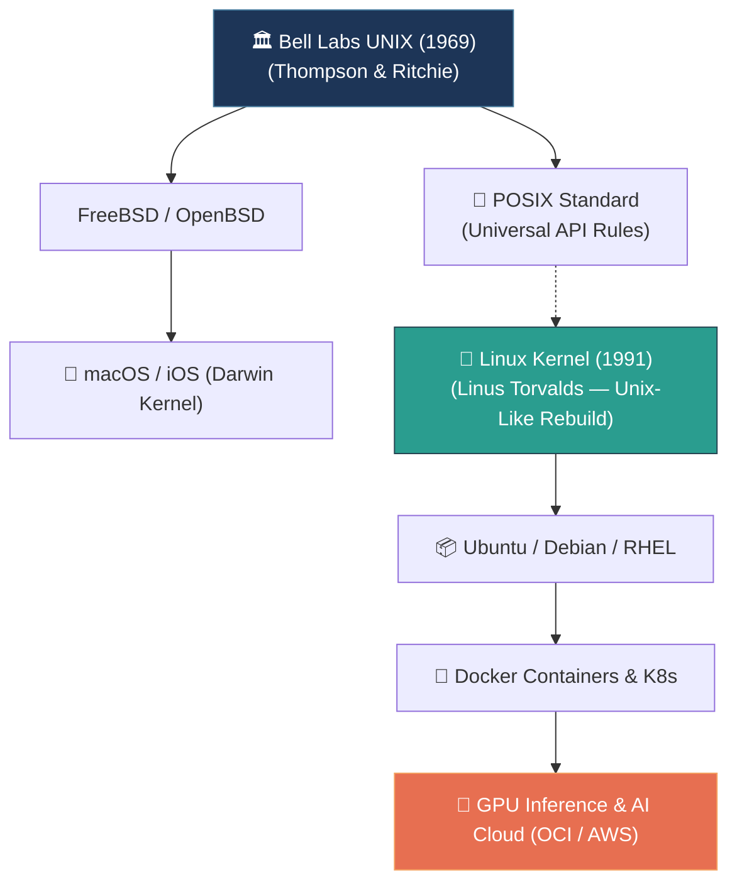

# 📌 What is Unix? (The Architectural Ancestor of Linux & macOS)

> **Reference / Context**: [10_linux_cli.md](file:///d:/Madhan_Utils/learnings/ai-ml/ai-ml-course/course-path/phase-0-engineering-foundations/10_linux_cli.md) | [the-complete-story-of-linux-and-ai.md](file:///d:/Madhan_Utils/learnings/ai-ml/ai-ml-course/explanations/the-complete-story-of-linux-and-ai.md) | [what-is-posix.md](file:///d:/Madhan_Utils/learnings/ai-ml/ai-ml-course/explanations/what-is-posix.md) | [what-is-the-os-kernel.md](file:///d:/Madhan_Utils/learnings/ai-ml/ai-ml-course/explanations/what-is-the-os-kernel.md) | [why-is-the-os-so-large.md](file:///d:/Madhan_Utils/learnings/ai-ml/ai-ml-course/explanations/why-is-the-os-so-large.md)

---

### 1. 🎯 What is Unix? (In Plain English)

**UNIX** originally stood for **UNICS** (**UNiplexed Information and Computing Service**). It was coined in 1969 as a playful pun on **MULTICS** (*MULTiplexed Information and Computing Service*), later shortened to **UNIX**.

It is the foundational operating system created in 1969 at AT&T Bell Labs (by Ken Thompson, Dennis Ritchie, Brian Kernighan, and Douglas McIlroy) that defined how modern operating systems, servers, and developer tools work today.

Virtually all modern server platforms—including **Linux (Ubuntu, Debian, RHEL)**, **macOS**, **Docker containers**, and **cloud VMs**—are built upon Unix design principles and standards (known as **POSIX**).

---

### 2. 💡 The Real-World Analogy: Lego Bricks vs. Monolithic Toys

Before Unix, computer operating systems were like **monolithic, glued-together plastic toys**—if you needed a slightly different toy, you had to build a whole new factory.

Unix invented the **Lego System**:
* Instead of building one massive program that does everything poorly, Unix builds **tiny, specialized Lego bricks** (`grep`, `awk`, `cat`, `sort`, `curl`).
* It connects them using standard universal snap-pins called **Pipes (`|`)**, allowing you to assemble infinite complex data pipelines out of simple, reusable parts.

---

### 3. 🎨 Visual Family Tree: Unix to Modern AI Platforms

---

### 4. ⚡ The 4 Core Unix Design Philosophies

Every terminal command used in **`10_linux_cli.md`** is an expression of these 4 rules:

| Unix Philosophy Principle | What It Means in Practice | Real Terminal Example |
| :--- | :--- | :--- |
| **1. Do One Thing Well** | Small, laser-focused utilities rather than bloated multi-tools. | `grep` only filters text; `wc` only counts lines. |
| **2. Everything is a File** | Hard drives, keyboard inputs, CPU stats, and network sockets are accessed as byte streams. | `/dev/null`, `/proc/cpuinfo`, socket file descriptors (`fd = 3`). |
| **3. Universal Text Streams** | The output of every tool is plain text that can be piped into another tool. | `cat access.log \| grep "500" \| wc -l` |
| **4. Silent Success** | If a command succeeds, print nothing. Noise is reserved for errors. | `mkdir models`, `rm temp.txt` (exit code `0` with zero stdout). |

---

### 5. ⚠️ Pro-Tip / Common Gotcha: Is Linux "Unix"?

* **Linux is NOT certified original Unix code**: In 1991, Linus Torvalds wrote the Linux kernel completely from scratch as an open-source, free clone that behaves identically to Unix. We call Linux **"Unix-like"**.
* **macOS IS a certified Unix OS**: macOS is built on FreeBSD/Darwin and carries official UNIX 03 certification.
* **Windows is NOT Unix**: Windows is built on the separate DOS/NT architecture, which is why commands like `ls`, `grep`, and file paths with `/` are native to Linux/macOS but require PowerShell aliases or WSL on Windows.
