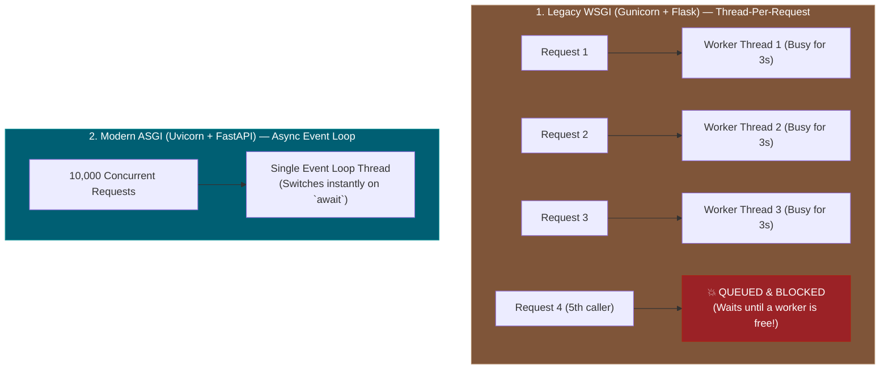
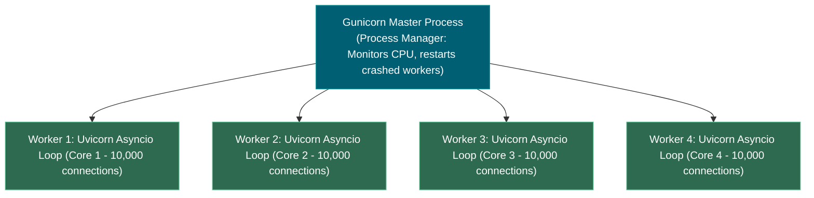

# 📌 What is WSGI? (Understanding Gunicorn, Flask, and the Legacy Web)

> **Reference / Context**: [07_http_fundamentals.md](file:///d:/Madhan_Utils/learnings/ai-ml/ai-ml-course/course-path/phase-0-engineering-foundations/07_http_fundamentals.md) | [09_building_apis_with_fastapi.md](file:///d:/Madhan_Utils/learnings/ai-ml/ai-ml-course/course-path/phase-0-engineering-foundations/09_building_apis_with_fastapi.md) | [complete-fastapi-and-systems-architecture-guide.md](file:///d:/Madhan_Utils/learnings/ai-ml/ai-ml-course/explanations/complete-fastapi-and-systems-architecture-guide.md) | [uvicorn-asgi-event-loop-explained.md](file:///d:/Madhan_Utils/learnings/ai-ml/ai-ml-course/explanations/uvicorn-asgi-event-loop-explained.md)

---

### 1. 🎯 What is WSGI? (In Plain English)

**WSGI** stands for **Web Server Gateway Interface** (created in 2003 under **PEP 3333**).

It was the original, 20-year-old standardized contract that allowed Python web frameworks (like **Flask** and **Django**) to talk to web servers (like **Gunicorn** or **uWSGI**).

- **The WSGI Rule**: It is **100% synchronous and blocking**. 
- In WSGI, **1 worker thread handles exactly 1 HTTP request at a time**. If that request takes 5 seconds to query a database or run an AI model, that entire thread is frozen and cannot touch any other user's request.



---

### 2. 💡 The Real-World Analogy: Bank Tellers vs. The Modern Kiosk

- **WSGI (Gunicorn / Flask)**: 
  - Like a traditional bank with **4 human teller windows (4 workers)**.
  - If Customer #1 has a complex loan application that takes 30 minutes, Teller #1 is locked to that customer for 30 minutes.
  - If 5 customers enter the bank, the 5th customer must stand in a waiting line outside the bank doors until a teller is finished.
- **ASGI (Uvicorn / FastAPI)**:
  - Like a high-speed digital automated kiosk.
  - 10,000 customers can scan their tickets simultaneously. While Customer #1 waits for the backend bank database to verify their credit score, the kiosk processes Customers #2 through #10,000 in microseconds.

---

### 3. 🔬 What is Flask? What is Gunicorn?

#### 1. Flask (The Synchronous Web Framework)
**Flask** is a minimal Python web framework created in 2010.
- When you write Flask code, every function runs **synchronously**:
```python
# Flask (WSGI):
from flask import Flask
import time

app = Flask(__name__)

@app.route("/predict")
def predict():
    time.sleep(2)  # 💥 Freezes the entire worker process for 2 full seconds!
    return {"status": "ok"}
```

#### 2. Gunicorn (The WSGI Web Server / Process Manager)
**Gunicorn** ("Green Unicorn") is a pre-fork worker web server for WSGI applications.
- When you run:
  ```bash
  gunicorn -w 4 app:app
  ```
- Gunicorn boots a master process and forks **4 worker OS processes**.
- **The Limit**: If all 4 workers are busy executing a 2-second ML calculation, **Request #5 is blocked and must wait in a queue**.

---

### 4. ⚡ Why WSGI Failed for Modern AI & Real-Time Web

| Feature | Legacy WSGI (Flask / Gunicorn) | Modern ASGI (FastAPI / Uvicorn) |
|---|---|---|
| **Underlying Function** | `def app(environ, start_response)` | `async def app(scope, receive, send)` |
| **Concurrency Style** | 1 OS Thread/Process per Request | Single-Thread Asyncio Event Loop |
| **LLM Token Streaming (SSE)** | ❌ Stalls 1 whole worker for 30 seconds | ✅ Streams tokens with zero thread overhead |
| **WebSockets** | ❌ Impossible natively (blocks thread forever) | ✅ Native bidirectional socket support |
| **I/O Waiting Cost** | Consumes heavy RAM ($30\text{ MB} - 50\text{ MB}$ per worker) | Lightweight coroutine ($< 2\text{ KB}$ per task) |

#### The LLM Problem with WSGI:
A ChatGPT-style LLM generation takes **5 to 20 seconds**.
- Under **WSGI**, serving 1,000 concurrent LLM users requires **1,000 heavy OS processes** (needing 50 GB+ of RAM!).
- Under **ASGI (FastAPI)**, 1,000 concurrent LLM streams run smoothly inside **a single process** using `await` and `StreamingResponse`.

---

### 5. 🛠️ How Gunicorn and Uvicorn Work Together in Production

In real-world enterprise production (Kubernetes, AWS, OCI), engineers actually use **BOTH Gunicorn and Uvicorn together**:

```bash
gunicorn -w 4 -k uvicorn.workers.UvicornWorker main:app
```



- **Gunicorn's Job**: Acts as the **Master Process Manager**. It spawns 1 worker per CPU core, handles auto-restarts if a process crashes, and reloads code during zero-downtime deployments.
- **Uvicorn's Job**: Runs inside each worker as the **ASGI Async Event Loop**, handling 10,000+ concurrent non-blocking connections on that CPU core.
