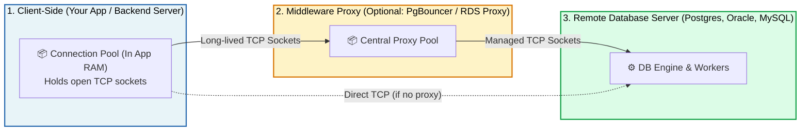

# 📌 Where Connection Pools Live & Why We Use Them

> **Reference / Context**: [08_consuming_rest_apis.md](file:///d:/Madhan_Utils/learnings/ai-ml/ai-ml-course/course-path/phase-0-engineering-foundations/08_consuming_rest_apis.md) | [09_building_apis_with_fastapi.md](file:///d:/Madhan_Utils/learnings/ai-ml/ai-ml-course/course-path/phase-0-engineering-foundations/09_building_apis_with_fastapi.md) | [15_postgres_pgvector_redis.md](file:///d:/Madhan_Utils/learnings/ai-ml/ai-ml-course/course-path/phase-0-engineering-foundations/15_postgres_pgvector_redis.md)
> **Topic Context**: System Architecture, Client vs. Server-Side Pooling, Latency vs. Throughput & Resource Protection

---

### 1. 🎯 Part 1: Is Connection Pooling Just to Reduce Latency?

**Latency reduction is a huge reason, but it is only HALF the story!**

There are **two critical reasons** connection pools exist:

| Reason | The Problem Without a Pool | How the Pool Solves It |
| :--- | :--- | :--- |
| **1. Latency Reduction (Speed)** | Every query suffers TCP handshake + TLS encryption + DB Login delay (adds **50ms – 300ms** per request). | Sockets are **pre-warmed and ready**, cutting connection overhead to **0ms**. |
| **2. Server Protection (Stability)** | If 10,000 users click at once, 10,000 connections open $\rightarrow$ Database runs out of RAM/CPU and **crashes**. | The pool acts as a **dam / gatekeeper** (`max_size = 20`), allowing only safe amounts of traffic through and queuing the rest. |

---

### 2. 🎯 Part 2: Where Does the Pool Physically Live?

> [!IMPORTANT]
> In 95% of standard applications, the **Connection Pool lives inside YOUR Application (the Client)**, in its RAM memory!

#### 📍 The 3 Architecture Locations:



1. **Client-Side Pool (Most Common)**:
   - Lives inside your application code (e.g., your Node.js, Python, or Spring Boot server).
   - Your app maintains open socket handles pointing across the network to the database.
2. **Middleware Pool Proxy (For Large Scale)**:
   - Tools like **PgBouncer**, **AWS RDS Proxy**, or **ProxySQL** sit as an independent layer between 50 app servers and 1 database.
3. **Database Server**:
   - The database server itself does **not** create the client's connection pool; it just accepts and maintains the connections that clients open.

---

### 3. 💡 The Real-World Analogy

#### 🏦 The Bank Teller Analogy
- **The Application Server**: A bus tour company bringing customers (requests) to the bank.
- **The Client-Side Pool**: The tour company has **3 reserved VIP tokens** (the pool) in its pocket.
- **Why reduce latency?**: Customers don't have to fill out registration forms at the door every time; they just use the pre-approved VIP token and walk straight to the counter.
- **Why protect the bank?**: Even if the bus has 100 tourists, only 3 can enter the bank at any single moment. This prevents 100 tourists from rushing the teller and breaking the glass!
- **Where does the pool live?**: The tour guide (Your App) holds the 3 tokens in their pocket, not the bank.

---

### 4. 🔬 Summary Comparison

```text
+-------------------------------------------------------------+
| YOUR BACKEND APP (e.g. Node.js / Python / Java)             |
|                                                             |
|   Memory Heap:                                              |
|   [ Connection Pool: max=10 ]                               |
|     ├── Socket 1  ══════════════════════════════╗           |
|     ├── Socket 2  ══════════════════════════════╬══╗        |
|     └── Socket 3  ══════════════════════════════╬══╬══╗     |
+-------------------------------------------------╫──╫──╫-----+
                                                  ║  ║  ║ (Network Cables)
                                                  ▼  ▼  ▼
                                    +-------------------------+
                                    | REMOTE DATABASE SERVER  |
                                    | (PostgreSQL / Oracle)   |
                                    | 10 Active Sessions      |
                                    +-------------------------+
```
