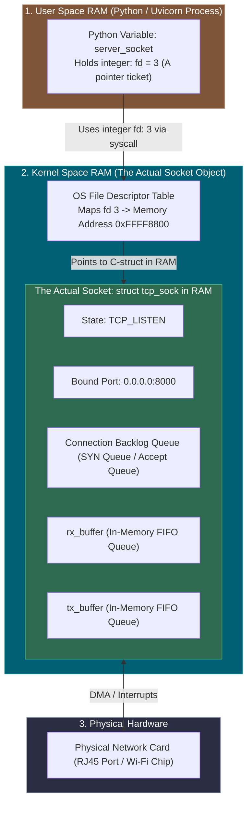
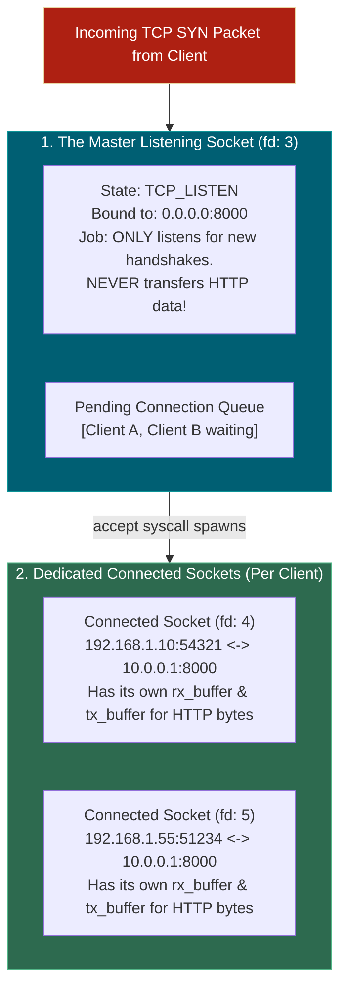

# 📌 Where Does the "Socket" Actually Live in the OS Kernel?

> **Reference / Context**: [07_http_fundamentals.md](file:///d:/Madhan_Utils/learnings/ai-ml/ai-ml-course/course-path/phase-0-engineering-foundations/07_http_fundamentals.md) | [09_building_apis_with_fastapi.md](file:///d:/Madhan_Utils/learnings/ai-ml/ai-ml-course/course-path/phase-0-engineering-foundations/09_building_apis_with_fastapi.md) | [10_linux_cli.md](file:///d:/Madhan_Utils/learnings/ai-ml/ai-ml-course/course-path/phase-0-engineering-foundations/10_linux_cli.md) | [what-is-the-os-kernel.md](file:///d:/Madhan_Utils/learnings/ai-ml/ai-ml-course/explanations/what-is-the-os-kernel.md)

---

### 1. 🎯 What is a Socket and Where Does It Live?

A **Socket** is NOT a physical hardware slot, and it is NOT a file stored on your hard drive.

A **Socket** is a **C-struct memory block (called `struct sock` / `struct tcp_sock`) allocated inside KERNEL SPACE RAM**.

To your Python program (Uvicorn / FastAPI), the socket is simply handed over as a tiny integer handle called a **File Descriptor** (e.g., `fd = 3` or `fd = 4`).

---

### 2. 💡 The Real-World Analogy: The Coat Check Ticket

Imagine visiting a luxury hotel:
- **The Physical Coat Room (Kernel RAM)**: A massive, locked storage room where physical coats (packets, buffers, TCP state) are hung on specific racks.
- **The Actual Rack / Hanger (`struct tcp_sock`)**: The specific numbered wooden hanger holding your coat, with a label showing your room number.
- **The Coat Check Ticket (The File Descriptor `fd: 3`)**: 
  - The hotel desk gives you a small plastic ticket with the number **`3`** stamped on it.
  - You (Python) do NOT hold the coat room or the hanger. You just hold ticket **`3`**.
  - Whenever you want to retrieve a coat or drop something in the pocket (`read()` or `write()`), you hand ticket **`3`** to the hotel staff (**the Kernel**).

---

### 3. 🔬 What is the "Listening Socket" That We Always Listen On?

When you run `uvicorn main:app --port 8000`, why do we say the server is "listening"?

There are actually **TWO completely different kinds of sockets** in the Kernel:

#### 1. The Master Listening Socket (`fd: 3`)
- **Location**: Registered in the Kernel's Global Port Hash Table under port `8000`.
- **Purpose**: It is a **doorbell**. It does NOT send or receive HTTP messages.
- **How It Works**: When an incoming TCP `SYN` packet arrives on port 8000, the Kernel matches it to this listening socket, performs the 3-way handshake, and places the ready connection into its `Accept Queue`.

#### 2. The Connected Sockets (`fd: 4`, `fd: 5`, etc.)
- When Uvicorn calls `accept()`, the Kernel pops a completed connection from the Listening Socket's queue and **creates a BRAND NEW `struct tcp_sock` in Kernel RAM**.
- This new socket gets its own **5-tuple** and its own dedicated **`rx_buffer` / `tx_buffer`**.
- This is where the actual HTTP JSON bytes are read and written!
- Meanwhile, the Master Listening Socket (`fd: 3`) goes right back to listening for the next incoming caller.

---

### 4. ⚡ Step-by-Step: The Life of a Socket in Kernel Memory

1. **Creation (`socket()`)**: Kernel allocates ~2KB of RAM for a `struct tcp_sock` and hands Python an integer (e.g. `3`).
2. **Binding (`bind()`)**: Kernel writes IP `0.0.0.0` and Port `8000` into that struct and registers it in its internal port lookup table.
3. **Listening (`listen()`)**: Kernel sets `state = TCP_LISTEN` and allocates memory for the connection queue.
4. **Accepting (`accept()`)**: When a client connects, Kernel clones the connection parameters into a **new socket struct** (`fd: 4`), allocating dedicated `rx_buffer` (e.g. 128KB FIFO) and `tx_buffer` in RAM.
5. **Data Transfer (`read()` / `write()`)**: Incoming TCP packets are DMA-written into `fd: 4`'s `rx_buffer`. Python reads from `fd: 4`.
6. **Destruction (`close()`)**: When the client disconnects, Python calls `close(fd: 4)`. The Kernel frees the socket's memory struct and returns the RAM back to the OS memory pool.
