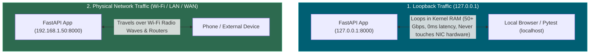
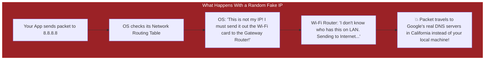

# 📌 Why `127.0.0.1`? How the Loopback Interface Actually Works

> **Reference / Context**: [file-descriptors-ip-ports-and-0000-explained.md](file:///d:/Madhan_Utils/learnings/ai-ml/ai-ml-course/explanations/file-descriptors-ip-ports-and-0000-explained.md) | [how-web-servers-bind-sockets-tls-and-bytes.md](file:///d:/Madhan_Utils/learnings/ai-ml/ai-ml-course/explanations/how-web-servers-bind-sockets-tls-and-bytes.md) | [09_building_apis_with_fastapi.md](file:///d:/Madhan_Utils/learnings/ai-ml/ai-ml-course/course-path/phase-0-engineering-foundations/09_building_apis_with_fastapi.md)

---

### 1. 🎯 The Core Truth

**Yes, `127.0.0.1` is an international internet standard (RFC 1122 & RFC 6890) reserved exclusively for the "Loopback Interface" (`lo`).**

In fact, the **entire block from `127.0.0.0` to `127.255.255.255` (over 16.7 million IP addresses!)** is reserved solely for your computer to talk to itself. You could bind FastAPI to `127.0.0.2` or `127.42.0.1` and it would still work!



---

### 2. 💡 The Real-World Analogy: Talking to Yourself vs. Sending Mail

- **Wi-Fi / LAN / WAN IP (`192.168.1.50` or `142.250.190.46`)**: 
  - Like writing a letter, putting a postal stamp on it, and dropping it in the mailbox outside on the street. It travels through postal trucks and sorting facilities (Routers/Switches) before reaching its destination.
- **Loopback IP (`127.0.0.1`)**: 
  - Like **handing a sticky note from your right hand to your left hand**. 
  - You don't buy a postage stamp, you don't go outside to the street mailbox, and the postal service never touches it. It happens instantly inside your own body (RAM).

---

### 3. 🔬 What Makes `127.0.0.1` Special? (The Loopback Interface)

When your code connects to `127.0.0.1`:

1. **Zero Hardware Involvement**: The packet **never touches your physical Network Card (NIC)**. No voltages are sent down the Ethernet wire, and no radio waves leave your Wi-Fi antenna.
2. **Lightning Speed**: Because the OS Kernel simply moves bytes from one memory buffer to another in RAM, loopback bandwidth reaches **$50 - 100\text{ Gbps}$** with near-zero latency ($< 0.02\text{ ms}$).
3. **100% Offline Guarantee**: It works in the middle of a desert or on an airplane with Wi-Fi and Ethernet completely disabled.
4. **Ironclad Security**: No outside device, hacker, or device on your local Wi-Fi can sniff, intercept, or connect to `127.0.0.1`.

---

### 4. ❓ "Why Can't I Just Use Any Random Address?"

What happens if you try to make up a random IP address like `8.8.8.8` or `192.168.99.99` on your laptop?



1. **Routing Conflicts & Internet Collisions**: IP addresses are governed by global routing protocols (BGP, OSPF, DHCP). If you pick a random public IP (like `8.8.8.8`), your operating system will broadcast packets out your Wi-Fi router toward the real global owner (Google), failing your local tests.
2. **You DO NOT Own Random IPs**: A network interface can only bind to an IP that the OS has formally assigned to its hardware adapter.

---

### 5. 🛠️ "Can I Use My Wi-Fi / LAN IP Instead?" — YES!

You **can** bind your FastAPI app to your real Wi-Fi / LAN IP:

```bash
# 1. Find your Wi-Fi IP on Windows/Mac (e.g. 192.168.1.45)
# 2. Run Uvicorn on that specific LAN IP:
uvicorn main:app --host 192.168.1.45 --port 8000
```

#### The Difference:
- **`127.0.0.1`**: Only your laptop can access `http://127.0.0.1:8000`.
- **`192.168.1.45`**: Anyone connected to your home/office Wi-Fi (like your mobile phone) can open `http://192.168.1.45:8000` to test your API!
- **`0.0.0.0` (The Best Practice)**: Listens on **both** `127.0.0.1` AND `192.168.1.45` simultaneously.
