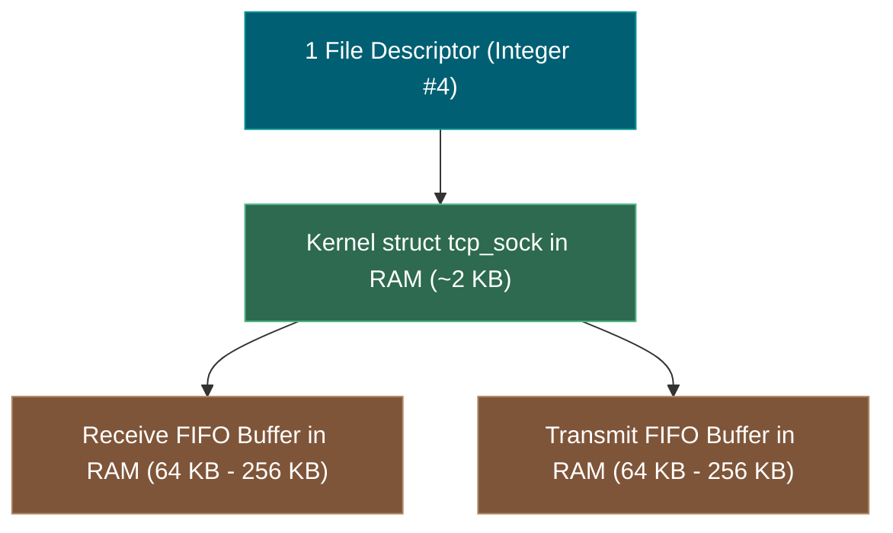
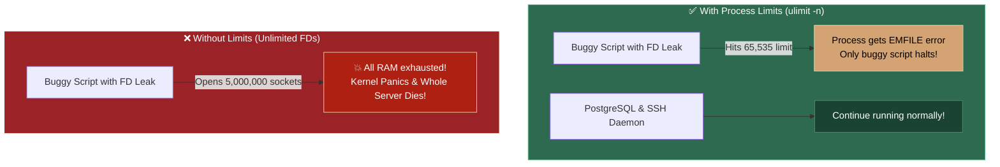

# 📌 Why Can't We Have "Unlimited" File Descriptors?

> **Reference / Context**: [09_building_apis_with_fastapi.md](file:///d:/Madhan_Utils/learnings/ai-ml/ai-ml-course/course-path/phase-0-engineering-foundations/09_building_apis_with_fastapi.md) | [10_linux_cli.md](file:///d:/Madhan_Utils/learnings/ai-ml/ai-ml-course/course-path/phase-0-engineering-foundations/10_linux_cli.md) | [file-descriptor-limits-and-server-crashes.md](file:///d:/Madhan_Utils/learnings/ai-ml/ai-ml-course/explanations/file-descriptor-limits-and-server-crashes.md) | [where-sockets-live-in-the-kernel.md](file:///d:/Madhan_Utils/learnings/ai-ml/ai-ml-course/explanations/where-sockets-live-in-the-kernel.md)

---

### 1. 🎯 The Core Truth

You cannot have "unlimited" File Descriptors because **every File Descriptor is backed by real, physical RAM inside the OS Kernel**.

An integer like `fd = 4` is just an index ticket. Behind that ticket in Kernel RAM sits a massive C-structure (`struct tcp_sock`) plus two in-memory FIFO buffers (`rx_buffer` and `tx_buffer`).

If the OS allowed "unlimited" FDs, a single buggy script or cyberattack could consume 100% of your physical RAM sticks in seconds, causing a **Kernel Panic** that hard-crashes the entire computer.



---

### 2. 💡 The Real-World Analogy: The Parking Garage & Valet Tickets

- **A File Descriptor** is like a **Valet Parking Ticket (Number #42)**.
- Printing a piece of paper with a number costs almost nothing.
- But every ticket represents a **2-ton physical car parked in a concrete stall**.
- You cannot issue "unlimited" valet tickets because your parking garage only has a finite amount of physical square footage (RAM).
- If you hand out 10,000 tickets for a 500-car garage, cars pile up on the highway, blocking emergency vehicles, and the entire city grid locks up.

---

### 3. 🔬 The 4 Hard Physical & Architectural Reasons

#### Reason 1: The Mathematics of Physical RAM
Every open TCP socket consumes at least **$4\text{ KB}$ (idle)** up to **$256\text{ KB}$ (active window buffering)** of non-swappable Kernel RAM:

| Number of Open Socket FDs | Minimum RAM Required (Idle) | Active Buffering RAM Required |
|---|---|---|
| **$1,000$ Sockets** | $\approx 4\text{ MB}$ | $\approx 128\text{ MB}$ |
| **$65,536$ Sockets** | $\approx 260\text{ MB}$ | $\approx 8\text{ GB}$ |
| **$1,000,000$ Sockets** | $\approx 4\text{ GB}$ | $\approx 128\text{ GB} - 256\text{ GB}$ |
| **"Unlimited" Sockets** | $\rightarrow \infty$ | 💥 **Kernel Out-Of-Memory (OOM) Panic** |

If a machine has 16 GB of RAM, having more than ~500,000 active full-buffered sockets is mathematically impossible.

---

#### Reason 2: Blast Radius & Multi-Tenant Protection (Fairness)
Your server runs dozens of critical background programs simultaneously (PostgreSQL, SSH daemon, monitoring agents, logging tools).
- If one buggy Python script has an FD leak and opens sockets in an infinite loop:
- **With Per-Process Limits (`ulimit -n = 65,535`)**: The Kernel stops *only that buggy Python script* (`EMFILE: Too many open files`). The database, SSH terminal, and operating system stay alive and healthy.
- **Without Limits ("Unlimited")**: The buggy script exhausts all physical RAM, crashing the entire server and locking you out of SSH.



---

#### Reason 3: Kernel Table & CPU Search Degradation
The OS Kernel must maintain internal red-black trees, hash tables, and descriptor arrays to map each integer `fd` to its kernel memory address.
- At millions of open FDs, memory fragmentation rises and the CPU spends more time traversing kernel data structures during context switches.

---

#### Reason 4: Defense Against Slowloris & DoS Attacks
In a **Slowloris DDoS attack**, an attacker opens thousands of connections and sends 1 byte every 30 seconds.
- If limits were unlimited, an attacker with a single laptop could open 1,000,000 zombie connections, holding gigabytes of your server's RAM hostage for zero effort.
- Strict FD limits force web servers and reverse proxies (NGINX) to reject suspicious connection floods.

---

### 5. 🛠️ How High Can You Actually Set the Limit in Production?

While you cannot have "unlimited", you can scale the limit to match your physical hardware:

```bash
# Check current soft limit:
ulimit -n
# 1024 (Default)

# In production /etc/security/limits.conf, engineers tune it to:
* soft nofile 1048576
* hard nofile 1048576
```

On a server with **64 GB - 128 GB of RAM**, a limit of **`1,048,576` ($1\text{ Million}$ FDs)** is standard and allows high-throughput services like NGINX, Redis, and FastAPI to serve massive traffic safely.
