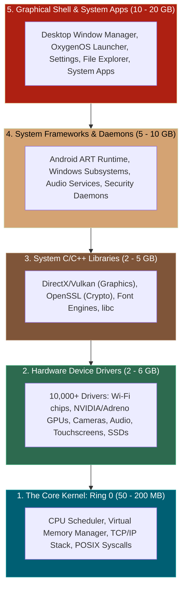

# 📌 What Makes Up an OS? (Why Windows & OxygenOS Are Gigabytes in Size)

> **Reference / Context**: [10_linux_cli.md](file:///d:/Madhan_Utils/learnings/ai-ml/ai-ml-course/course-path/phase-0-engineering-foundations/10_linux_cli.md) | [11_docker_and_compose.md](file:///d:/Madhan_Utils/learnings/ai-ml/ai-ml-course/course-path/phase-0-engineering-foundations/11_docker_and_compose.md) | [what-is-the-os-kernel.md](file:///d:/Madhan_Utils/learnings/ai-ml/ai-ml-course/explanations/what-is-the-os-kernel.md)

---

### 1. 🎯 The Core Truth

**Yes, that is the core engine—but it is only one slice of the iceberg.**

The code responsible for **TCP/IP networking, memory management, and hardware communication** is called the **Kernel & Device Drivers**. 

Interestingly, the **Kernel itself is surprisingly tiny** (a Linux kernel image is only $\approx 50\text{ MB} - 150\text{ MB}$). What makes an entire OS like **Windows 11 ($30 - 60\text{ GB}$)** or **OxygenOS / Android ($15 - 25\text{ GB}$)** so large is the massive ecosystem of drivers, libraries, system daemons, and graphical user interfaces built around that kernel.

---

### 2. 💡 The Real-World Analogy: A Modern Luxury Car

- **The Engine & Transmission (The Kernel ~100MB)**: The raw mechanical heart that injects fuel, fires pistons, and spins the axle (allocating CPU registers, managing RAM, and routing TCP packets).
- **The Electronic Adapters & Sensor Wiring (Device Drivers ~3GB)**: The chips and wiring harnesses that let the engine talk to 50 different wheel sensors, cameras, tire pressure gauges, and alternators.
- **The Power Steering & Anti-Lock Brake Computers (System Frameworks ~5GB)**: High-level automated control systems.
- **The Leather Seats, Touchscreen Dashboard, Air Conditioning & Sound System (GUI & Apps ~20GB)**: The massive, luxurious cockpit that humans actually interact with.

---

### 3. 🔍 The 5 Layers that Make Up the OS Size

#### Layer 1: The Core Kernel ($\approx 50\text{ MB} - 200\text{ MB}$)
- The raw binary that boots into RAM first (`vmlinuz` in Linux / `ntoskrnl.exe` in Windows).
- Handles:
  - CPU process scheduling & context switching.
  - Virtual memory mapping & RAM page tables.
  - The TCP/IP network protocol stack.
  - Basic file system drivers.

#### Layer 2: Hardware Device Drivers ($\approx 2\text{ GB} - 6\text{ GB}$)
Your computer or phone must be ready to talk to thousands of different physical chips manufactured by hundreds of competing companies:
- **Display/GPU Drivers**: NVIDIA, AMD, Intel, Qualcomm Adreno graphics pipelines.
- **Network Drivers**: Broadcom, Realtek, Qualcomm Wi-Fi, 5G Modems, Bluetooth controllers.
- **Sensors (in OxygenOS / Android)**: Fingerprint scanners, gyro sensors, cameras, battery management ICs.

#### Layer 3: System Libraries & APIs ($\approx 2\text{ GB} - 5\text{ GB}$)
Shared pre-compiled C/C++ libraries that all applications need:
- **`libc` / `msvcrt.dll`**: The standard C library for strings, math, and memory allocation.
- **Cryptography**: OpenSSL / Windows CryptoAPI for SSL/TLS encryption.
- **Graphics & Audio**: DirectX, Vulkan, OpenGL, ALSA, PulseAudio.

#### Layer 4: System Services & Daemons ($\approx 3\text{ GB} - 8\text{ GB}$)
Background worker programs constantly running without user intervention:
- On Windows: Windows Update, Windows Defender Antivirus, Print Spooler, Network Manager.
- On OxygenOS / Android: **Android Runtime (ART)** (the Java/Kotlin virtual machine), Google Play Services, Notification Push Daemons, Power Management optimizers.

#### Layer 5: The Graphical User Interface & System Apps ($\approx 5\text{ GB} - 20\text{ GB}$)
- Visual assets: 4K wallpapers, icon sets, fonts, sound effects, animations.
- Desktop Shell: Windows Explorer (`explorer.exe`) or OxygenOS Launcher (`SurfaceFlinger` compositor).
- Bundled Apps: Camera app, Settings, Photos, App Stores, system utilities.

---

### 4. 📱 OxygenOS (Android) vs. Windows 11 Comparison

| Dimension | Windows 11 (Desktop / Laptop) | OxygenOS (OnePlus / Android Phone) |
|---|---|---|
| **Underlying Kernel** | **Windows NT Kernel** (Proprietary Microsoft C/C++ kernel) | **Linux Kernel** (Open-source Unix-like kernel) |
| **Installed Size** | $\approx 30\text{ GB} - 64\text{ GB}$ | $\approx 15\text{ GB} - 25\text{ GB}$ |
| **Driver Model** | Supports millions of legacy PC hardware parts (Printers, PCIe cards, GPUs) | Tailored specifically for Qualcomm Snapdragon / MediaTek SoC chips |
| **App Execution** | Native x86_64 machine code / Win32 APIs | Android Runtime (ART / Dalvik) running bytecode + Native C/C++ (NDK) |
| **Networking Stack** | `winsock.dll` + NT Kernel TCP/IP driver (`tcpip.sys`) | Linux Kernel TCP/IP stack (`sk_buff` / POSIX sockets) |
| **System Calls** | `NtCreateFile`, `NtDeviceIoControlFile` | `sys_open`, `sys_read`, `sys_socket`, `sys_bind` |
