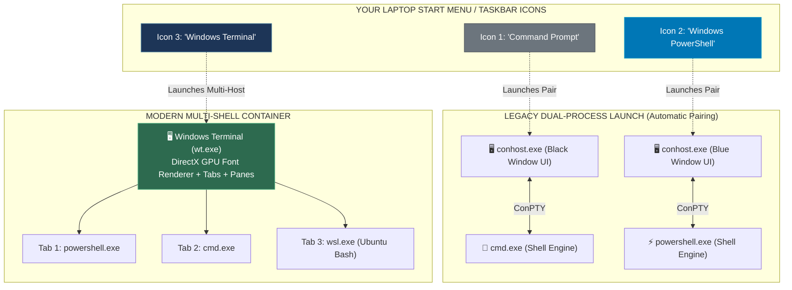

# 📌 Windows Terminal vs Windows PowerShell vs Command Prompt: Demystifying the 3 Laptop Apps

> **Reference / Context**: [10_linux_cli.md](file:///d:/Madhan_Utils/learnings/ai-ml/ai-ml-course/course-path/phase-0-engineering-foundations/10_linux_cli.md) | [terminal-vs-shell-and-powershell-vs-cmd.md](file:///d:/Madhan_Utils/learnings/ai-ml/ai-ml-course/explanations/terminal-vs-shell-and-powershell-vs-cmd.md) | [posix-unix-linux-gnu-kernel-terminal-shell.md](file:///d:/Madhan_Utils/learnings/ai-ml/ai-ml-course/explanations/posix-unix-linux-gnu-kernel-terminal-shell.md)

---

### 1. 🎯 What is it? (In Plain English)

When you look at your Windows laptop, you see 3 separate app icons: **"Command Prompt"**, **"Windows PowerShell"**, and **"Terminal"**.

[Certain] **None of these 3 icons are what they appear to be on the surface:**
1. **"Command Prompt" App** is **TWO programs glued together**: The OS launches the headless shell `cmd.exe` and wraps it inside a hidden legacy UI window program called `conhost.exe`.
2. **"Windows PowerShell" App** is also **TWO programs glued together**: The OS launches the headless .NET shell `powershell.exe` and wraps it inside `conhost.exe`.
3. **"Windows Terminal" App (`wt.exe`)** is a **pure UI Container (Terminal Emulator)**: It has zero shell capabilities. It is a modern GPU-accelerated window that can host `PowerShell`, `CMD`, and `Linux WSL Bash` inside tabs.

---

### 2. 💡 The Real-World Analogy: 3 TV Sets vs 1 Modern Smart TV

| Windows App on Laptop | Real-World Analogy | Under the Hood Architecture |
| :--- | :--- | :--- |
| **"Command Prompt" App** | **Old 1980s TV with a built-in VHS tape player (glued together)** | A legacy window (`conhost.exe`) hard-wired to run the 1980s text engine (`cmd.exe`). |
| **"Windows PowerShell" App** | **2000s TV with a built-in DVD player (glued together)** | The same legacy window (`conhost.exe`) hard-wired to run the modern .NET engine (`powershell.exe`). |
| **"Windows Terminal" App** | **Modern 4K Smart TV with HDMI Ports (The Universal Screen)** | A pure display screen with tabs (`wt.exe`). Port 1 = PowerShell, Port 2 = CMD, Port 3 = Ubuntu Linux. |

---

### 3. 🎨 Visual Architecture: What Actually Launches When You Click Each Icon

---

### 4. 🔬 The 3 Apps Dissected: File Paths & Runtimes

| Laptop Application | Executable File Path on Disk | Layer in Architecture | What Code Runs When Opened |
| :--- | :--- | :--- | :--- |
| **Command Prompt** | `C:\Windows\System32\cmd.exe` | **Layer 4 Shell** (wrapped in Layer 6 `conhost.exe`) | Spawns `cmd.exe`. OS automatically spawns `conhost.exe` so you can see a black window. Runs legacy batch scripts and string commands. |
| **Windows PowerShell** | `C:\Windows\System32\WindowsPowerShell\v1.0\powershell.exe` | **Layer 4 Shell** (wrapped in Layer 6 `conhost.exe`) | Spawns `powershell.exe`. OS automatically spawns `conhost.exe` (configured with blue background). Loads .NET Framework 4.8 runtime. |
| **PowerShell 7 (`pwsh`)** *(Optional Modern Install)* | `C:\Program Files\PowerShell\7\pwsh.exe` | **Layer 4 Shell** | Modern, cross-platform PowerShell running on .NET 8 / 9 Core (runs on Windows, Linux, and macOS). |
| **Windows Terminal** | `C:\Program Files\WindowsApps\Microsoft.WindowsTerminal_...\wt.exe` | **Layer 6 Terminal Emulator** | Pure GUI window written in C++/WinUI. Spawns whatever shell is set as your default profile (usually PowerShell). |

---

### 5. ⚡ Why Does Windows Have All 3 on Your Laptop?

1. **Backwards Compatibility (The #1 Rule of Windows)**:
   - Thousands of corporate enterprise systems and server scripts written in 1995 still rely on `cmd.exe` and `conhost.exe`. Microsoft cannot delete them without breaking millions of legacy enterprise programs.
2. **The Evolution from String to Objects**:
   - In 2006, Microsoft realized `cmd.exe` was obsolete for system administration and built **PowerShell** on top of the .NET object runtime.
3. **The Modern Separation of GUI and Engine (2019)**:
   - Linux and macOS always separated the Terminal GUI (e.g., `GNOME Terminal`, `iTerm2`) from the Shell (`bash`, `zsh`).
   - In 2019, Microsoft built **Windows Terminal** to give Windows developers the same modern multi-tab, GPU-rendered experience that Linux and macOS developers enjoyed for decades.

---

### 6. ⚠️ Key Takeaways & Which One You Should Actually Use

* **Which one should you use for daily development and AI/ML?**
  - **Always open "Windows Terminal" (`wt.exe`)**.
  - Inside Windows Terminal, use **PowerShell 7 (`pwsh`)** for Windows automation or **WSL2 (Ubuntu / Bash)** for Python, PyTorch, Docker, and AI engineering.
* **When do you touch `cmd.exe`?**
  - Almost never, unless you are maintaining legacy `.bat` scripts or old corporate tooling.
