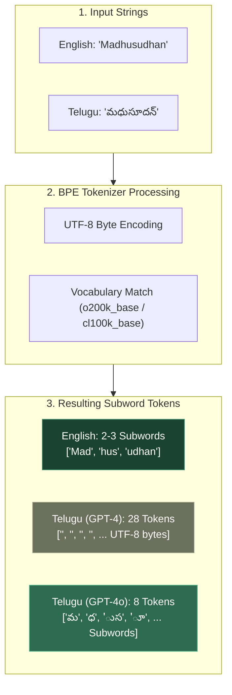
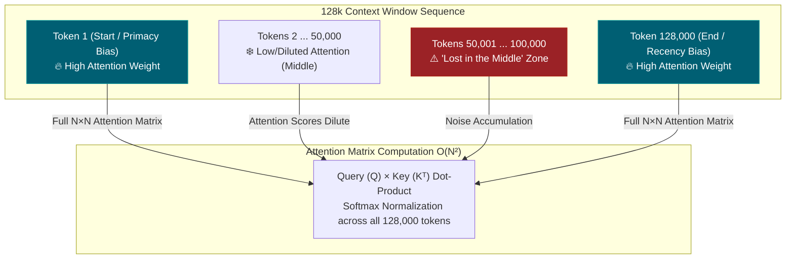
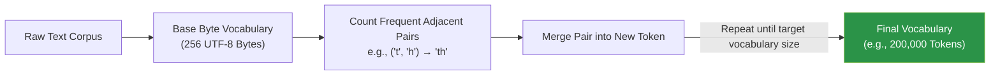
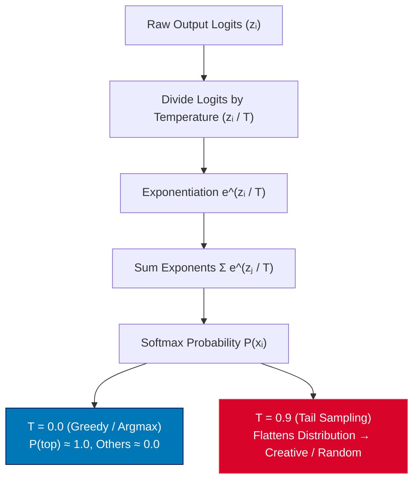

# 0.1 — Transformer Architecture + Tokenization (Conceptual)

## Overview & Conceptual Answers

### Skip Test Questions & Answers

#### ① Why a 128k token context window doesn't mean the LLM remembers 128k words perfectly
1. **Tokens vs. Words Conversion:** 128k tokens is equivalent to roughly ~90,000–98,000 English words ($1 \text{ word} \approx 1.3 \text{–} 1.4 \text{ tokens}$). Non-Latin scripts (e.g., Telugu, Devanagari) consume significantly more tokens per word due to subword vocabulary encoding (*see Glossary: Byte Pair Encoding (BPE)*).
2. **"Lost in the Middle" Effect:** Self-attention distributes attention weights across the entire sequence. As context length increases, attention weights dilute. Models exhibit **primacy bias** (high recall for context at the beginning) and **recency bias** (high recall for context at the end), while information buried in the middle of long prompts experiences sharp retrieval degradation.
3. **Attention Noise & Softmax Accumulation:** The softmax function (*see Glossary: Softmax Function & Logit Scaling*) in self-attention normalizes scores over all $N$ tokens in the context. In a 128k sequence, thousands of low-relevance tokens accumulate small probability values, accumulating background noise that can mask critical details.

#### ② Why `temperature=0` gives more consistent tool-calling output than `temperature=0.9`
1. **Greedy Decoding ($T=0$):** At temperature 0, the sampling process selects the token with the absolute maximum predicted logit probability ($\text{argmax}$). Tool calling requires rigid, deterministic syntax (precise JSON key names, proper escaping, closing brackets, matching argument types).
2. **Tail-Probability Sampling ($T=0.9$):** Higher temperatures flatten the softmax probability distribution ($z_i / T$) (*see Glossary: Softmax Function & Logit Scaling*). This allows low-probability tail tokens to be sampled. A single non-deterministic token inside a JSON string (e.g., a missing quote, unexpected space, or altered key name) invalidates the JSON payload, breaking structured tool calls.

---

## Core LLM Architectural Concepts

| Concept | Explanation |
| :--- | :--- |
| **Subword Tokenization** | LLMs operate over subword tokens rather than full words or raw characters. Tokenizers like Byte Pair Encoding (*see Glossary: Byte Pair Encoding (BPE)*) build vocabularies from training corpora. Because datasets are heavily dominated by English ASCII text, common English words receive dedicated single tokens, while non-Latin scripts (e.g., Telugu, Indic scripts) get split into multi-byte UTF-8 character fragments. |
| **Attention Mechanism & $O(N^2)$ Complexity** | Every token calculates a query-key dot-product relevance score against every other token: $\text{Attention}(Q, K, V) = \text{Softmax}\left(\frac{QK^T}{\sqrt{d_k}}\right)V$ (*see Glossary: Softmax Function & Logit Scaling*). Computing an $N \times N$ matrix costs $O(N^2)$ in time and memory, creating a hard physical hardware constraint on context window capacity. |
| **Context Window vs. Perfect Recall** | Context capacity specifies the maximum sequence length that fits into GPU memory (KV-cache). It does not guarantee equal retrieval accuracy across all positions. Retrieval reliability degrades non-linearly with distance and context density. |
| **Temperature Sampling** | Adjusts the sharpness of next-token probability distributions by scaling raw logits before softmax ($z_i / T$) (*see Glossary: Softmax Function & Logit Scaling*). Low values approach deterministic argmax selection; high values flatten probabilities across candidate tokens. |
| **Hallucinations vs. Grounding** | LLMs do not query a database; they produce statistically plausible continuations based on learned context weights. Without external grounding (RAG, live API tool responses), "statistically plausible" text frequently diverges from factual truth. |

---

## Visual Concept Explanations

### 1. Subword Tokenization & Script Disparity (BPE Pipeline)

The diagram below illustrates how raw text strings pass through the Byte Pair Encoding (BPE) tokenizer (*see Glossary: Byte Pair Encoding (BPE)*). Notice how English words merge into single dense subword tokens, while non-Latin scripts (like Telugu) decompose into multiple raw byte/fragment tokens due to corpus training bias:



---

### 2. Self-Attention $O(N^2)$ Complexity & "Lost in the Middle"

Every token in the context window calculates attention scores against every other token. In a 128k context window, this creates an $N \times N$ attention matrix ($128,000 \times 128,000 \approx 16.3 \text{ billion connections}$). Attention weights dilute in the middle of the context window (*primacy and recency bias*):



---

## Token Cost Experiment across Scripts

Tokenizers can be executed **100% locally** in Python using free open-source libraries (`tiktoken`, `transformers`) without requiring paid API subscriptions.

### Benchmark Setup & Code

The script [01_token_cost_across_scripts.py](file:///d:/Madhan_Utils/learnings/ai-ml/ai-ml-course/llm-fundamentals/01_token_cost_across_scripts.py) compares character counts, token counts, and tokenization efficiency across English, Telugu, and PL/SQL strings:

```python
import sys
import tiktoken
from transformers import AutoTokenizer

# Ensure UTF-8 output formatting on Windows console
if hasattr(sys.stdout, 'reconfigure'):
    sys.stdout.reconfigure(encoding='utf-8')

texts = {
    "English": "Madhusudhan Reddy",
    "Telugu": "మధుసూదన్ రెడ్డి",
    "PL/SQL": "CREATE OR REPLACE PROCEDURE update_invoice(p_id IN NUMBER, p_status IN VARCHAR2) IS BEGIN UPDATE invoices SET status = p_status WHERE id = p_id; COMMIT; END;"
}

# 1. Local OpenAI Tokenizers (GPT-4o vs GPT-4)
enc_gpt4o = tiktoken.get_encoding("o200k_base")
enc_gpt4  = tiktoken.get_encoding("cl100k_base")

# 2. Local Open-Source Tokenizer (Qwen 2.5)
tok_qwen25 = AutoTokenizer.from_pretrained("Qwen/Qwen2.5-7B")

print(f"{'Script':<10} | {'Chars':<6} | {'GPT-4o':<8} | {'GPT-4':<8} | {'Qwen-2.5':<8} | {'GPT-4o Chars/Token'}")
print("-" * 85)

for label, text in texts.items():
    chars = len(text)
    t_gpt4o = len(enc_gpt4o.encode(text))
    t_gpt4  = len(enc_gpt4.encode(text))
    t_qwen  = len(tok_qwen25.encode(text))
    ratio = chars / t_gpt4o if t_gpt4o > 0 else 0
    print(f"{label:<10} | {chars:<6} | {t_gpt4o:<8} | {t_gpt4:<8} | {t_qwen:<8} | {ratio:.2f}")
```

### Empirical Results

```text
=====================================================================================
 LOCAL TOKENIZATION COMPARISON
=====================================================================================

Script     | Chars  | GPT-4o   | GPT-4    | Qwen-2.5 | GPT-4o Chars/Token
-------------------------------------------------------------------------------------
English    | 17     | 7        | 6        | 6        | 2.43
Telugu     | 15     | 8        | 28       | 24       | 1.88
PL/SQL     | 157    | 39       | 37       | 37       | 4.03
```

### Detailed Token Breakdown

1. **Telugu Script Token Disparity (GPT-4 vs. GPT-4o):**
   - **GPT-4 (`cl100k_base`):** `మధుసూదన్ రెడ్డి` (15 characters) split into **28 tokens** (~1.86 tokens per character).
   - **GPT-4o (`o200k_base`):** OpenAI expanded its tokenizer vocabulary (*see Glossary: Byte Pair Encoding (BPE)*) to 200,000 entries, optimizing non-Latin tokenization. The same Telugu phrase reduced from **28 tokens to 8 tokens**.
2. **PL/SQL Code Token Efficiency:**
   - Reserved SQL keywords (`CREATE`, `REPLACE`, `PROCEDURE`, `UPDATE`, `WHERE`, `COMMIT`) exist as single entries in the BPE vocabulary (*see Glossary: Byte Pair Encoding (BPE)*). 157 characters tokenized into just **39 tokens** (~4.03 characters per token).

---

## Glossary

### Byte Pair Encoding (BPE)

**Byte Pair Encoding (BPE)** is a data compression and subword tokenization algorithm used by state-of-the-art LLMs (e.g., GPT-4, Llama 3, Qwen 2.5) to convert raw text into sequences of numerical token IDs.

#### BPE Training & Merging Pipeline



#### Why Script Disparity Occurs in BPE
- **Corpus Bias:** BPE vocabulary construction is purely frequency-driven. Because training datasets consist predominantly of English web text and code, English character pairs merge repeatedly into long word tokens (e.g., `"update_invoice"` $\to$ 2 tokens).
- **Fallback to Byte Tokens:** Infrequent scripts like Telugu appear less often in the training corpus. As a result, BPE vocabulary fills up before complex Telugu character combinations can be merged, forcing the tokenizer to split non-English text into individual multi-byte UTF-8 character fragments.

---

### Softmax Function & Logit Scaling

The **Softmax function** is a core mathematical transformation used in both **Self-Attention** (to compute attention weights across sequence positions) and **Final Output Next-Token Prediction** (to convert raw logit vectors into a probability distribution over the vocabulary).

#### Softmax Temperature Scaling Pipeline



#### 1. Standard Mathematical Formula

Given an unnormalized logit vector $\mathbf{z} = [z_1, z_2, \dots, z_K]$ for a vocabulary of size $K$, the Softmax probability $P(x_i)$ for token $i$ is defined as:

$$\text{Softmax}(z_i) = \frac{e^{z_i}}{\sum_{j=1}^{K} e^{z_j}}$$

Properties of Softmax:
- **Non-negativity:** $P(x_i) > 0$ for all $i$.
- **Normalization:** $\sum_{i=1}^{K} P(x_i) = 1.0$.
- **Monotonic Exponentiation:** Amplifies relative differences between the largest logit and smaller logits.

---

#### 2. Role of Softmax in Self-Attention

In the Transformer attention block, softmax converts scaled dot-product query-key similarity scores into normalized scalar attention weights:

$$\text{Attention}(Q, K, V) = \text{Softmax}\left(\frac{Q K^T}{\sqrt{d_k}}\right) V$$

Where:
- $Q \in \mathbb{R}^{N \times d_k}$ is the Query matrix for $N$ sequence tokens.
- $K \in \mathbb{R}^{N \times d_k}$ is the Key matrix.
- $\sqrt{d_k}$ is the scaling factor preventing extremely large dot-products that cause small gradients in softmax.
- $\text{Softmax}(\cdot)$ is applied row-wise across the $N$ sequence positions.

---

#### 3. Softmax with Temperature ($T$) Logit Scaling

During next-token generation, temperature $T > 0$ scales raw model logits $z_i$ prior to applying the exponential function:

$$\text{Softmax}(z_i, T) = \frac{e^{z_i / T}}{\sum_{j=1}^{K} e^{z_j / T}}$$

##### Temperature Regimes & Behavior

| Temperature ($T$) | Mathematical Effect on Logits | Sampling Behavior | Use Case |
| :--- | :--- | :--- | :--- |
| **$T \to 0$** (e.g., $T=0.0$) | $z_i / T \to \pm \infty$. Differences between logits are infinitely magnified. $\max(z)$ approaches probability $1.0$; all other logits approach $0.0$. | **Greedy Decoding ($\text{argmax}$)**<br>Model deterministically selects the single top token. Zero randomness. | Structured JSON output, tool calling, code generation, math reasoning. |
| **$T = 1.0$** | Unscaled logits ($z_i / 1.0$). Softmax outputs raw model learned probabilities. | **Standard Sampling**<br>Model samples strictly according to its natural training distribution. | Standard conversational responses. |
| **$T > 1.0$** (e.g., $T=0.9$) | $z_i / T$ compresses logits closer together. Exponents become more equal, flattening the probability distribution. | **Tail-Probability Sampling**<br>Mass spreads across secondary and tertiary candidate tokens. Increases output variance and entropy. | Creative writing, brainstorming, non-deterministic storytelling. |

---

### Key Summary Equations
- **Token Efficiency Ratio:** $\text{Ratio} = \frac{\text{Character Count}}{\text{Token Count}}$
- **Attention Matrix Memory:** $\text{Memory}_{\text{Attention}} \propto O(N^2 \cdot d_{\text{head}})$
- **Temperature Logit Scaling:** $P(x_i) \propto \exp\left(\frac{z_i}{T}\right)$
- **BPE Vocabulary Merging:** $(s_a, s_b) \to s_{new} \quad \text{based on } \max(\text{Frequency})$
