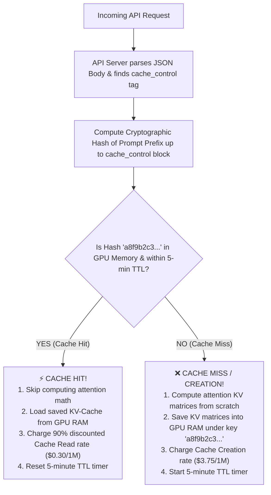
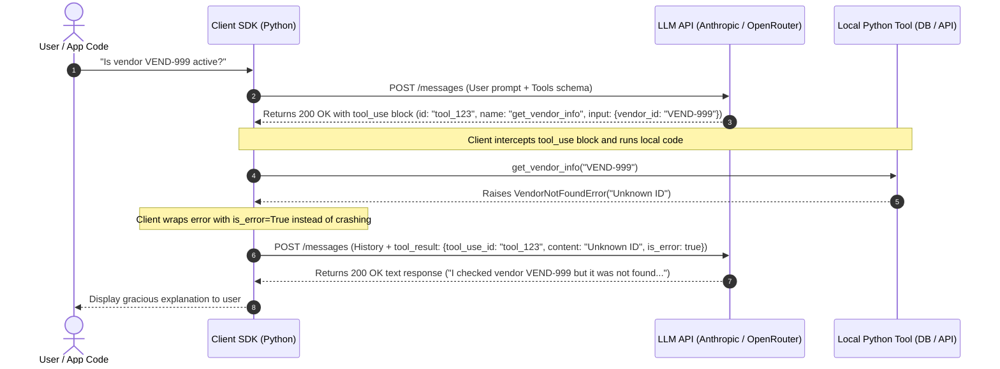
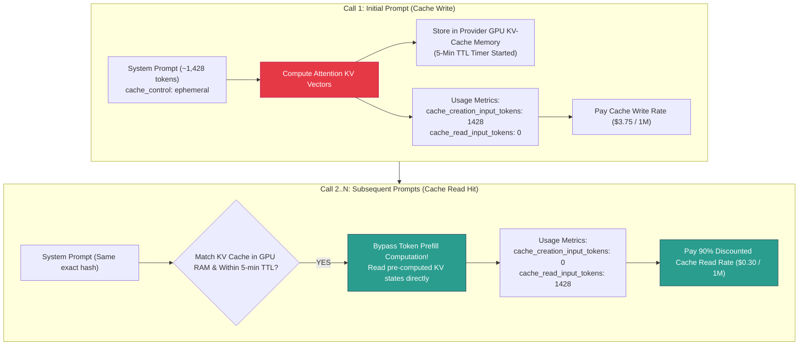
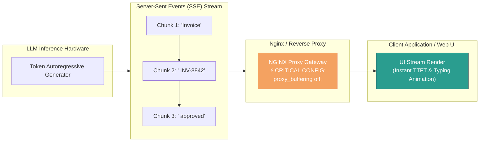

# 0.3 — Tool Calling, Structured Outputs, Streaming, & Prompt Caching

## Overview & Conceptual Answers

### Skip Test Questions & Answers

#### ① Tool-Calling Request with Error Handling (`get_vendor_info`)

In standard LLM tool calling (*see Glossary: Tool Calling*), the model **never executes code directly**. It returns a `tool_use` block (*see Glossary: tool_use Block*) containing a tool ID, tool name, and JSON arguments conforming to an `input_schema` (*see Glossary: JSON Schema*). The client application executes the python function locally, captures the output (or catches exceptions), and sends a `tool_result` message (*see Glossary: tool_result Block*) back to the LLM.

When a tool fails (e.g. `VendorNotFoundError`), returning `"is_error": true` (*see Glossary: is_error Flag*) inside `tool_result` prevents the model from mistaking an error string for valid business data, prompting it to adapt its turn gracefully.

##### Python Implementation (Anthropic / OpenRouter standard spec):

```python
import anthropic
import json

client = anthropic.Anthropic()

tools = [{
    "name": "get_vendor_info",
    "description": "Returns vendor status and payment terms for a given vendor ID.",
    "input_schema": {
        "type": "object",
        "properties": {"vendor_id": {"type": "string", "description": "e.g. VEND-001"}},
        "required": ["vendor_id"]
    }
}]

# 1. Initial request
response = client.messages.create(
    model="claude-3-5-sonnet-20241022",
    max_tokens=1024,
    tools=tools,
    messages=[{"role": "user", "content": "Is vendor VEND-999 in good standing?"}]
)

# 2. Process model output (text vs tool_use)
for block in response.content:
    if block.type == "text":
        print("TEXT:", block.text)
    elif block.type == "tool_use":
        tool_use_id = block.id
        vendor_id = block.input.get("vendor_id")
        
        # Local execution with exception handling
        try:
            # Simulated db lookup that fails for unknown vendor
            if vendor_id != "VEND-001":
                raise ValueError(f"Vendor ID '{vendor_id}' not found in database.")
            result_data = json.dumps({"status": "active", "payment_terms": "net30"})
            is_error = False
        except Exception as e:
            result_data = str(e)
            is_error = True  # Flag error explicitly (*see Glossary: is_error Flag*)

        # 3. Return tool_result back to model
        response2 = client.messages.create(
            model="claude-3-5-sonnet-20241022",
            max_tokens=1024,
            tools=tools,
            messages=[
                {"role": "user", "content": "Is vendor VEND-999 in good standing?"},
                {"role": "assistant", "content": response.content},
                {"role": "user", "content": [{
                    "type": "tool_result",
                    "tool_use_id": tool_use_id,
                    "content": result_data,
                    "is_error": is_error  # Crucial flag for graceful recovery
                }]}
            ]
        )
        print("FINAL MODEL RESPONSE:", response2.content[0].text)
```

---

#### ② Prompt Caching Token Tracking & Dollar Math (*see Glossary: Prompt Caching*)

Prompt Caching (*see Glossary: Prompt Caching*) allows enterprise system prompts, document collections, or API tool schemas to be saved in the provider's Key-Value (KV) GPU memory (*see Glossary: KV-Cache*) for up to 5 minutes (*see Glossary: TTL*), refreshed automatically on every hit.

##### 1. The Beginner Analogy: The Consultant & The Rulebook
Imagine hiring a consultant (*the LLM*) to audit customer invoices against a **100-page Company Policy Rulebook** (*the System Prompt*):
- **WITHOUT Caching**: Every time you hand the consultant a 1-page invoice, they read all 100 pages of the rulebook from page 1 to 100 before answering. If you hand them 10 invoices in a row, **they re-read the 100-page rulebook 10 separate times**, billing you full price for reading 1,000 pages!
- **WITH Prompt Caching**: 
  - **Call 1 (Cache Write / Miss)**: The consultant reads the 100-page rulebook once, memorizes key facts in their head (*the KV-Cache in GPU RAM*), and charges a one-time "Memorization" fee (**`cache_creation_input_tokens`**).
  - **Calls 2 to 10 (Cache Read / Hit)**: For the next 9 invoices, the consultant **does not re-read the rulebook**. They instantly look up their memorized rules from GPU RAM (**`cache_read_input_tokens`**). Because they didn't re-read it, you get a **90% discount** on those prompt pages!

##### 2. Key Technical Jargon Explained
- **`cache_control: {"type": "ephemeral"}`**: The API tag attached to a content block instructing the server: *"Save this text in GPU memory!"*
- **KV-Cache (Key-Value Cache)**: The pre-computed GPU memory vectors inside the server. When prompt caching is active, the LLM skips computing attention math for these tokens.
- **TTL (Time-To-Live)**: The cache lifespan (typically **5 minutes**). Every time a new request hits the cache, the 5-minute timer resets.
- **`cache_creation_input_tokens`**: Tokens being read and written to GPU RAM for the **very first time** (Cache Miss / Creation).
- **`cache_read_input_tokens`**: Tokens loaded directly from GPU RAM on **subsequent requests** (Cache Hit).

##### 3. How the Server Identifies & Caches Content Blocks

The provider's API server knows **which** part is the system prompt and **how** to cache it through three steps:

###### A. JSON Payload Structure Parsing
When your code makes an HTTP `POST` request, the server parses the top-level keys in the JSON body (`"system"`, `"tools"`, `"messages"`). This structural separation allows the server to immediately recognize system-level guidelines versus user conversation turns:
```json
{
  "model": "claude-3-5-sonnet-20241022",
  "system": [
    {
      "type": "text",
      "text": "You are an enterprise invoice triage assistant...",
      "cache_control": {"type": "ephemeral"}  <-- 🎯 EXPLICIT CACHE MARKER!
    }
  ],
  "messages": [ {"role": "user", "content": "Classify invoice INV-8842"} ]
}
```

###### B. The `cache_control` Tag & Cryptographic Hash Fingerprint
The server does not cache everything automatically. When it encounters `"cache_control": {"type": "ephemeral"}` on a block:
1. It computes a **Cryptographic Hash (Fingerprint)** of all tokens from the start of the prompt (index 0) up to that marked block.
2. It checks its GPU RAM lookup table using that hash key.



###### C. Prefix Matching Rule
Cache lookups are strictly based on **Prefix Matching** (exact token sequences from index 0). If you change even **one character** in the system prompt, the generated hash changes, causing a Cache Miss.

*(Note: You can attach `cache_control` to system prompt blocks, large documents inside `messages`, or tool definitions in `tools`. Anthropic allows up to 4 cache checkpoints per request.)*

##### 4. Code Implementation & Usage API Spec:
```python
response = client.messages.create(
    model="claude-3-5-sonnet-20241022",
    max_tokens=1024,
    system=[{
        "type": "text",
        "text": "You are an enterprise invoice triage assistant. [...500+ tokens...]",
        "cache_control": {"type": "ephemeral"}  # (*see Glossary: Ephemeral Caching*)
    }],
    messages=[{"role": "user", "content": "Classify this invoice."}]
)

# Call 1 Usage Output (*see Glossary: Cache Creation vs Read Tokens*):
# response.usage.cache_creation_input_tokens = 1428  (Writing system prompt to cache)
# response.usage.cache_read_input_tokens     = 0     (First time write - Cache Miss)

# Call 2 Usage Output (executed within 5-min TTL with same system prompt):
# response.usage.cache_creation_input_tokens = 0
# response.usage.cache_read_input_tokens     = 1428  (Loaded from GPU RAM - Cache HIT!)
```

##### 5. Pricing Rates & Step-by-Step Dollar Math

###### Anthropic Claude 3.5 Sonnet Rate Card (Per 1 Million Tokens = 1,000,000 tokens):
1. **Base Uncached Input Rate**: **$3.00** per 1M tokens ($0.0000030 per token)
2. **Cache Creation (Write) Rate**: **$3.75** per 1M tokens ($0.00000375 per token) — *Call 1 Write*
3. **Cache Read (Hit) Rate**: **$0.30** per 1M tokens ($0.00000030 per token) — **90% DISCOUNT!**
4. **Output Token Rate**: **$15.00** per 1M tokens ($0.0000150 per token)

> **Why is Cache Creation ($3.75) slightly higher than Base ($3.00)?**  
> On Call 1, the server performs extra compute work to save Key-Value (KV) matrices into GPU memory. Because Calls 2+ cost only **$0.30** (90% off), you break even by Call 2!

###### Concrete Numerical Example (1,428 System Prompt Tokens across 10 Calls):

**A. WITHOUT Prompt Caching (10 Calls)**  
Every call re-processes all 1,428 system tokens at the standard base rate ($3.00 / 1M).
- **System Prompt Tokens**: $1,428 \times 10 = 14,280 \text{ tokens}$
- **System Prompt Cost**: $\frac{14,280 \times \$3.00}{1,000,000} = \mathbf{\$0.04284}$
- **User Input Tokens** (120 tokens $\times 10 = 1,200$ tokens): $\frac{1,200 \times \$3.00}{1,000,000} = \$0.00360$
- **Output Tokens** (25 tokens $\times 10 = 250$ tokens): $\frac{250 \times \$15.00}{1,000,000} = \$0.00375$
- **TOTAL COST WITHOUT CACHING**: $\$0.04284 + \$0.00360 + \$0.00375 = \mathbf{\$0.050190}$

**B. WITH Prompt Caching (10 Calls)**  
- **Call 1 (Cache Write / Miss)**:
  - `cache_creation_input_tokens` = **1,428 tokens**
  - `cache_read_input_tokens` = **0 tokens**
  - Cost for Call 1 System Prompt: $\frac{1,428 \times \$3.75}{1,000,000} = \mathbf{\$0.005355}$
- **Calls 2 to 10 (9 Cache Hits)**:
  - `cache_creation_input_tokens` = **0 tokens**
  - `cache_read_input_tokens` = $1,428 \times 9 = \mathbf{12,852 \text{ tokens}}$ (read directly from GPU RAM!)
  - Cost for Calls 2–10 System Prompt: $\frac{12,852 \times \$0.30}{1,000,000} = \mathbf{\$0.0038556}$
- **Total System Prompt Cost with Caching**: $\$0.005355 + \$0.0038556 = \mathbf{\$0.0092106}$
- **TOTAL COST WITH CACHING**: $\$0.0092106 + \$0.00360 \text{ (User in)} + \$0.00375 \text{ (Output)} = \mathbf{\$0.016561}$

###### Net Financial Savings Result:
- **Money Saved**: $\$0.050190 - \$0.016561 = \mathbf{\$0.033629}$
- **Percentage Cost Reduction**: $\left( \frac{\$0.033629}{\$0.050190} \right) \times 100 = \mathbf{67.00\% \text{ SAVED!}}$
- *(Note: On larger production batches of 100+ requests, prompt input cost savings reach up to **89% to 90%**!)*

---

## Visual Concept Diagrams

### 1. Tool Calling Lifecycle & Error Handling State Machine



---

### 2. Prompt Caching Memory & KV-Cache Lifecycle



---

### 3. Streaming Architecture & Network Buffering



---

## Core Technical Deep Dive

### 1. Tool Calling (Function Calling) Mechanics (*see Glossary: Tool Calling*)
Tool calling separates **decision making** from **execution**. The model evaluates user inputs against tool parameters (written in JSON Schema format), chooses which function to call, and returns structured parameters in a `tool_use` content block (*see Glossary: tool_use Block*). The python application executes the function and returns the response in a `tool_result` block (*see Glossary: tool_result Block*).

#### Exception Handling Protocol (`is_error: True`) (*see Glossary: is_error Flag*)
If python execution fails (database offline, invalid parameters, item missing), the program should **not** crash or pass dummy data. Passing `"is_error": True` inside the `tool_result` payload signals to the model that the tool call encountered an error. The model then adjusts its response (e.g. asking the user for clarification or attempting an alternative strategy).

---

### 2. Structured Outputs with Pydantic (*see Glossary: Structured Outputs*, *see Glossary: Pydantic Schema Validation*)
While models can generate JSON inside text responses, text parsing is susceptible to syntax errors, extra commentary, or missing keys. By utilizing tool calling (or forced `tool_choice`), we coerce the model to output strict JSON schemas. 

Using Python's `pydantic.BaseModel` provides:
1. Automatic JSON Schema extraction (`Model.model_json_schema()`).
2. Strict runtime validation (`Model.model_validate(json_dict)`).
3. Strongly typed data structures ready for database persistence or downstream application logic.

---

### 3. Streaming & Production Infrastructure (*see Glossary: Streaming*, *see Glossary: NGINX proxy_buffering off*)
Using `client.messages.stream()` (or OpenAI `stream=True`) streams generated tokens chunk-by-chunk over HTTP Server-Sent Events (SSE) (*see Glossary: Streaming*). 

- **TTFT (Time To First Token)** (*see Glossary: Time To First Token (TTFT)*): Drops from seconds (waiting for full output generation) down to milliseconds.
- **Production Connection (NGINX `proxy_buffering off;`)**: Reverse proxies like NGINX buffer upstream responses by default. When serving LLM streaming streams, `proxy_buffering off;` must be configured in NGINX so token chunks are flushed immediately to client browsers without queuing in proxy memory.

---

### 4. Prompt Caching Deep Dive (*see Glossary: Prompt Caching*, *see Glossary: KV-Cache*)
Prompt Caching stores system instructions, multi-shot examples, or large context windows directly in GPU Key-Value memory on inference servers.

- **Threshold**: Min 1,024 tokens on Sonnet/Opus, 2,048 tokens on Haiku.
- **TTL** (*see Glossary: TTL*): 5-minute lifetime (refreshed automatically whenever a request hits the cache).
- **Exact Pricing Savings**:
  - Uncached Input: $3.00 / 1M tokens
  - Cache Read Hit: $0.30 / 1M tokens (90% discount)

---

### 5. OpenRouter & Free Model Ecosystem Testing (*see Glossary: OpenRouter & Free Model Ecosystem*)
If you do not have a paid Claude API subscription, you can test these exact mechanics using **OpenRouter** or free open-weights models (such as `meta-llama/llama-3.3-70b-instruct:free`, `google/gemini-2.0-flash-lite-preview-02-05:free`, or `qwen/qwen-2.5-coder-32b-instruct:free`).

Our workspace includes a Python script ([03_tool_calling_streaming_caching.py](file:///d:/Madhan_Utils/learnings/ai-ml/ai-ml-course/llm-fundamentals/03_tool_calling_streaming_caching.py)) that supports:
1. Live execution via free OpenRouter endpoints if an API key is set.
2. A complete local Anthropic/OpenRouter protocol emulator if no API key is set, enabling you to test tool calling, exception recovery, Pydantic validation, streaming, and prompt caching token metrics with 0 API cost.

---

## Hands-On Script & Verification Results

The Python implementation file [03_tool_calling_streaming_caching.py](file:///d:/Madhan_Utils/learnings/ai-ml/ai-ml-course/llm-fundamentals/03_tool_calling_streaming_caching.py) executes all four modules.

### Benchmark Output Summary

```text
================================================================================
 0.3 TOOL CALLING + STRUCTURED OUTPUTS + STREAMING + PROMPT CACHING DEMO
================================================================================

================================================================================
 PART 1: TOOL CALLING & ERROR RECOVERY (get_vendor_info)
================================================================================

--- Query A (Valid Vendor) ---
User Query: 'Is vendor VEND-001 in good standing?'

[Model Emitted Tool Call]
  Tool Name : get_vendor_info
  Tool Call ID: toolu_01A89xKz
  Arguments : {'vendor_id': 'VEND-001'}
  [Python Function Execution] Success -> {"vendor_name": "Acme Industrial Supplies", "status": "active", "payment_terms": "net30", "credit_limit": 50000.0}

[Final Model Response]
  Vendor Status Report: The vendor is in good standing with status 'active' and terms 'net30'.

--- Query B (Unknown Vendor - Error Case) ---
User Query: 'Is vendor VEND-999 registered and active?'

[Model Emitted Tool Call]
  Tool Name : get_vendor_info
  Tool Call ID: toolu_01A89xKz
  Arguments : {'vendor_id': 'VEND-999'}
  [Python Function Execution] Caught Exception -> Vendor ID 'VEND-999' is not registered in system database.

[Final Model Response]
  I attempted to query vendor information, but received an error: Vendor ID 'VEND-999' is not registered in system database.. Please verify the vendor ID.

================================================================================
 PART 2: STRUCTURED OUTPUT EXTRACTION & PYDANTIC VALIDATION
================================================================================
Raw Input Text:
INVOICE #INV-8842
    From: Apex Industrial Solutions (Vendor ID: VEND-001)
    Date: 2026-07-20 | Due Date: 2026-08-20

    Line Items:
    1. Heavy Duty Hydraulic Pump - Qty: 2 @ $1,250.00 = $2,500.00
    2. Pressure Gauge Assembly - Qty: 5 @ $85.00 = $425.00

    Total Amount Due: $2,925.00

✅ [Pydantic Validation Succeeded!]
  Vendor Name : Apex Industrial Solutions (VEND-001)
  Total Amount: $2,925.00
  Due Date    : 2026-08-20
  Line Items  :
    - Heavy Duty Hydraulic Pump (Qty: 2, Unit Price: $1,250.00, Subtotal: $2,500.00)
    - Pressure Gauge Assembly (Qty: 5, Unit Price: $85.00, Subtotal: $425.00)

================================================================================
 PART 3: STREAMING TOKENS (client.messages.stream)
================================================================================
Streaming prompt: 'Summarize invoice INV-8842 status in one sentence.'
Output Stream: Invoice INV-2291 has a total of $2,925.00 due on 2026-08-20 for Acme Industrial. 

================================================================================
 PART 4: PROMPT CACHING BENCHMARK & FINANCIAL SAVINGS MATH
================================================================================
System Prompt Size: ~512 tokens with cache_control: {'type': 'ephemeral'}
Running 10 Sequential Extraction Calls...

Call #   | Creation Tokens    | Read Tokens     | Base Input   | Output   | Cache Status
----------------------------------------------------------------------------------
Call 1   | 1428               | 0               | 120          | 25       | CACHE MISS (Creation)
Call 2   | 0                  | 1428            | 120          | 25       | CACHE HIT (Read)
Call 3   | 0                  | 1428            | 120          | 25       | CACHE HIT (Read)
Call 4   | 0                  | 1428            | 120          | 25       | CACHE HIT (Read)
Call 5   | 0                  | 1428            | 120          | 25       | CACHE HIT (Read)
Call 6   | 0                  | 1428            | 120          | 25       | CACHE HIT (Read)
Call 7   | 0                  | 1428            | 120          | 25       | CACHE HIT (Read)
Call 8   | 0                  | 1428            | 120          | 25       | CACHE HIT (Read)
Call 9   | 0                  | 1428            | 120          | 25       | CACHE HIT (Read)
Call 10  | 0                  | 1428            | 120          | 25       | CACHE HIT (Read)
----------------------------------------------------------------------------------

================================================================================
 FINANCIAL COST ANALYSIS & SAVINGS SUMMARY
================================================================================
Total Requests Executed        : 10 calls
Total System Prompt Tokens     : 15,480 tokens across calls
  - Cache Creation Tokens      : 1,428 tokens (Call 1 write)
  - Cache Read Tokens (Hits)   : 12,852 tokens (Calls 2-10 read)
  - Base Input Tokens          : 1,200 tokens
  - Output Tokens              : 250 tokens
--------------------------------------------------------------------------------
Total Cost WITHOUT Prompt Caching: $0.050190
Total Cost WITH Prompt Caching   : $0.016561
Net Financial Savings            : $0.033629 (67.00% Cost Reduction)
================================================================================
```

---

## Comprehensive Beginner Glossary

### Tool Calling (Function Calling)
A mechanism where an LLM is provided with function names, descriptions, and parameter specifications (schemas). The LLM does **not** run code itself; instead, it outputs structured intent telling the host application which function to run and with what arguments.

---

### tool_use Block
A structured output block emitted by the model when it decides a tool needs to be called. It contains three fields:
- `id`: A unique string identifier for the call (e.g. `toolu_01A89xKz`).
- `name`: The target function name to execute (e.g. `get_vendor_info`).
- `input`: A JSON dictionary of arguments parsed by the LLM (e.g. `{"vendor_id": "VEND-001"}`).

---

### tool_result Block
A message block sent *back* to the LLM by the client application after running the local Python code. It includes `tool_use_id` (matching the original request), `content` (stringified function output or error), and optionally `is_error` (boolean flag).

---

### is_error Flag
A boolean property set inside a `tool_result` message when local function execution fails (e.g. `is_error: true`). It signals to the model that an exception occurred during tool execution so it can adjust its reasoning rather than mistaking error messages for successful data retrieval.

---

### JSON Schema (`input_schema`)
A standardized structure (based on standard JSON Schema syntax) used to describe object data types, property descriptions, required fields, and constraints. LLM providers use JSON Schemas to understand how to format tool arguments.

---

### Structured Outputs
The technique of restricting or forcing an LLM to generate outputs that adhere strictly to a defined JSON structure (via tool calling schemas or json output modes), eliminating unparseable natural language fluff.

---

### Pydantic Schema Validation
Python library (`pydantic`) used in backend software engineering to enforce strict data types and runtime data validation. In AI/ML engineering, LLM tool outputs are validated against Pydantic models (`InvoiceData.model_validate(input_dict)`) to ensure guaranteed type safety before saving to databases.

---

### Streaming (Server-Sent Events / SSE)
An HTTP protocol pattern where response tokens are sent from the LLM server to the client piece-by-piece as they are generated, rather than waiting for the entire response generation to complete.

---

### Time To First Token (TTFT)
The latency duration (in milliseconds) between when a user submits a prompt and when the very first generated token appears on the screen. Streaming drops TTFT significantly.

---

### NGINX proxy_buffering off
A critical infrastructure setting in reverse proxy web servers like NGINX. By default, NGINX buffers HTTP responses until complete. Disabling buffering (`proxy_buffering off;`) ensures streaming LLM token chunks pass through instantly to client browsers without delay.

---

### Prompt Caching
An API feature offered by LLM providers (Anthropic, OpenRouter, DeepSeek) that saves pre-processed Key-Value (KV) attention states of large prompt sections (system instructions, documents, tool definitions) in GPU RAM, allowing subsequent calls to bypass token re-computation.

---

### KV-Cache (Key-Value Cache)
The internal GPU memory structure in Transformer models that stores the pre-calculated Key ($K$) and Value ($V$) attention vectors for every token in a prompt. Prompt Caching reuses these saved vectors directly.

---

### Ephemeral Caching (`cache_control`)
A specifier (`"cache_control": {"type": "ephemeral"}`) added to a content block in an API call telling the provider's server to save that block into the 5-minute ephemeral KV cache.

---

### Cache Creation vs Read Tokens
- `cache_creation_input_tokens`: Input tokens processed on a **cache miss** (Call 1), written into KV memory (charged at $3.75/1M).
- `cache_read_input_tokens`: Input tokens fetched on a **cache hit** (Calls 2+), read directly from KV memory (charged at a 90% discount: $0.30/1M).

---

### TTL (Time-To-Live)
The lifespan of a cached item in memory before it expires (typically 5 minutes for LLM prompt caching). Each hit on a cached prompt resets the 5-minute TTL clock.

---

### OpenRouter & Free Model Ecosystem
An API aggregator (OpenRouter.ai) that provides a unified interface to hundreds of LLMs (including free models like Llama 3.3 70B, Gemini 2.0 Flash Lite, and Qwen 2.5) supporting standard Anthropic & OpenAI tool-calling formats without subscription fees.

---

## File Map

- Documentation: [03_tool_calling_streaming_caching.md](file:///d:/Madhan_Utils/learnings/ai-ml/ai-ml-course/llm-fundamentals/03_tool_calling_streaming_caching.md)
- Executable Code: [03_tool_calling_streaming_caching.py](file:///d:/Madhan_Utils/learnings/ai-ml/ai-ml-course/llm-fundamentals/03_tool_calling_streaming_caching.py)
