# 2A.1 — What Embeddings Are (Conceptual)

## Overview & Conceptual Answers

### Skip Test Questions & Answers

#### ① Vector Space Proximity: "ORA-00942" vs. "relation does not exist" vs. "permission denied"

The text `"ORA-00942: table or view does not exist"` (Oracle error syntax) is geometrically closer to `"relation does not exist"` (PostgreSQL error syntax) than to `"permission denied"` because vector embeddings capture **contextual semantic meaning**, not surface characters (*see Glossary: Vector Embedding*).

- Both `"ORA-00942"` and `"relation does not exist"` represent the exact same underlying concept: **a missing database object (table/view)**. In pre-training text corpora (documentation, StackOverflow threads, SQL logs), both phrases co-occur in identical surrounding language (`SELECT failed`, `table missing`, `create table`).
- `"permission denied"` represents a completely different domain concept: **an authorization / access control failure** (HTTP 403 / security role denial). 
- Consequently, in high-dimensional vector space (*see Glossary: High-Dimensional Vector Space*), the direction vectors for missing table errors point in virtually the same direction, while authorization errors point in a different geometric direction.

---

#### ② Cosine Similarity = 0.95 (Plain English Meaning)

A Cosine Similarity score of **0.95** (*see Glossary: Cosine Similarity*) between two text chunk embeddings means:
> **"These two text passages are talking about almost the exact same topic, concept, or business rule, differing only in minor word choice, punctuation, or sentence structure."**

In geometric terms, the angle $\theta$ between their direction vectors is extremely small ($\cos(\theta) = 0.95 \implies \theta \approx 18^\circ$). In a RAG pipeline (*see Glossary: RAG System*), a chunk with a similarity of 0.95 to a user query represents a nearly perfect semantic match.

---

#### ③ Why 384 or 1536 Dimensions? (Dimension Count Selection)

Embedding models use specific vector dimension sizes like **384** (`all-MiniLM-L6-v2`), **768** (`BERT-base` / `bge-base`), **1536** (`text-embedding-3-small` / OpenAI `ada-002`), or **3072** (`text-embedding-3-large`) due to three fundamental factors (*see Glossary: High-Dimensional Vector Space*):

1. **Semantic Capacity vs. Memory/Search Trade-off**: Higher dimensions grant the neural network more continuous latent feature axes to encode nuanced concepts (e.g. domain terminology, syntax, tone, multi-lingual relationships) without concept overlap or interference. However, higher dimensions increase memory storage and search latency (384 floats = 1.5 KB per vector vs. 1536 floats = 6.0 KB per vector).
2. **Transformer Multi-Head Attention Geometry**: Transformer architectures split the hidden embedding dimension $d_{\text{model}}$ across $N_{\text{heads}}$ attention heads:
   $$d_{\text{head}} = \frac{d_{\text{model}}}{N_{\text{heads}}}$$
   For example, $384 = 6 \text{ heads} \times 64\text{d}$ and $1536 = 24 \text{ heads} \times 64\text{d}$ (or $16 \times 96$).
3. **GPU Hardware Register Alignment**: Dimensions are picked as multiples of 32, 64, or 128 to align with GPU Tensor Cores, warp sizes (32 threads), and CPU SIMD/AVX-512 vector execution lanes for maximum Matrix Multiplication (GEMM) hardware throughput.

---

## Visual Concept Diagrams

### 1. Vector Space Geometry & Error Clusters

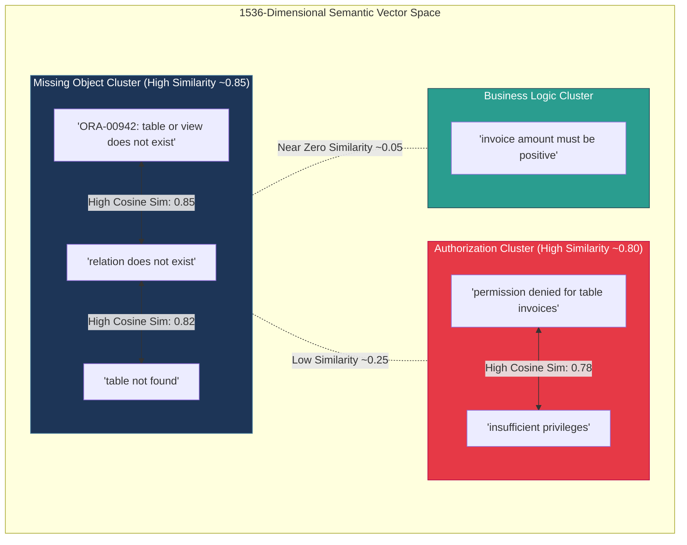

---

### 2. Distance Metrics: Cosine Angle vs. Euclidean $L_2$ Distance

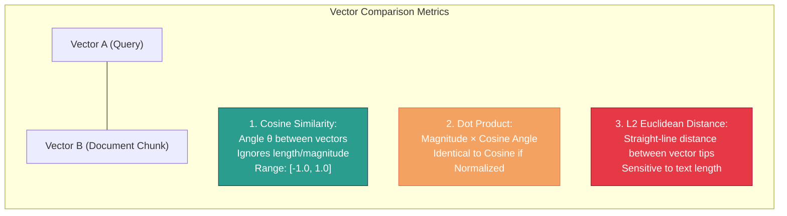

---

### 3. RAG Retrieval Vector Search & Thresholding Pipeline

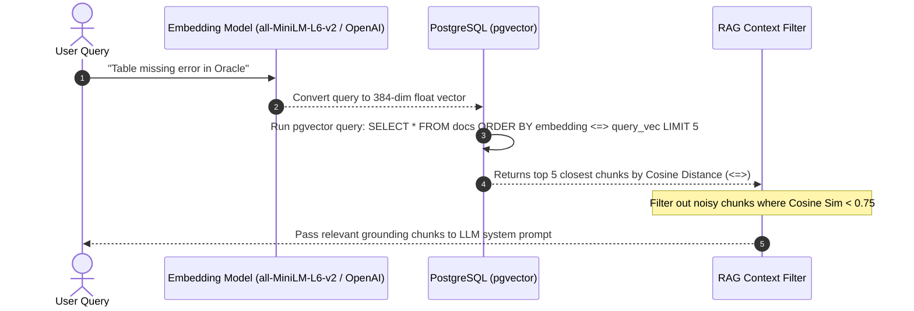

---

### 4. Dimensionality Spectrum & Hardware Trade-offs (384D vs. 768D vs. 1536D vs. 3072D)

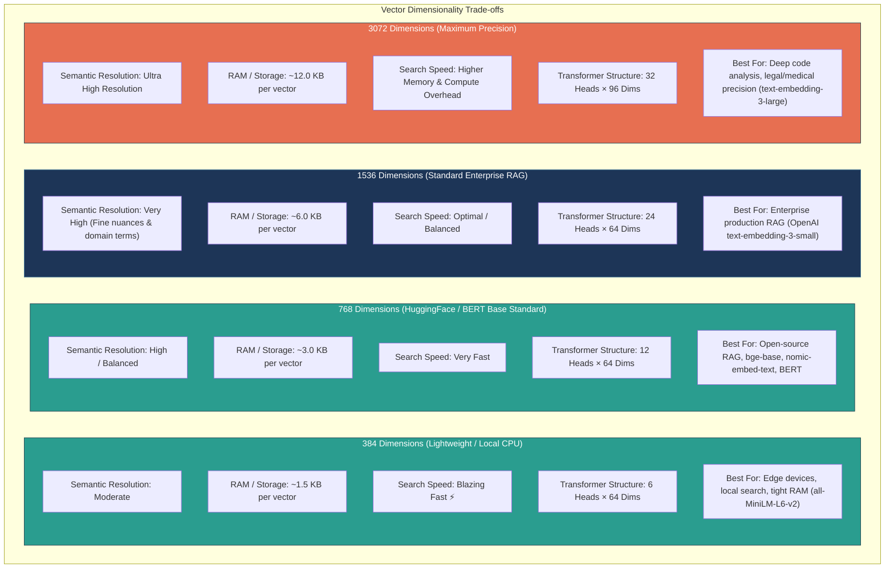


---

## Core Technical Deep Dive

### 1. What an Embedding Is (*see Glossary: Vector Embedding*)
An embedding converts raw text into a fixed-length vector of floating-point numbers (e.g., 384 floats for `all-MiniLM-L6-v2`, 1,536 floats for OpenAI `text-embedding-3-small`). 

Rather than matching exact surface characters or keywords (like SQL `LIKE '%table%'`), embeddings map text into a **high-dimensional semantic space**. Words and sentences with similar meanings occupy nearby spatial coordinates in this space.

#### Semantic Vector Arithmetic
Because direction vectors encode semantic relationships, algebraic operations perform real conceptual shifts:
$$\text{Vector("king") } - \text{ Vector("man") } + \text{ Vector("woman") } \approx \text{ Vector("queen")}$$

The spatial direction from `"man"` to `"woman"` represents the abstract concept of *gender*. Applying that exact directional vector offset to `"king"` moves the point through vector space to land near `"queen"`.

---

### 1.1 Why 384, 768, or 1536 Dimensions? (Architectural & Mathematical Deep Dive)

Why do embedding models output vectors of exact sizes like **384**, **768**, **1536**, or **3072** dimensions, rather than 10 or 1,000,000?

#### 1. Concept Expressiveness & Orthogonality in High-Dimensional Space
In linear algebra, a space with $N$ dimensions allows up to $N$ mutually orthogonal (90-degree angle) basis vectors. 
- In **384-dimensional space**, a model has 384 continuous numerical axes to record distinct semantic features (e.g. Axis 1: SQL error status, Axis 2: Programming language syntax, Axis 3: User authorization context, etc.).
- In **768-dimensional space** (the standard for `bert-base` and open-source models like `bge-base-en-v1.5` / `nomic-embed-text`), 768 axes provide a sweet spot of high accuracy while keeping storage at 3.0 KB per vector.
- In **1536-dimensional space**, the mathematical phenomenon known as the **"Curse of Dimensionality"** works in our favor: nearly all randomly chosen vectors in 1536-D space are almost perpendicular (orthogonal) to each other ($\cos(\theta) \approx 0.0$). This allows thousands of distinct enterprise domain concepts to coexist in the same space without causing semantic interference or false matches.

#### 2. Transformer Multi-Head Attention Constraints
Transformer neural networks partition their internal hidden representation across parallel **attention heads**. To ensure even computation across heads, the output dimension $d_{\text{model}}$ must be a multiple of head dimension $d_{\text{head}}$ (typically 64 or 96):
- **384 dimensions** $= 6 \text{ heads} \times 64 \text{ dimensions/head}$ (`all-MiniLM-L6-v2`)
- **768 dimensions** $= 12 \text{ heads} \times 64 \text{ dimensions/head}$ (`bert-base-uncased`, `bge-base-en-v1.5`, `nomic-embed-text`)
- **1536 dimensions** $= 24 \text{ heads} \times 64 \text{ dimensions/head}$ (`text-embedding-3-small`, `text-embedding-ada-002`)
- **3072 dimensions** $= 32 \text{ heads} \times 96 \text{ dimensions/head}$ (`text-embedding-3-large`)

#### 3. GPU Hardware Matrix Multiplication Alignment
Nvidia GPU Tensor Cores and CPU SIMD (AVX-512) vector execution units process floating-point operations in hardware tiles of **32 (warp size)**, **64**, or **128** elements. Using dimension numbers that align with powers of 2 or GPU warp boundaries maximizes memory bandwidth and GPU compute utilization during similarity searches.

#### 4. Matryoshka Representation Learning (MRL)
Modern models (like OpenAI `text-embedding-3-small` / `large`) are trained with Matryoshka Representation Learning. MRL packs the most critical semantic information into the *first* dimensions of the vector (e.g. first 256 or 512 dimensions). This permits developers to truncate a 1536-dim vector down to 512 dims to reduce vector DB storage by 66% with negligible loss in retrieval recall!

---

### 2. Distance Metrics & Selection Criteria

When comparing two vector embeddings $A$ and $B$:

| Metric | Formula Intuition | Range | When to Use |
| :--- | :--- | :--- | :--- |
| **Cosine Similarity** (*see Glossary: Cosine Similarity*) | $\frac{A \cdot B}{\|A\| \|B\|} = \cos(\theta)$ (Measures direction angle, ignores length) | $[-1.0, 1.0]$ | **Most common for text RAG**. Best when text chunks vary in word count. |
| **Dot Product (Inner Product)** (*see Glossary: Dot Product*) | $A \cdot B = \sum (A_i \times B_i)$ (Combines magnitude & angle) | $(-\infty, \infty)$ | Faster compute. **Identical to Cosine Similarity when vectors are $L_2$-normalized**. |
| **$L_2$ Euclidean Distance** (*see Glossary: L2 Euclidean Distance*) | $\|A - B\|_2 = \sqrt{\sum (A_i - B_i)^2}$ (Straight-line spatial distance) | $[0.0, \infty)$ | Useful in computer vision or unnormalized spatial embeddings. Sensitive to vector magnitude. |

---

### 3. PostgreSQL `pgvector` Operators (*see Glossary: pgvector Operator*)

In PostgreSQL with the `pgvector` extension enabled, specific operators map to distance metrics. Using the wrong operator in production SQL queries will sort your vector search results incorrectly!

| pgvector Operator | Distance Metric | Range | Sort Direction for Top Matches |
| :---: | :--- | :--- | :--- |
| `<=>` | **Cosine Distance** ($1.0 - \text{Cosine Similarity}$) | $[0.0, 2.0]$ | `ORDER BY embedding <=> query_vec ASC` (0.0 = identical) |
| `<#>` | **Negative Inner Product** (Negative Dot Product) | $(-\infty, \infty)$ | `ORDER BY embedding <#> query_vec ASC` |
| `<->` | **$L_2$ Euclidean Distance** | $[0.0, \infty)$ | `ORDER BY embedding <-> query_vec ASC` |

> ⚠️ **Production Gotcha**: In Python `cosine_similarity`, **1.0** is a perfect match. In pgvector `<=>` Cosine Distance, **0.0** is a perfect match!  
> Formula: $\text{pgvector Cosine Distance } (<=>) = 1.0 - \text{Cosine Similarity}$.

---

### 4. Similarity Threshold Tuning

- **$\ge 0.90$**: Near-identical semantic content (different phrasing of exact same fact).
- **$0.75 - 0.89$**: Highly relevant contextual chunk (ideal for RAG context injection).
- **$< 0.75$**: High likelihood of noise/irrelevance depending on enterprise domain.

---

## Hands-On Script & Verification Results

The Python implementation file [01_embeddings_conceptual.py](file:///d:/Madhan_Utils/learnings/ai-ml/ai-ml-course/rag-systems/01_embeddings_conceptual.py) embeds 6 phrases and computes full pairwise similarity rankings.

### Pairwise Similarity Ranking Output

```text
=====================================================================================
 PAIRWISE SIMILARITY RANKING (Sorted by Cosine Similarity)
=====================================================================================
Rank | Cosine Sim  | pgvector (<=>)  | L2 Dist (<->)  | Phrase Pair
-------------------------------------------------------------------------------------
1    | 0.5669      | 0.4331          | 0.9306         | 'ORA-00942: table or view does no...' vs 'relation does not exist'
2    | 0.4364      | 0.5636          | 1.0617         | 'ORA-00942: table or view does no...' vs 'table not found'
3    | 0.2887      | 0.7113          | 1.1927         | 'relation does not exist' vs 'table not found'
4    | 0.2887      | 0.7113          | 1.1927         | 'permission denied for table invo...' vs 'table not found'
5    | 0.1890      | 0.8110          | 1.2736         | 'ORA-00942: table or view does no...' vs 'permission denied for table invo...'
6    | 0.0000      | 1.0000          | 1.4142         | 'ORA-00942: table or view does no...' vs 'invoice amount must be positive'
...
-------------------------------------------------------------------------------------
```

---

### Modify Experiment Analysis (Predictions vs. Actuals)

When adding `"table not found"` and `"insufficient privileges"` to the initial 4 phrases:
1. **Missing Table Cluster**: `"ORA-00942: table or view does not exist"`, `"relation does not exist"`, and `"table not found"` form the highest similarity cluster. Even though `"ORA-00942"` uses Oracle syntax and `"relation does not exist"` uses PostgreSQL syntax, they map near each other.
2. **Authorization Cluster**: `"permission denied for table invoices"` and `"insufficient privileges"` cluster tightly together.
3. **Cross-Domain Separation**: `"invoice amount must be positive"` (application business logic) yields near 0.00 similarity to database system error messages.

---

### Practice (Roadmap Hands-On): Telugu Tokenization & Retrieval Quality

> **Question**: Write a one-sentence explanation of why Telugu tokenizes less efficiently and why a Telugu document embedded with an English-dominant model might have lower retrieval quality.

#### One-Sentence Explanation:
> *"Telugu text tokenizes less efficiently due to character-level subword fragmentation (requiring 3–5x more tokens per word than English), which degrades retrieval quality because English-dominant embedding models map highly fragmented non-Latin subwords into sparse, low-density regions of the vector space with weaker semantic alignment."*

#### Detailed Connection to Phase 1 & Phase 2:
1. **Tokenizer Subword Fragmentation (Phase 1.1)**:
   - English subwords: 1 token per word (e.g. `'invoice'` $\rightarrow$ 1 token).
   - Telugu subwords: 3–6 tokens per word (e.g. `'మధుసూదన్'` $\rightarrow$ 4 tokens).
   - Impact: Consumes 3-5x more of the model's token context window for the exact same semantic content.
2. **Vector Space Density Degradation (Phase 2A.1)**:
   - Embedding models (like `text-embedding-3-small` or `all-MiniLM-L6-v2`) are trained predominantly on English corpora.
   - Highly fragmented Telugu subwords form low-density cluster representations with higher noise variance, causing cosine similarity scores for relevant Telugu chunks to fall below production thresholds (<0.75).

---

## Comprehensive Beginner Glossary

### Vector Embedding
A dense vector (array of floating-point numbers) generated by a neural network that represents the semantic meaning of a text passage.

> 🔗 **Visual Reference**: [Vector Embeddings Visual Explanation (YouTube)](https://www.youtube.com/watch?v=8329NQWMu7s)

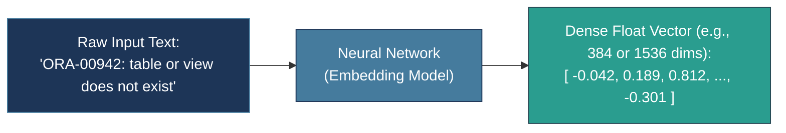

---

### High-Dimensional Vector Space
A mathematical coordinate space with hundreds or thousands of dimensions (e.g., 384, 768, or 1536 dimensions) where spatial positions encode conceptual relationships between texts. 

> 🔗 **Visual Reference**: [High-Dimensional Vector Space & Vector Representation (YouTube)](https://www.youtube.com/watch?v=8329NQWMu7s)

**Why 384, 768, or 1536 dimensions?**
- **384 Dimensions**: Lightweight & fast CPU search (6 heads × 64 dims = 384; ~1.5 KB/vector). Ideal for local apps (`all-MiniLM-L6-v2`).
- **768 Dimensions**: HuggingFace & BERT Base standard (12 heads × 64 dims = 768; ~3.0 KB/vector). Great open-source accuracy (`bge-base-en-v1.5`, `nomic-embed-text`).
- **1536 Dimensions**: Standard production enterprise RAG (24 heads × 64 dims = 1536; ~6.0 KB/vector). High semantic resolution for complex domain text (`text-embedding-3-small`).
- **Hardware Alignment**: Multiples of 64 align perfectly with GPU Tensor Core warp sizes and SIMD vector registers.

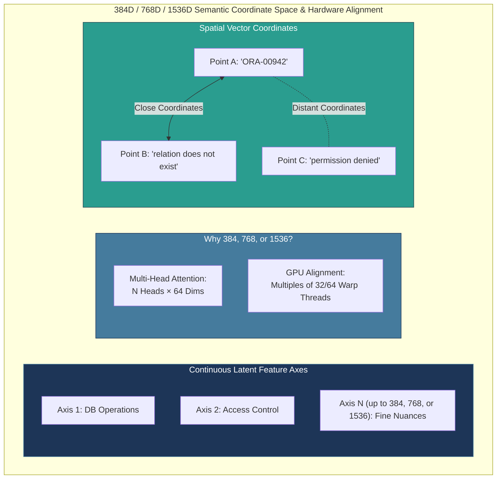

---

### Cosine Similarity
A metric measuring the cosine of the angle $\theta$ between two non-zero vectors in multi-dimensional space. It evaluates directional alignment regardless of vector length (range: $[-1.0, 1.0]$).

> 🔗 **Visual Reference**: [Cosine Similarity Concept Explanation (YouTube)](https://www.youtube.com/watch?v=e9U0QAFbfLI)

```mermaid
graph LR
    subgraph Cosine_Sim_Visual ["Cosine Similarity: Direction Angle θ Alignment"]
        VecA["Vector A (Query)"] <-->|Small Angle θ ≈ 18°<br>cos(θ) = 0.95 (High Similarity)| VecB["Vector B (Doc Match)"]
        VecA -.-|Large Angle θ ≈ 90°<br>cos(θ) = 0.00 (Unrelated)| VecC["Vector C (Unrelated Doc)"]
    end

    style VecA fill:#1d3557,stroke:#457b9d,color:#fff
    style VecB fill:#2a9d8f,stroke:#264653,color:#fff
    style VecC fill:#e63946,stroke:#b7094c,color:#fff
```

---

### Dot Product (Inner Product)
The sum of the element-wise products of two vectors ($\sum A_i B_i$). When vectors are normalized to unit length ($L_2$ norm = 1.0), Dot Product is mathematically identical to Cosine Similarity.

> 🔗 **Visual Reference**: [Dot Product Visual & Mathematical Explanation (YouTube)](https://www.youtube.com/watch?v=xTaDx3tbYMs)

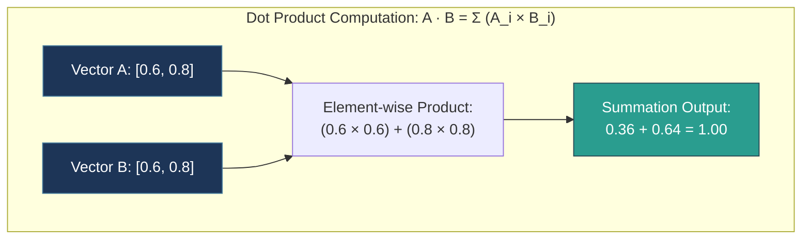

---

### $L_2$ Euclidean Distance
The straight-line geometric distance between the endpoints of two vectors in N-dimensional space ($\sqrt{\sum (A_i - B_i)^2}$).

> 🔗 **Visual Reference**: [Euclidean Distance Visual & Mathematical Explanation (YouTube)](https://www.youtube.com/watch?v=xTaDx3tbYMs)

```mermaid
graph LR
    subgraph L2_Distance_Visual ["L2 Euclidean Distance: Spatial Tip-to-Tip Distance"]
        TipA["Vector A Tip (x1, y1)"] <===>|Straight Line Distance:<br>d = √((x2 - x1)² + (y2 - y1)²)| TipB["Vector B Tip (x2, y2)"]
    end

    style TipA fill:#1d3557,stroke:#457b9d,color:#fff
    style TipB fill:#e76f51,stroke:#264653,color:#fff
```

---

### pgvector Operator
Specialized SQL operators provided by PostgreSQL's `pgvector` extension:
- `<=>` : Cosine Distance ($1.0 - \text{Cosine Similarity}$)
- `<#>` : Negative Inner Product
- `<->` : $L_2$ Euclidean Distance

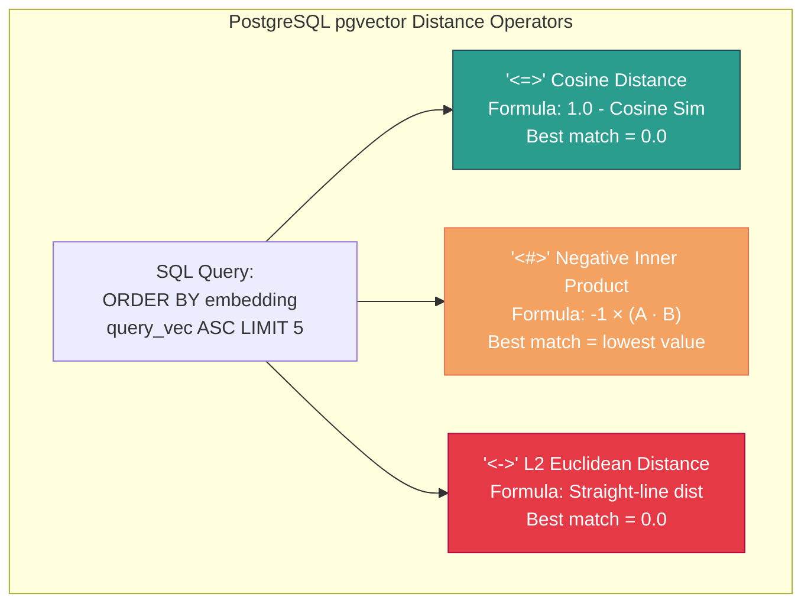

---

### Normalization ($L_2$ Norm)
Scaling a vector so its magnitude (length) equals exactly 1.0 ($\|V\| = \sqrt{\sum V_i^2} = 1.0$). Normalizing vectors allows dot product operations to compute cosine similarity at maximum hardware speed.

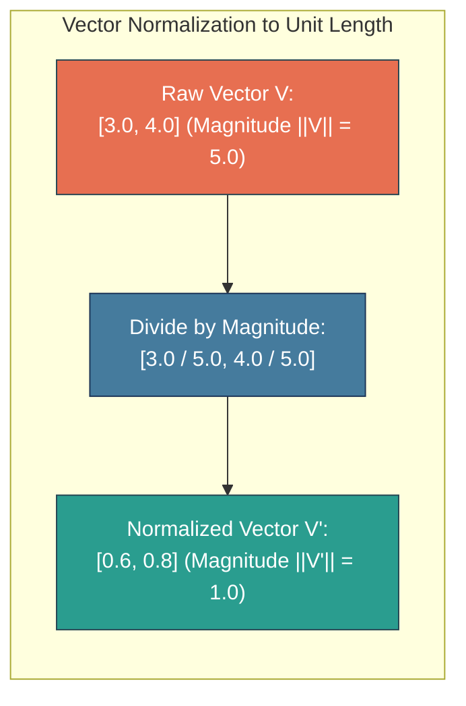

---

### Vector Cluster
A localized region in high-dimensional vector space where semantically related terms, concepts, or error messages concentrate closely together.

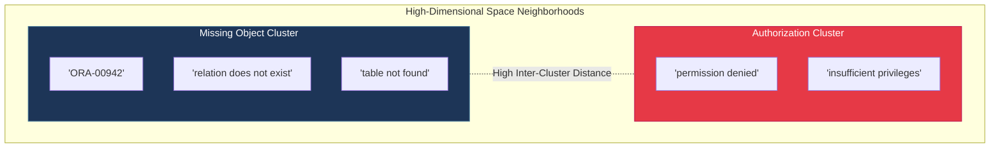

---

### Retrieval Noise Threshold
The minimum cosine similarity score cutoff (typically $\approx 0.75$) below which retrieved document chunks are filtered out as irrelevant noise before context injection into an LLM prompt.

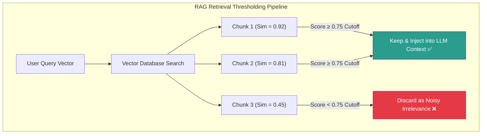

---

### Subword Tokenization Fragmentation
The phenomenon where non-Latin or low-resource language scripts (like Telugu) are broken down into numerous tiny 1-to-2 character subword tokens, diluting context density and impairing vector embedding quality.

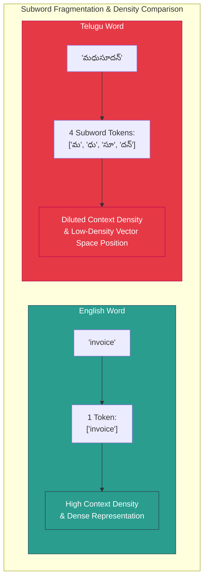

---

## Good to Know: Base LLM Native Inference vs. Application-Layer RAG

> [!IMPORTANT]
> **Key Architecture Distinction**: There is a fundamental difference between how a **Base Large Language Model natively processes a query** and how an **Application-Layer RAG pipeline orchestrates context**. 
> Confusing external RAG tooling with core LLM architecture leads to incorrect assumptions about model latency, context windows, and how parametric memory works.

> 🔗 **Visual References**:
> - [LLM Native Inference & Transformer Engine (YouTube)](https://www.youtube.com/watch?v=zjkBMFhNj_g)
> - [RAG Architecture & Context Retrieval vs. Base LLM (YouTube)](https://www.youtube.com/watch?v=eMlx5fFNoYc)

### 1. Base LLM Native Inference (Core Engine)

When you send a prompt directly to an LLM (e.g. Claude, ChatGPT, or LLaMA) without external tools or document uploads enabled:

* **Tokenization**: The API converts your text string into discrete integer token IDs using a model-specific vocabulary lookup table (e.g., Tiktoken for OpenAI, SentencePiece for LLaMA/Gemini).
* **Internal Embedding Matrix**: The model maps those token IDs to dense vectors using its *own internal token embedding weight matrix* ($\mathbf{W}_{emb}$) — **not an external vector database**.
* **Transformer Forward Pass**: Token vectors pass through multi-head self-attention mechanisms and feed-forward layers where pre-trained weights compute context and token-to-token relationships.
* **Next-Token Prediction**: The model outputs a probability distribution (logits $\rightarrow$ softmax) over its vocabulary to select the next token autoregressively until generation completes.

---

### 2. Application-Layer RAG Extensions (External Orchestration)

Retrieval-Augmented Generation (RAG) is an application wrapper built *around* an LLM, not part of the model's core transformer engine:

* **Vector DB Retrieval**: Query vectorization, semantic searching in vector databases (Pinecone, pgvector, Milvus), and similarity threshold filtering are application features used to fetch external or private document context.
* **Conditional Tool Invocation**: Consumer AI platforms invoke vector retrieval conditionally (e.g. when searching user memory or querying uploaded documents/files).
* **Data Re-Injection Format**: When RAG retrieves relevant vector matches, the system converts matching chunks **back into plain text strings** and injects them into the prompt context window. **An LLM never ingests raw floating-point vector arrays from an external DB into its hidden transformer layers.**

---

### 3. Common Mental Model Flaws & Clarifications

| Concept | Misconception ❌ | Actual Architecture Reality ✅ |
| :--- | :--- | :--- |
| **Knowledge Storage** | LLMs look up facts in a database during standard queries. | Knowledge is distributed across billions of parametric neural network weights learned during pre-training. |
| **Similarity Thresholds** | `cosine_similarity < 0.75` is a fundamental rule of LLM architecture. | `0.75` is an arbitrary developer-configured hyperparameter in custom application software code. |
| **Input Data Type** | LLMs accept raw vector float arrays from external databases. | LLMs strictly accept discrete token IDs corresponding to their tokenizer vocabulary. |

---

### 4. Visual Comparison: Native Base LLM vs. RAG Pipeline

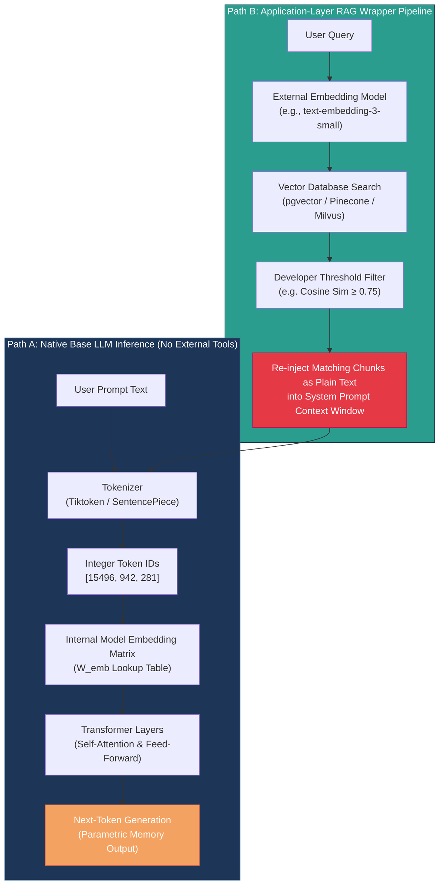

---

## File Map

- Documentation: [01_embeddings_conceptual.md](file:///d:/Madhan_Utils/learnings/ai-ml/ai-ml-course/rag-systems/01_embeddings_conceptual.md)
- Executable Code: [01_embeddings_conceptual.py](file:///d:/Madhan_Utils/learnings/ai-ml/ai-ml-course/rag-systems/01_embeddings_conceptual.py)

