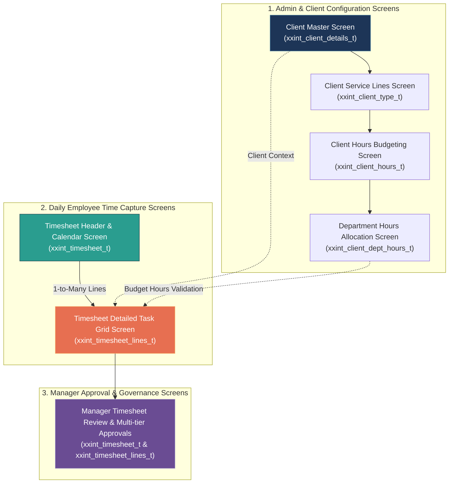

# Time Capture App - Database Schema & UI Screen Mapping

> **Source SQL Script**: [`TIme Capture App Table Scripts.sql`](file:///C:/Users/madhankumar.ch/Downloads/TIme%20Capture%20App%20Table%20Scripts.sql)  
> **Target Downloads Copy**: [`time-capture-app-table-fields-mapping.md`](file:///C:/Users/madhankumar.ch/Downloads/time-capture-app-table-fields-mapping.md)  
> **Application**: Time Capture & Employee Timesheet Portal (Nalsoft / Enterprise Time Tracking)

---

## 1. Complete Field-to-Screen Mapping Catalog

Below is the consolidated mapping table listing **Table Name, Field, and Type** in the first column, and the corresponding **Screen / UI Mapping & Control** in the second column.

| Table Name \| Field \| Data Type | Screen / UI Mapping & Control Behavior |
| :--- | :--- |
| **`xxint_client_details_t.client_id`** (`NUMBER`) | **Client Master Screen** → System Primary Key *(Hidden / Internal Identifier)* |
| **`xxint_client_details_t.client_name`** (`VARCHAR2(240 BYTE)`) | **Client Master Screen** → **Client Name** *(Mandatory Text Input / Search Filter / Table Column)* |
| **`xxint_client_details_t.short_code`** (`VARCHAR2(20 BYTE)`) | **Client Master Screen** → **Client Short Code** *(Text Input / Badge / Unique Tag)* |
| **`xxint_client_details_t.country`** (`VARCHAR2(240 BYTE)`) | **Client Master Screen** → **Country** *(Searchable Dropdown / Select)* |
| **`xxint_client_details_t.client_type`** (`VARCHAR2(30 BYTE)`) | **Client Master Screen** → **Client Category / Type** *(Dropdown: Internal, External, Retainer)* |
| **`xxint_client_details_t.address`** (`VARCHAR2(2000 BYTE)`) | **Client Master Screen** → **Client Office Address** *(Multi-line Textarea)* |
| **`xxint_client_details_t.me_mapping_code`** (`VARCHAR2(120 BYTE)`) | **Client Master Screen** → **Middle East / ERP Integration Code** *(Text Input)* |
| **`xxint_client_details_t.start_date`** (`DATE`) | **Client Master Screen** → **Contract / Engagement Start Date** *(Date Picker)* |
| **`xxint_client_details_t.end_date`** (`DATE`) | **Client Master Screen** → **Contract / Engagement End Date** *(Date Picker)* |
| **`xxint_client_details_t.ps_flag`** (`VARCHAR2(5 BYTE)`) | **Client Master Screen** → **Professional Services Flag (PS)** *(Checkbox / Toggle Switch: 'Y'/'N')* |
| **`xxint_client_details_t.client_allowed_flag`** (`VARCHAR2(5 BYTE)`) | **Client Master Screen** → **Active / Allowed for Timesheet Entry** *(Toggle Switch / Checkbox - Default 'Y')* |
| **`xxint_client_details_t.created_by`** (`VARCHAR2(64 BYTE)`) | **Audit Trail / Record History Screen** → **Created By User** *(Read-only Info Field)* |
| **`xxint_client_details_t.creation_date`** (`DATE`) | **Audit Trail / Record History Screen** → **Created Date & Time** *(Read-only Timestamp)* |
| **`xxint_client_details_t.last_updated_by`** (`VARCHAR2(64 BYTE)`) | **Audit Trail / Record History Screen** → **Last Modified By User** *(Read-only Info Field)* |
| **`xxint_client_details_t.last_update_date`** (`DATE`) | **Audit Trail / Record History Screen** → **Last Modified Date & Time** *(Read-only Timestamp)* |
| **`xxint_client_details_t.object_version_number`** (`NUMBER`) | **System / Backend Engine** → **Optimistic Concurrency Lock** *(Hidden Version Counter)* |
| --- | --- |
| **`xxint_client_type_t.client_type_id`** (`NUMBER`) | **Client Service Line Setup Screen** → Primary Key *(Hidden / Internal ID)* |
| **`xxint_client_type_t.client_id`** (`NUMBER`) | **Client Service Line Setup Screen** → **Parent Client** *(Header Context / Foreign Key)* |
| **`xxint_client_type_t.client_type`** (`VARCHAR2(30 BYTE)`) | **Client Service Line Setup Screen** → **Engagement Model / Type** *(Dropdown / Text)* |
| **`xxint_client_type_t.client_type_code`** (`VARCHAR2(30 BYTE)`) | **Client Service Line Setup Screen** → **Service Line / Contract Code** *(Text Input / Unique Code)* |
| **`xxint_client_type_t.client_type_desc`** (`VARCHAR2(2000 BYTE)`) | **Client Service Line Setup Screen** → **Service Line Description** *(Textarea)* |
| **`xxint_client_type_t.product_type`** (`VARCHAR2(30 BYTE)`) | **Client Service Line Setup Screen** → **Product / Line of Business** *(Dropdown: Oracle Fusion, Apex, AI, Custom)* |
| **`xxint_client_type_t.sub_product_type`** (`VARCHAR2(30 BYTE)`) | **Client Service Line Setup Screen** → **Sub-Product / Technology Stream** *(Dropdown)* |
| **`xxint_client_type_t.start_date`** (`DATE`) | **Client Service Line Setup Screen** → **Effective Start Date** *(Date Picker)* |
| **`xxint_client_type_t.end_date`** (`DATE`) | **Client Service Line Setup Screen** → **Effective End Date** *(Date Picker)* |
| **`xxint_client_type_t.source_code`** (`VARCHAR2(30 BYTE)`) | **Client Service Line Setup Screen** → **Origin / Source System Code** *(Dropdown / Text Input)* |
| **`xxint_client_type_t.me_mapping_code`** (`VARCHAR2(30 BYTE)`) | **Client Service Line Setup Screen** → **Finance / GL Cost Center Code** *(Text Input)* |
| **`xxint_client_type_t.old_client_type_code`** (`VARCHAR2(30 BYTE)`) | **Client Service Line Setup Screen** → **Legacy System Reference Code** *(Text Input / Read-only)* |
| **`xxint_client_type_t.created_by`** (`VARCHAR2(64 BYTE)`) | **Audit Trail / Record History Screen** → **Created By** *(Read-only Info Field)* |
| **`xxint_client_type_t.creation_date`** (`DATE`) | **Audit Trail / Record History Screen** → **Creation Date** *(Read-only Timestamp)* |
| **`xxint_client_type_t.last_updated_by`** (`VARCHAR2(64 BYTE)`) | **Audit Trail / Record History Screen** → **Last Updated By** *(Read-only Info Field)* |
| **`xxint_client_type_t.last_update_date`** (`DATE`) | **Audit Trail / Record History Screen** → **Last Update Date** *(Read-only Timestamp)* |
| **`xxint_client_type_t.object_version_number`** (`NUMBER`) | **System / Backend Engine** → **Optimistic Concurrency Lock** *(Hidden Version Counter)* |
| --- | --- |
| **`xxint_client_hours_t.client_hour_id`** (`NUMBER`) | **Client Hours & Budgeting Screen** → Primary Key *(Hidden / Internal ID)* |
| **`xxint_client_hours_t.client_id`** (`NUMBER`) | **Client Hours & Budgeting Screen** → **Client Selector** *(Dropdown / Header Context)* |
| **`xxint_client_hours_t.client_type_id`** (`NUMBER`) | **Client Hours & Budgeting Screen** → **Contract / Service Line Selector** *(Dropdown / Foreign Key)* |
| **`xxint_client_hours_t.client_type`** (`VARCHAR2(30 BYTE)`) | **Client Hours & Budgeting Screen** → **Service Type Display** *(Read-only / Dropdown Display)* |
| **`xxint_client_hours_t.estimated_hours`** (`NUMBER`) | **Client Hours & Budgeting Screen** → **Estimated Budget Hours** *(Numeric Input)* |
| **`xxint_client_hours_t.contracted_hours`** (`NUMBER`) | **Client Hours & Budgeting Screen** → **Contracted / SOW Hours** *(Numeric Input)* |
| **`xxint_client_hours_t.frequency_code`** (`VARCHAR2(30 BYTE)`) | **Client Hours & Budgeting Screen** → **Billing Frequency** *(Dropdown: Monthly, Quarterly, Annual, Total)* |
| **`xxint_client_hours_t.effective_from_date`** (`DATE`) | **Client Hours & Budgeting Screen** → **Budget Period Effective From** *(Date Picker)* |
| **`xxint_client_hours_t.effective_to_date`** (`DATE`) | **Client Hours & Budgeting Screen** → **Budget Period Effective To** *(Date Picker)* |
| **`xxint_client_hours_t.me_mapping_code`** (`VARCHAR2(30 BYTE)`) | **Client Hours & Budgeting Screen** → **Accounting Budget Code** *(Text Input)* |
| **`xxint_client_hours_t.created_by`** (`VARCHAR2(64 BYTE)`) | **Audit Trail / Record History Screen** → **Created By** *(Read-only Info Field)* |
| **`xxint_client_hours_t.creation_date`** (`DATE`) | **Audit Trail / Record History Screen** → **Creation Date** *(Read-only Timestamp)* |
| **`xxint_client_hours_t.last_updated_by`** (`VARCHAR2(64 BYTE)`) | **Audit Trail / Record History Screen** → **Last Updated By** *(Read-only Info Field)* |
| **`xxint_client_hours_t.last_update_date`** (`DATE`) | **Audit Trail / Record History Screen** → **Last Update Date** *(Read-only Timestamp)* |
| **`xxint_client_hours_t.object_version_number`** (`NUMBER`) | **System / Backend Engine** → **Optimistic Concurrency Lock** *(Hidden Version Counter)* |
| --- | --- |
| **`xxint_client_dept_hours_t.dept_hour_id`** (`NUMBER`) | **Department Allocation Screen** → Primary Key *(Hidden / Internal ID)* |
| **`xxint_client_dept_hours_t.client_hour_id`** (`NUMBER`) | **Department Allocation Screen** → **Parent Client Budget Header** *(Header Reference / FK)* |
| **`xxint_client_dept_hours_t.client_type_id`** (`NUMBER`) | **Department Allocation Screen** → **Service Line Reference** *(Context / FK)* |
| **`xxint_client_dept_hours_t.client_id`** (`NUMBER`) | **Department Allocation Screen** → **Client Reference** *(Context / FK)* |
| **`xxint_client_dept_hours_t.department_id`** (`NUMBER`) | **Department Allocation Screen** → **Department Name** *(Dropdown: ERP, Cloud, AI/ML, QA, Infra)* |
| **`xxint_client_dept_hours_t.dept_estimated_hours`** (`NUMBER`) | **Department Allocation Screen** → **Department Estimated Hours** *(Numeric Input)* |
| **`xxint_client_dept_hours_t.dept_contracted_hours`** (`NUMBER`) | **Department Allocation Screen** → **Department Contracted Hours** *(Numeric Input)* |
| **`xxint_client_dept_hours_t.created_by`** (`VARCHAR2(64 BYTE)`) | **Audit Trail / Record History Screen** → **Created By** *(Read-only Info Field)* |
| **`xxint_client_dept_hours_t.creation_date`** (`DATE`) | **Audit Trail / Record History Screen** → **Creation Date** *(Read-only Timestamp)* |
| **`xxint_client_dept_hours_t.last_updated_by`** (`VARCHAR2(64 BYTE)`) | **Audit Trail / Record History Screen** → **Last Updated By** *(Read-only Info Field)* |
| **`xxint_client_dept_hours_t.last_update_date`** (`DATE`) | **Audit Trail / Record History Screen** → **Last Update Date** *(Read-only Timestamp)* |
| **`xxint_client_dept_hours_t.object_version_number`** (`NUMBER`) | **System / Backend Engine** → **Optimistic Concurrency Lock** *(Hidden Version Counter)* |
| --- | --- |
| **`xxint_timesheet_t.timesheet_id`** (`NUMBER`) | **Timesheet Header / Approvals Screen** → Timesheet Record ID *(System ID / Top Header Badge)* |
| **`xxint_timesheet_t.employee_id`** (`NUMBER`) | **Timesheet Header / Approvals Screen** → **Employee Profile / Name** *(Logged-in User Banner / Search)* |
| **`xxint_timesheet_t.timesheet_date`** (`DATE`) | **Timesheet Header / Calendar Screen** → **Timesheet Date / Calendar Day** *(Date Picker / Day Header)* |
| **`xxint_timesheet_t.department_id`** (`NUMBER`) | **Timesheet Header Screen** → **Employee Department** *(Read-only Badge / Profile Department)* |
| **`xxint_timesheet_t.manager_id`** (`NUMBER`) | **Timesheet Header / Approvals Screen** → **Reporting Manager (L1 Approver)** *(User Card / Select)* |
| **`xxint_timesheet_t.delegate_manager_id`** (`NUMBER`) | **Timesheet Header / Approvals Screen** → **Delegated / Acting Approver** *(User Card / Select)* |
| **`xxint_timesheet_t.location_code`** (`VARCHAR2(30 BYTE)`) | **Timesheet Header Screen** → **Base Work Location** *(Dropdown: Offshore, Onsite, Hybrid)* |
| **`xxint_timesheet_t.timesheet_status`** (`VARCHAR2(30 BYTE)`) | **Timesheet Dashboard / Header Screen** → **Timesheet Status** *(Status Badge: DRAFT, SUBMITTED, APPROVED, REJECTED, WITHDRAWN)* |
| **`xxint_timesheet_t.wfh`** (`VARCHAR2(5 BYTE)`) | **Timesheet Header Screen** → **Work From Home (WFH)** *(Checkbox / Toggle Switch: 'Y'/'N')* |
| **`xxint_timesheet_t.wfh_hours`** (`NUMBER`) | **Timesheet Header Screen** → **WFH Total Hours** *(Numeric Input)* |
| **`xxint_timesheet_t.leave_type`** (`VARCHAR2(30 BYTE)`) | **Timesheet Header Screen** → **Leave Type** *(Dropdown: Sick, Casual, Annual, Comp-Off)* |
| **`xxint_timesheet_t.leave_category`** (`VARCHAR2(30 BYTE)`) | **Timesheet Header Screen** → **Leave Duration Category** *(Dropdown: Full Day, First Half, Second Half)* |
| **`xxint_timesheet_t.leave_hours`** (`NUMBER`) | **Timesheet Header Screen** → **Leave Hours Claimed** *(Numeric Input, e.g. 4.0 or 8.0)* |
| **`xxint_timesheet_t.submitted_on`** (`DATE`) | **Timesheet Approval / History Screen** → **Submitted Date & Time** *(Read-only DateTime Stamp)* |
| **`xxint_timesheet_t.submitted_by`** (`VARCHAR2(64 BYTE)`) | **Timesheet Approval / History Screen** → **Submitted By User** *(Read-only Info Field)* |
| **`xxint_timesheet_t.approved_on`** (`DATE`) | **Timesheet Approval / History Screen** → **Approved Date & Time** *(Read-only DateTime Stamp)* |
| **`xxint_timesheet_t.approved_by`** (`VARCHAR2(64 BYTE)`) | **Timesheet Approval / History Screen** → **Approved By Manager** *(Read-only Info Field)* |
| **`xxint_timesheet_t.approval_remarks`** (`VARCHAR2(2000 BYTE)`) | **Manager Approval Modal / Screen** → **Approval Remarks / Comments** *(Textarea)* |
| **`xxint_timesheet_t.rejection_reason`** (`VARCHAR2(2000 BYTE)`) | **Manager Rejection Modal / Screen** → **Rejection Reason** *(Mandatory Textarea on Reject)* |
| **`xxint_timesheet_t.withdrawn_date`** (`DATE`) | **Timesheet History / Audit Screen** → **Withdrawn Date & Time** *(Read-only DateTime Stamp)* |
| **`xxint_timesheet_t.withdrawn_remarks`** (`VARCHAR2(2000 BYTE)`) | **Timesheet Withdraw Modal** → **Withdrawal Justification** *(Textarea on Employee Withdraw)* |
| **`xxint_timesheet_t.status`** (`VARCHAR2(30 BYTE)`) | **System / Workflow Engine** → **Lifecycle Record Status** *(Internal Processing State)* |
| **`xxint_timesheet_t.lvl2_manager_id`** (`NUMBER`) | **Approval Workflow Chain Screen** → **Level 2 Approver** *(Multi-tier Approval Hierarchy Card)* |
| **`xxint_timesheet_t.lvl3_manager_id`** (`NUMBER`) | **Approval Workflow Chain Screen** → **Level 3 Approver** *(Multi-tier Approval Hierarchy Card)* |
| **`xxint_timesheet_t.lvl4_manager_id`** (`NUMBER`) | **Approval Workflow Chain Screen** → **Level 4 Approver** *(Multi-tier Approval Hierarchy Card)* |
| **`xxint_timesheet_t.lvl5_manager_id`** (`NUMBER`) | **Approval Workflow Chain Screen** → **Level 5 Approver** *(Multi-tier Approval Hierarchy Card)* |
| **`xxint_timesheet_t.created_by`** (`VARCHAR2(64 BYTE)`) | **Audit Trail / Record History Screen** → **Created By** *(Read-only Info Field)* |
| **`xxint_timesheet_t.creation_date`** (`DATE`) | **Audit Trail / Record History Screen** → **Creation Date** *(Read-only Timestamp)* |
| **`xxint_timesheet_t.last_updated_by`** (`VARCHAR2(64 BYTE)`) | **Audit Trail / Record History Screen** → **Last Updated By** *(Read-only Info Field)* |
| **`xxint_timesheet_t.last_update_date`** (`DATE`) | **Audit Trail / Record History Screen** → **Last Update Date** *(Read-only Timestamp)* |
| **`xxint_timesheet_t.object_version_number`** (`NUMBER`) | **System / Backend Engine** → **Optimistic Concurrency Lock** *(Hidden Version Counter)* |
| --- | --- |
| **`xxint_timesheet_lines_t.line_id`** (`NUMBER`) | **Timesheet Task Entry Grid Screen** → Task Line Primary Key *(Hidden / Row Key)* |
| **`xxint_timesheet_lines_t.timesheet_id`** (`NUMBER`) | **Timesheet Task Entry Grid Screen** → **Timesheet Header Reference** *(Parent FK / Hidden)* |
| **`xxint_timesheet_lines_t.employee_id`** (`NUMBER`) | **Timesheet Task Entry Grid Screen** → **Employee Reference** *(Context FK / Hidden)* |
| **`xxint_timesheet_lines_t.client_id`** (`NUMBER`) | **Timesheet Task Entry Grid Screen** → **Client Selector ID** *(Underlying Key for Client Dropdown)* |
| **`xxint_timesheet_lines_t.client_code`** (`VARCHAR2(30 BYTE)`) | **Timesheet Task Entry Grid Screen** → **Client Code** *(Searchable Dropdown / Grid Column)* |
| **`xxint_timesheet_lines_t.client_type_code`** (`VARCHAR2(30 BYTE)`) | **Timesheet Task Entry Grid Screen** → **Service Line / Contract Code** *(Dependent Dropdown)* |
| **`xxint_timesheet_lines_t.category_code`** (`VARCHAR2(30 BYTE)`) | **Timesheet Task Entry Grid Screen** → **Task Category** *(Dropdown: Development, Bug Fix, Meeting, Support)* |
| **`xxint_timesheet_lines_t.product_code`** (`VARCHAR2(30 BYTE)`) | **Timesheet Task Entry Grid Screen** → **Product Code** *(Dropdown / Text: ERP, Custom, AI, Mobile)* |
| **`xxint_timesheet_lines_t.ticket_number`** (`VARCHAR2(120 BYTE)`) | **Timesheet Task Entry Grid Screen** → **Ticket / Task Number** *(Text Input, e.g. JIRA-1042, INC88412)* |
| **`xxint_timesheet_lines_t.ticket_desc`** (`VARCHAR2(2000 BYTE)`) | **Timesheet Task Entry Grid Screen** → **Task / Ticket Summary** *(Text Input / Single-line Description)* |
| **`xxint_timesheet_lines_t.ticket_owner`** (`VARCHAR2(120 BYTE)`) | **Timesheet Task Entry Grid Screen** → **Ticket Assignee / Owner** *(Text Input / User Selector)* |
| **`xxint_timesheet_lines_t.stream_code`** (`VARCHAR2(120 BYTE)`) | **Timesheet Task Entry Grid Screen** → **Technical Stream** *(Dropdown: Frontend, Backend, DBA, Functional)* |
| **`xxint_timesheet_lines_t.module_code`** (`VARCHAR2(120 BYTE)`) | **Timesheet Task Entry Grid Screen** → **Functional Module** *(Dropdown: AP, AR, GL, HR, Custom)* |
| **`xxint_timesheet_lines_t.issue_type`** (`VARCHAR2(30 BYTE)`) | **Timesheet Task Entry Grid Screen** → **Issue Type** *(Dropdown: Bug, Change Request, User Query, Patch)* |
| **`xxint_timesheet_lines_t.phase_code`** (`VARCHAR2(30 BYTE)`) | **Timesheet Task Entry Grid Screen** → **SDLC Project Phase** *(Dropdown: Requirements, Dev, QA, UAT, PROD)* |
| **`xxint_timesheet_lines_t.activity_code`** (`VARCHAR2(120 BYTE)`) | **Timesheet Task Entry Grid Screen** → **Activity Type** *(Dropdown: Coding, Code Review, Testing, Call)* |
| **`xxint_timesheet_lines_t.other_task_code`** (`VARCHAR2(120 BYTE)`) | **Timesheet Task Entry Grid Screen** → **Internal Non-Billable Task** *(Dropdown: Internal POC, Admin, Org Meet)* |
| **`xxint_timesheet_lines_t.training_code`** (`VARCHAR2(30 BYTE)`) | **Timesheet Task Entry Grid Screen** → **Training Code** *(Dropdown / Text Input: Course / Certification)* |
| **`xxint_timesheet_lines_t.other_task_activity`** (`VARCHAR2(2000 BYTE)`) | **Timesheet Task Entry Grid Screen** → **Internal Task Activity Details** *(Textarea)* |
| **`xxint_timesheet_lines_t.time_in_minutes`** (`NUMBER`) | **Timesheet Task Entry Grid Screen** → **Time Spent (Minutes)** *(Numeric Input / Time Duration Picker)* |
| **`xxint_timesheet_lines_t.additional_desc`** (`VARCHAR2(4000 BYTE)`) | **Timesheet Task Entry Grid Screen** → **Detailed Worklog / Remarks** *(Expandable Textarea)* |
| **`xxint_timesheet_lines_t.manager_remarks`** (`VARCHAR2(2000 BYTE)`) | **Manager Timesheet Review Grid Screen** → **Manager Line Comment** *(Editable by Approver in Review Mode)* |
| **`xxint_timesheet_lines_t.client_type_id`** (`NUMBER`) | **Timesheet Task Entry Grid Screen** → Foreign Key Reference to Service Line *(System Mapping)* |
| **`xxint_timesheet_lines_t.client_hour_id`** (`NUMBER`) | **Timesheet Task Entry Grid Screen** → Foreign Key Reference to Client Budget *(System Mapping)* |
| **`xxint_timesheet_lines_t.dept_hour_id`** (`NUMBER`) | **Timesheet Task Entry Grid Screen** → Foreign Key Reference to Dept Budget *(System Mapping)* |
| **`xxint_timesheet_lines_t.me_mapping_code`** (`VARCHAR2(120 BYTE)`) | **Timesheet Task Entry Grid Screen** → **ERP Sync / Cost Center Code** *(System / Text Mapping)* |
| **`xxint_timesheet_lines_t.location_code`** (`VARCHAR2(3 BYTE)`) | **Timesheet Task Entry Grid Screen** → **Line Work Location** *(Dropdown / Segmented Control: ONS, OFF, WFH)* |
| **`xxint_timesheet_lines_t.out_of_office`** (`VARCHAR2(5 BYTE)`) | **Timesheet Task Entry Grid Screen** → **Out of Office Flag** *(Checkbox / Toggle: 'Y'/'N' - Default NULL)* |
| **`xxint_timesheet_lines_t.ticket_category`** (`VARCHAR2(30 BYTE)`) | **Timesheet Task Entry Grid Screen** → **Ticket Priority / Severity** *(Dropdown: L1, L2, L3, Critical)* |
| **`xxint_timesheet_lines_t.request_type`** (`VARCHAR2(120 BYTE)`) | **Timesheet Task Entry Grid Screen** → **Request Type** *(Dropdown: Incident, SR, RFC, Project Work)* |
| **`xxint_timesheet_lines_t.ticket_status`** (`VARCHAR2(200 BYTE)`) | **Timesheet Task Entry Grid Screen** → **Ticket Lifecycle Status** *(Dropdown: Open, In-Progress, Closed)* |
| **`xxint_timesheet_lines_t.application_code`** (`VARCHAR2(30 BYTE)`) | **Timesheet Task Entry Grid Screen** → **Target Application Code** *(Dropdown: Portal, Mobile, Cloud ERP)* |
| **`xxint_timesheet_lines_t.created_by`** (`VARCHAR2(64 BYTE)`) | **Audit Trail / Record History Screen** → **Line Created By** *(Read-only Info Field)* |
| **`xxint_timesheet_lines_t.creation_date`** (`DATE`) | **Audit Trail / Record History Screen** → **Line Creation Date** *(Read-only Timestamp)* |
| **`xxint_timesheet_lines_t.last_updated_by`** (`VARCHAR2(64 BYTE)`) | **Audit Trail / Record History Screen** → **Line Last Updated By** *(Read-only Info Field)* |
| **`xxint_timesheet_lines_t.last_update_date`** (`DATE`) | **Audit Trail / Record History Screen** → **Line Last Update Date** *(Read-only Timestamp)* |
| **`xxint_timesheet_lines_t.object_version_number`** (`NUMBER`) | **System / Backend Engine** → **Optimistic Concurrency Lock** *(Hidden Version Counter)* |

---

## 2. Screen-by-Screen Functional Hierarchy & Summary

### Screen Breakdown:
1. **Client Master Screen (`xxint_client_details_t`)**: Core client entity screen managing client name, country, dates, PS flag, and active toggle.
2. **Client Service Line Setup Screen (`xxint_client_type_t`)**: Child tab / screen configuring contract types, ERP product streams, and source codes per client.
3. **Client Hours & Budgeting Screen (`xxint_client_hours_t`)**: Project setup screen tracking contracted vs estimated hours and billing cycle frequencies.
4. **Department Hours Allocation Screen (`xxint_client_dept_hours_t`)**: Internal resource planning screen dividing budgeted hours among departments (ERP, QA, AI, Infra).
5. **Employee Timesheet Header Screen (`xxint_timesheet_t`)**: Daily time tracking header capturing date, WFH flags, leave duration, and submission status.
6. **Timesheet Task Entry Grid Screen (`xxint_timesheet_lines_t`)**: Core worklog grid recording ticket numbers, tasks, modules, duration in minutes, and activity notes.
7. **Manager Approval & Hierarchy Screen (`xxint_timesheet_t` + `xxint_timesheet_lines_t`)**: Multi-tier review screen (Level 1 to 5) for line-by-line inspection, approval comments, or rejection justifications.
